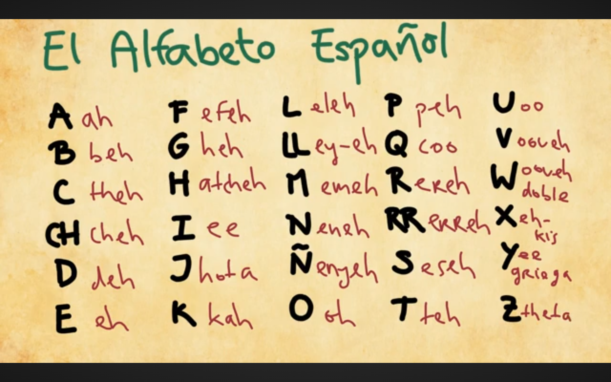

[[Spanish Verbs]]

Babbel support - support@babbel.com
 
# Table of Contents 
[[#Common Phrases]]
- [[#Greetings]]
- [[#Small talk]]
- [[#Exclamations]]
- [[#Short phrases]]
- [[#Holiday Greetings]]
[[#Common Adverbs & Adjectives]]
- [[#Turning verbs into adjectives]]
- [[#Turning adjectives into adverbs]]
- [[#Adjectives Before vs. After the Noun]]
- [[#Who, what, when...]]
- [[#Some/Any variations]]
[[#Prepositions]]
[[#Pronouns]]
- [[#Direct Object Pronouns]]
  - [[#it and them]]
- [[#Indirect Object Pronouns]]
  - [[#Attach Indirect Object Pronouns to Verbs]]
- [[#Reflexive verbs and pronouns]]
- [[#Possessive pronouns (singular/plural)]]
[[#Vosotros]]
[[#this/these, that/those]]
[[#Expressing that something still hasn't happened, just happened and keeps happening]]
- [[#Still hasn't happened]]
- [[#Just happened or finished]]
- [[#Keeps happening repeatedly]]
[[#Conditional sentences]]
[[#Commands]]
[[#Noun gender tips]]
- [[#Article Gender Noun Exceptions]]
[[#Comparisons]]
[[#Superlatives]]
[[#Bein vs bueno]]
[[#por vs para]]
[[#al versus del]]
[[#Sizes]]
[[#Home related]]
- [[#Kitchen]]
- [[#Bathroom]]
- [[#Bedroom]]
[[#Relationships]]
- [[#Nationality]]
[[#Occupations]]
[[#Small and cute - los diminutivos]]
[[#Location related words and phrases]]
- [[#Proximity]]
- [[#Directions]]
- [[#Transportation and travel]]
- [[#Weather]]
[[#Computer related]]
[[#Soccer (fútbol)]]
- [[#Field Positions]]
- [[#Plays]]
- [[#Non-playing positions]]
- [[#Field layout]]
- [[#Fútbol equipment]]
[[#Body parts (partes del cuerpo)]]
- [[#Face (la cara)]]
- [[#Body (el cuerpo)]]
- [[#Organs (los órganos)]]
- [[#Sickness and Injury]]
[[#Feelings & Emotions]]
- [[#Verbs used when expressing feelings]]
[[#Clothing (la ropa)]]
[[#Food]]
- [[#Food feelings]]
- [[#Cooking related]]
- [[#Salad (ensalada)]]
- [[#Non-Salad Vegetables]]
- [[#Fruit (fruta)]]
- [[#Meat (carne)]]
- [[#Seafood (el marisco)]]
- [[#Desserts (postres)]]
- [[#Snacks]]
- [[#Meals]]
- [[#Drinks]]
- [[#Spanish Dishes]]
- [[#Ordering at a restaurant]]
[[#Animals (animales)]]
[[#Shopping]]
[[#Commands]]
[[#Noun gender tips]]
- [[#Article Gender Noun Exceptions]]
[[#por vs para]]
[[#al versus del]]
[[#Use of the personal 'a' in Spanish]]

[[#Pronunciation]]
- [[#Vowels]]
- [[#Consonants]]
- [[#Sounds nearly the same in Spanish as English]]
- [[#Stressed syllables]]
[[#Spanish Alphabet]]
[[#Cognate tricks for translating English to Spanish]]
[[#Spanish in Latin America vs Spain]]

[[#Numbers (números)]]
- [[#Ordinals (Rank)]]
- [[#Years(años)/Dates(fechas)]]
[[#Time]]
 - [[#Telling time]]
 - [[#Using *desde* and *desde hace* and *hace* to talk about time]]
[[#Days of the week]]
[[#Months (meses)]]
[[#Weather]]
- [[#Vocabulary]]
- [[#Phrases]]
[[#Colors (Colores)]]

[[#Holiday Greetings]]
[[#Common Phrases]]

[[#Spanish learning resources]]

---
# Common Adverbs & Adjectives

***Note: Adjectives always come after the noun they refer to.***

bien - well (bueno=good)
mal - badly (malo=bad)
cada - each/every
todos - every
todo el mundo - everybody 
solamente - just/only
solo - only 
listos - ready
cierto - sure
debería - should 
tal - such
ya - already 
algo - something 
alguno(a) - some
- alguna vez - ever
alguien - someone 
a veces - sometimes
ambos(as) - both
mismo(a) - same
- yo mismo(a) - myself
- mi mismo(a) - myself
otro(a) - another/other 
otra vez - again
a menudo - often 
un par de veces - a couple of times 
- cuatro veces - four times 
antes - before
después - after
aún - yet 
 - No, aún no he estado allí - I haven't been there yet.
never - nunca
almost - casi
demasiado - too
- demasiados - too much 
tanto(a)/tantos(as) - so much/so many 
- tan - so
tan...como - as ... as
- tanto(a)...como -as much/many ... as
bastante - quite, quite a lot of
tal vez - maybe 
- quizás - maybe (ES)
- posible - possible
- imposible - impossible 
- a lo mejor - maybe/possible
todavia - still, yet (something that didn't take place or wasn't completed)
porque - because 
acá - here
- aquí 
allá - over there
ahí - there 
verdad - true
realmente - really 
 - verdaderamente - really, truly 
seguramente - surely, probably 
supremamente - supremely
sumamente - highly, extremely 
extremadamente - extremely 
increíblemente - incredibly 
altamente - highly 
simplemente - simply/plainly afortunadamente - fortunately 
desafortunadamente - unfortunately 
- lamentablemente - unfortunately 
frecuentemente - frequently 
inmediatamente - immediately 
actividad - activity 
oportunidad - opportunity 
calidad - quality
cantidad - quantity
irreproachable - irreproachable 
rápidamente - quickly, rapidly 
adrede - intentionally, deliberately, on purpose 
híper - hyper
por fin - finally, at last 
- finalmente - finally 
en fin - anyway 
bastante - quite
seguro - sure/safe
tampoco - either/neither 
- Yo tampoco - Me neither.
- Context determines if meaning is either or neither.
feo(a) - ugly
cómodo(a) - comfortable 
incómodo(a) - uncomfortable
en lugar de - in place of, instead of 
estupendo - stupendous, wonderful 
fantástico - fantastic
excelente - excellent 
óptimo(a) - optimal
hermosísimo(a) - really beautiful 
bellísimo(a) - really beautiful 
carisimo(a) - really expensive 
así - this way, that way, like this, like that
#### Turning verbs into adjectives 
In English, we can use verbs (like to haunt) as adjectives. For example, in The house is haunted, haunted describes the word house.

You can do the same thing in Spanish! For -ar verbs, use-ado and for er and -ir verbs, use -ido.

pintar -> pintado(a) - painted 

perder -> perdido(a) - lost

dormir -> dormido(a) - asleep 

Notice that the endings also change depending on gender and number.

*La cafetera está apagada.*
The coffee maker is off.

*Los hombres están perdidos.*
The men are lost.

[[#Table of Contents]]
#### Turning adjectives into adverbs

For adjectives that end in an *e*, add *mente* to the end.

For adjectives that end in an *e* or a consonant, add *mente* to the end.

For adjectives that end in an *o*/*a* add *mente* to the end if the feminine form.

[[#Table of Contents]]

#### Adjectives Before vs. After the Noun

In Spanish, adjectives can come either after or before the noun — and that can be pretty confusing. So below I’ve explained what actually determines the order of nouns and adjectives in a sentence.

***AFTER the noun → Literal, descriptive, factual***

This is the default and most common word order in Spanish. When you place the adjective after the noun, you’re usually describing a real, objective, or physical quality of the thing you're talking about.

Un coche grande → A big car.

Una casa nueva → A house that was just built.

Un amigo viejo → A friend who is old.

Una historia cierta → A story that is true.

***Adjective BEFORE the noun → Figurative, emotional, subjective***

Placing the adjective before the noun often adds an emotional, figurative, or interpretive twist. You’re not just describing — you’re expressing something: a feeling, a personal judgment, or a commonly accepted quality.

Una gran sorpresa. → A great surprise.

Un dulce recuerdo → A sweet (emotional) memory.

Un viejo amigo → A longtime friend.

**From**: https://www.reddit.com/r/SpanishAIlines/s/ssupchRLld

[[#Table of Contents]]
### Who, what, when...
who - quién
- quiénes - who (a group)
what - qué
when - cuando
where - dónde
- where are... - dónde están
how - cómo
- how many - cuántos(as)
- how much - cuanto(a)
why - por qué
which - cuál
while - mientras 
then - entonces 

### Some/Any variations 
Some/Any - algún(a)
Something/Anything - algo
Someone/Somebody/Anyone/Anybody - alguien 
#### Nobody/Nothing 
Nobody - nadie
Nothing - nada

# Prepositions
See this video for a complete list and meanings: https://youtu.be/RLnwem941ok?si=TKTQBlWQNqM3fKHK

- durante - during, for (an amount of time)
- a - to 
- por - for and others 
- para - others and for
- contra - against 
- con - with
- sin - without
- de - of, from (refers to possession) 
- desde - from, since (implies motion)
- entre - between, among 
- sobre - over, above, on top, on top of, about
  - el sobre - envelope (noun)
- en - in, on, at, into
- antes de - before 
- después de - after
- debajo de - under
- dentro de - inside, inside of 
- encima de - on top, on top of
- cerca de - close to, near. around 
- alrededor de - around 
- a través de - through (end to end)
- acerca de - about (a subject)

- tan ... como ... - so .... as ...
- entonces - so, then
- pero - but
- pero que - because 

[[#Table of Contents]]
# Pronouns

| (Person)        | English Object Pronouns | Spanish [[#Direct Object Pronouns]] | Spanish [[#Indirect Object Pronouns]] |
| --------------- | ----------------------- | ----------------------------------- | ------------------------------------- |
| (Yo)            | Me                      | Me                                  | Me                                    |
| (Tú)            | You                     | Te                                  | Te                                    |
| (Él / Ella)     | Him / Her / It          | Lo / La                             | Le (Se before Lo/La)                  |
| (Usted)         | You (Formal)            | Lo / La                             | Le (Se before Lo/La)                  |
| (Nosotros)      | Us                      | Nos                                 | Nos                                   |
| (Vosotros)      | You All                 | Os                                  | Os                                    |
| (Ellos / Ellas) | Them                    | Los / Las                           | Les (Se before Los/Las)               |
| (Ustedes)       | You All (Formal)        | Los / Las                           | Les (Se before Los/Las)               |

***Direct object pronouns answer what? or whom***? (e.g., *Lo vi* → "I saw him/it.")

***Indirect object pronouns answer to whom***? or for whom? (e.g., *Le di el libro* → "I gave him/her the book.")

When both object pronouns are used together ***the indirect object pronoun comes before the direct object pronoun***. If "le/les" comes before "lo/la/los/las," "le/les" changes to se (*Se lo di* instead of *Le lo di*). 

Remember, little words like *me or te* generally come before the verb, like in *Me llamo Duo.

[[#Table of Contents]]
## Direct Object Pronouns 
A direct object pronoun (*un pronombre de objeto directo*) replaces a direct object, which is **a noun that directly receives the action of a verb** in a sentence.
A way to remember them is to note the article that is used with the noun that will be replaced by a pronoun:
- la, las (f) & los (m) articles are the same when used as direct object pronouns 
- el (m) becomes lo when used as a direct object pronoun.
Direct object placement follows the following rules:
- Attached to infinitive: comer (to eat) becomes comerla (eat it)
- Attached to a gerund (ing word): comiendo (eating) becomes comiendola (eating it)
- Attached to an affirmative command: hazlo (Do it) or hágalo ([you (formal:usted)]do it)
- Before a conjugated verb: put the pronoun before the verb: lo hago (I do it) Él los quiere ver (He wants to see it)
Don't use a direct object pronoun with a preposition. **DO NOT do this**: 
~~para la~~ - for it/him
~~sobre la~~ - about it/her
~~en las~~ - in them
 
See https://www.spanishdict.com/guide/direct-object-pronouns-in-spanish

### it and them
Often used as direct object pronouns when *it* and *them* refer to objects 
#### it
lo - a masculine object 
la - a feminine object 
lo/la tengo - I have it (lo or la depending on what gender *it* is)
#### them
los - a masculine object 
las - a feminine object 
los/las tango - I have them (los or las depending on what gender *them* is)

[[#Table of Contents]]
## Indirect Object Pronouns 

An indirect object pronoun tells you **to whom or for whom something is done**.  It is often used for receiving and giving.

In simple terms, the indirect object pronoun answers the questions:
- To who/what
- For who/what

Here are the indirect object pronouns in Spanish:
me (to/for me)
te (to/for you)
le (to/for him/her/it)
nos (to/for us)
os (to/for you all)
les (to/for them)

**_Indirect object pronouns always come before the direct object pronoun (if there is one) in the sentence. If is attached to an infinitive, gerund or affirmative command then it is the first suffix._**

*Díselo*
Tell it to her (*her (se)* is the IOP)

See https://www.spanishdict.com/guide/indirect-object-pronouns

[[#Table of Contents]]
### Attach Indirect Object Pronouns to Verbs
1. If your sentence has an infinitive verb, you can attach these little words to the end of that instead!
	1. Ella se quiere quedar en Nueva York.
	    She wants to stay in New York.
        becomes:
        Ella quiere *quedarse* en Nueva York.
        She wants to stay in New York.

	2. ¿Me vas a decir tu nombre?
       Are you going to tell me your name
       becomes:
     ¿Vas a *decirme* tu nombre?
     Are you going to tell me your name?
2. Attached to gerund
	1. Le estoy preguntando
		I am asking him
		becomes:
		Estoy *preguntandole*
		I am asking him
3. Attach to an affirmative command
	1. Le quiero preguntar
	   I want to ask him/her/it
	   becomes:
       Quiero *preguntarle*
		Ask him
4. Before the conjugated verb
    Le pregunto
    I ask him/her/it

***If the indirect object is not specified, you have to add it onto your sentence for clarity:***
*Le compré flores...*
I bought flowers for...
becomes:
Le compré flores *a mi novia*
I bought flowers for my girlfriend 

***Like a direct object pronoun, you DO NOT put an indirect object pronoun before a preposition*** 

[[#Table of Contents]]
## Reflexive verbs and pronouns 
A reflexive pronoun (pronombre reflexivo) is used as part of a reflexive verb (verbo reflexivo) to indicate that someone or something is performing an action on or for itself.

The reflexive pronoun is placed before the verb.
### Reflexive pronouns for each person
yo - me
tu - te
el/ella/usted - se
nosotros - nos
vosotros - os
ellos/ellas/ustedes - se

### Reflexive verbs
- ducharse - shower oneself  
- lavarse - wash oneself
- vestirse - get dressed 
- maquillarse - put on makeup 
- peinarse - comb oneself
- cepillarse - brush (teeth or hair)
- acostarse - go to bed 
- despertarse  - wake up
- levantarse - get up (from reclining)
- enfadarse - get angry 
- llamarse - call oneself

See https://www.spanishdict.com/guide/reflexive-verbs-and-reflexive-pronouns

[[#Table of Contents]]
## Possessive pronouns (singular/plural)

***Note: possessive pronouns always agree in gender and number (singular/plural) to the noun they refer to.***
### Used before the object/noun 
yo - mi/mis - my (sing/pl)
tú - tu/tus - your (sing/pl) (LA)
- vuestro(a)/vuestros(as) - ES pl
el/ella/usted - su/sus - his/her (sing/pl)
ellos/ellas/ustedes - su/sus - their
nosotros - nuestro/nuestros - our
### Possessives used after the object/noun
yo - mio/mia,míos/mías - mine
tú - tuyo(os)/tuya(as) - yours
el/ella - suyo(os)/suya(as)* - his/hers
ellos/ellas/ustedes - suyo(os)/suya(as) - theirs/yours \*
nosotros - nuestro(os)/nuestra(as) - ours
vosotros(ES) - vuestro(os)/vuestra(as)

\* suyo/suya is often ambiguous, so in that case it can  be used with 'de' to identify the particular object/person doing the possession 
Also see [[#Relationships]]

**Stressed possessive pronouns can also come straight after the noun. In this case you emphasize things and people which belong to a group.**

***Una amiga mía habla muy bien inglés.***
A friend of mine speaks very good English.

***¡Esos discos tuyos de rock son viejísimos!***
These rock records of yours are ancient!

**You can use the definite article el, la, los, las before a stressed possessive pronoun in the place of a noun, provided that the noun has already been mentioned.**

***Esta es tu cartera. La mía está en casa.***
That's your wallet. Mine (lit. The mine) is at home.!

***Me gustan estos cuadros, pero los tuyos son más bonitos.***
I like these pictures, but yours (lit. the yours) are nicer.

[[#Table of Contents]]
# Vosotros 

**In Spain, *Vosotros* is an informal 'you all'
*Ustedes* is still used as a formal 'you all'

|               | Singular          | Plural                  |
| ------------- | ----------------- | ----------------------- |
| First person  | yo                | nosotros / nosotras     |
| Second person | tú                | vosotros / vosotras     |
| Third person  | él / ella / usted | ellos / ellas / ustedes |
See [[https://blog.duolingo.com/what-is-spanish-vosotros/]]

### Conjugation of vosotros for regular verbs
 Remember that vosotros is used for you-all instead of ustedes 

| Verbs | Present | Preterite | Future |
| ----- | ------- | --------- | ------ |
| -ar   | -aís    | -asteis   | -aréis |
| -er   | -éis    | -isteis   | -eréis |
| -ir   | -ís     | -isteis   | -iréis |
See [[https://youtu.be/CO0VKeEawtc?si=KUaFu-u2MWnilmzE]]

[[#Table of Contents]]
# this/these, that/those
#### Used to indicate distance to an object 
this - esta (fem) este (masc)
 - closest object
- esto when 'this' refers to an unknown object (What is this?, ¿Qué es esto?)
- What is this? - ¿qué es esto?
these - estas (fem) estos (masc)!
those - esas(f) esos(m)
- aquellas/aquellos also (at a distance) 
that - esa (fem) ese (masc)
- further away than ***this***
- aquella/aquello  at a distance (over there)
- What is that? - ¿qué es eso?
Pneumonic: **THIS AND THESE HAVE Ts**

[[#Table of Contents]]

# Expressing that something still hasn't happened, just happened and keeps happening 

## Still hasn't happened

**The formulation of *seguir sin***

By using the irregular verb ***seguir (to continue, to follow) and sin (without) + the infinitive of a verb***, you express that something still hasn't been done.

*Siguen sin resolver el problema.*
They still haven't resolved (lit. continue without resolving) the problem.

*Sigo sin pagar el recibo de teléfono.*
I still haven't paid (lit. continue without paying) the telephone bill.

Also see: [[Spanish Verbs#seguir - to continue, to follow]]
## Just happened or finished 

**The formulation of *acabar de***

You use acabar de + the infinitive of a verb to express that something has just been done.

*Pedro acaba de desayunar.*
Pedro has just had breakfast.

It is ***often used to say if something is finished or not.***

*Todavía no he acabado de limpiar.*
I still haven't finished cleaning.

*¿Cuándo acabas de cocinar?*
When will you finish cooking?

Also see: [[Spanish Verbs#acabar - to finish, end, complete]]
***Note:*** acabar is a regular verb

## Keeps happening repeatedly 

**The formulation of *volver a***

You use volver a + the infinitive of a verb for something that ***keeps happening or for an activity that happens again***. Volver literally means to return.

*Volvemos a ver la película.*
We are seeing the film again.

*Vuelven a arrojar basura.*
They keep throwing trash out.

[[#Table of Contents]]

# Conditional sentences 
### The sequence of tenses in real conditional clauses (si-clauses)

Conditional sentences always have a fixed sequence of tenses.

The first verb in the sentence with Si is in the present tense. In the next sentence after the comma, the second verb is in the present tense or alternatively in the future. There can also be conditional sentences that start in the future and end in the past too.

*Si tienes 18 años, ya eres mayor de edad.*
If you are 18 years old, you are already of legal age.

*Si estudias mucho, aprobarás el examen.*
If you study a lot, you will pass the exam.

The compound future tense with ir a + the infinitive is also possible.

*Si estudias mucho, vas a aprobar el examen.*
If you study a lot, you're going to pass the exam.

[[#Table of Contents]]
# Relationships
la madre - the mother 
el padre - the father 
el padres - the parents 
el hijo - the son
los hijos - the children or sons (parents would say)
- los niños - the children (generic)
- la ninez - childhood 
la hija - the daughter 
el hermano - the brother
- los hermanos - siblings
la hermana - the sister 
la abuela - the grandmother 
el abuelo - the grandfather 
el abuelos - the grandparents 
el sobrino - the nephew 
la sobrina - the niece 
el tío - the uncle 
la tia - the aunt
el nieto - the grandson 
la nieta - the granddaughter 
los nietos - the grandchildren 
primo(a) - cousin (m/f)
el marido - the husband (ES)
- el esposo (latín america)
la mujer - the wife (ES)
- la esposa (LA)
- la mujer - the woman (in ES it depends on context)
el hombre - the man
casado(a) - married 
divorciado(a) - divorced
soltero(a) - single 
adolescente - teenager
vecino(a) - neighbor 
el colega - collegue
la reunión - meeting 
la cita - date (going out)
el beso - kiss

Also see [[#Possesive pronouns (singular/plural)]]]

## Nationality 
US American - estadounidense 
Spaniard - español(a)
Mexican - mexicano(a)
English - inglés(a)
French - frances(a)
Italian - italiano(a)
Chinese - chino(a)

[[#Table of Contents]]
# Small and cute - los diminutivos

## The diminutive with -ito

***The ending -ito is added to nouns, adjectives and adverbs to form the diminutive in Spanish***. This makes everyday Spanish alive and expressive.

*Espera un momentito.*
Wait a second (lit. a little moment).

*Ella tiene un perro pequeñito.*
She has a tiny (lit. very small) dog.

*La niña corre rapidito.*
The girl runs quite fast.

***Just as with the adjectives, the form of the ending agrees with the noun in gender and number. The masculine singular ending is -ito, the feminine is -ita. In the plural you add an -s to those endings.***

*Mi casa es pequeñita, pero hermosa.*
My house is quite small, but pretty.

*Manuelito juega con sus primitos y primitas.*
Little Manuel plays with his little cousins 

## Forming the diminutive

***If the word ends with a consonant then -ito is usually added.***

*El hámster es un animalito pequeño. (el animal)*
The hamster is a little animal.

***With words ending with -o or -a the -ito replaces these endings.***

*Nuestra abuelita se llama Rosalía. (la abuela)*
Our little granny is called Rosalía.

*Mis hermanitos tienen 5 y 3 años. (el hermano)*
My little brothers are 5 and 3 years old.

## More about the diminutive

***With words ending with -e, -r, or -n, -ito isn't added, but instead -cito.***

¿Te preparo un cafecito? (el café)
Shall I make a little coffee for you?

Mi amorcito, ¡cuánto te quiero! (el amor)
My little darling, how much I love you!

Quiero comprar un pantaloncito rojo para el bebé. (el pantalón)
I would like to buy a little red pair of pants for the baby.

***If the word has a z before the ending, then the z is dropped and -cito is used:***
taza -> tacita (small cup)
pedazo -> pedacito (small slice)

[[#Table of Contents]]

# Occupations
médico(a) - doctor 
enfermera - nurse
estudiante de medicina - medical student 
dentista - dentist
artista - artist
escritor(ora) - writer
professor(a) - teacher 
- maestro(a)
cocinero(a) - cook
periodista - journalist 
juez(a) - judge
cantante - singer
poeta(poetisa) - poet
el vendedor - salesman 
el constructor - construction worker 

¿Qué profesión tienes? - What do you do for a living?

[[#Table of Contents]]
# Computer related 
ordenador - computer
- computadora 
ordenador portátil - laptop 
- portátil - laptop 
- la pantalla - screen
cargador - charger
aplicación - app
un línea - online
- universidad en línea - online college
ingeniero de software - software engineer
correo electrónico - email 
texto del mensaje - text message
enviar un mensaje - send a text
borrar - to delete 
archivos - files

[[#Table of Contents]]

# Soccer (fútbol)
Names can be different in different Spanish speaking countries 

Home game - partido de casa 
Away game - partido fuera de casa 
## Field Positions
Goalie
- el portero - defends the *porteria*
- el arquero - defends the *arco* (arch)
- el guardamenta - translates to goalkeeper
- el goleador (ES)
Defenders (defensas or defensores)
- defensas centrales - central defenderse
- laterales o carrileros - outside defenders or fullbacks 
- carrilero - wingbacka
Midfielders (mediocampistas/volantesi)
- medio de contención - defensive midfielder
  - pevote
  - mediocampista defensivo
- medio creativo - offensive midfielder (el diez)
  - mediocampista central 
Forwards (delanteros)
- delantero centro, ariete - central forward, striker
- extremo, puntero o interior - wingers
Substitute players
- el sublimente
- los reservas
- el suplente (ES)
- el banquillo - the bench 
## Plays
game tactics - las tácticas de juego 
kick off - saque inicial 
corner kick - saque de esquina o sacar de córner
free kick - toro libre 
center the ball - centrar el balón 
pass the ball - pasar el balón 
- make a pass - hacer un pase 
tackle - derribar
shoot - tirar o lanzar o chitat
- shoot a goal - meter un gol
aimed at the goal - apuntó al arco
header - rematar de cabeza
throw in - saque lateral o saque de banda
goal kick - saque de puerta 
penalty - penalti 
score a goal - marca un gol
- hacer un gol 
equalizer goal - gold de empate 
tie the game - empatar el partido 
tie, draw - empate
win the game - ganar el partido 
lose the game - perder el partido 
offsides - fuera de juego 
to be on the bench - estar en el banquillo 
Score a goal - meter un gol

first half - el primer tiempo
half-time - descanso o medio tiempo 
second half - segundo tiempo 
additional/injury time - tiempo adicional
extra/over time - prórroga
## Field layout 
Stadium - estadio 
Pitch - campo
Goal (la portería (ES) o el arco)
- la red - net
- los postes o los palos - goalposts
- el vaquero o el travesaño - crossbar
Goal box - àrea chica o àrea de meta
Penalty area or 16 yard box - àrea grande o àrea de penal (ES)
Corner - el toro de esquina o el área de esquina (ES)
+ corner flag - banderín
Midfield line - la línea de medio campo
- central circle - el circulo central 
Sidelines - la línea de banda o la línea lateral  
Goaline - la línea de meta
## Non-playing positions
Referee - el árbitro 
- first warning - advertencia 
- yellow card - la tarjeta amarilla 
- red card - la tarjeta roja 
- signal a foul - señalar una falta 
- sending off - expulsión 
- expell from the game - expulsar del partido 
Offsides referee, linesman
- juez de línea 
- abanderado 
Coach - el entrenador
Trainer 
- preparador físico
- detector téchnico
Fan - hincha, afición, fan o fanático 
## Fútbol equipment 
Ball - la pelota o el balón  
Whistle - el silbato, pitar
Fútbol shoes - los botines o las zapatillas 
Studs/cleats - los tacos o los taquetes
Shin guards - las espinilleras o las canilleras
Jersey - la camiseta o el jersey 
Shorts - los pantalones cortos 
Goalkeeper gloves - los guantes del portero 

[[#Table of Contents]]

# Body parts (partes del cuerpo)
## Face (la cara)
la mente - mind
el rostro - face (ES)
la cabeza - head
- dolor de cabeza - headache 
el cuello - neck, throat 
la boca - mouth 
- los labios - lips
- voz - voice
la carrillera - cheek
la sonrisa - smile
- sonreir - to smile (irregular)
el ojo - eye
- los lentes - glasses
- llorar - to cry
la oreja - the (outer) ear
- el oido - inner ear 
- el tímpano - eardrum 
- los pendientes - earrings
- oìr (irregular) - to hear 
- el ruido - noise 
- ¿me oyes? - Do you hear me?
el diente - tooth
- el cepillo de dientes - toothbrush 
la nariz - nose
- las narices - noses
- oler (irregular) - to smell 
el cabello - hair (caballo - horse)
- cabello largo (long hair)
- pelo (ES)
la barba - beard 
la garganta - throat 
- garganta irritada - sore throat 
- tos - cough
el cuello - neck
## Body (el cuerpo)
la mano - hand (las manos)
- el jabón - soap
  - Lávate las manos con jabón. - Wash your hands with soap.
el dedo - finger
el brazo - arm
la pierna - leg
el pie - foot
el pecho - chest
- pechuga - breast
la espalda - back
- dolor de espalda - back pain 
- lumbago - lower back
ventresca - belly
blood - sangre
la rodilla - knee
el culo - ass
entrenar - to train, work outq

## Organs (los órganos)
el corazón - heart
el estómago - stomach

## Sickness and Injury 
enfermo(a) - sick/ill
te ves muy mal - You look really bad 
tos - cough
- Tango tos - I have a cough 
la nariz congestionada - stuffed nose 
dolor de cabeza - headache 
el resfriado - the cold 
la gripe - flu
el accidente - accident
doler - to hurt (irregular: [[Spanish Verbs#doler - to hurt]])
- el dolor - the pain  
- dolorosa - painful  
  - dolor de cabeza - headache 
el médico - doctor
- Doctor (Dr.) - male doctor (Dr.)
- Doctora (Dra.) - female doctor (Dr.)
el enfermero - male nurse
la enfermera - female nurse 
el pálido - pale
Te ves muy mal - You look very bad 
cuidar - to take care of 
la pastilla - pill
la aspirina - aspirin
el accidente - accident
cuidar - to take care of (regular verb)
cigarillos - cigarettes 
- Fumar no es bueno para la salud. - Smoking is not good for your health.

[[#Table of Contents]]
# Bedtime activities 
madrugar- get up early 
despertar - wake up
dormir  - sleep 

[[#Table of Contents]]

# Feelings & Emotions
good - bien
love - amor
happy - feliz
- contento(a) - contented
- unhappy - infeliz
sad - triste
tired - cansado(a) 
- descansado(a) - rested
restless - inquieto(a)
patient - paciente 
timid, shy - tímidos 
worried - preocupado(a)
afraid - miedo(a)
nervous - nervioso(a)
upset/bothered - molesto(a)
- te molesto(a) - do you mind 
angry - enfadado(a)
mean - mezquino(a)
- malo(a) - mean
jealous - celoso(a)
calm,quiet - tranquilo(a)
timid - timid
- timidez - shyness
kind - amable
funny - gracioso(a)
disgust - asco(a)
surprised - sorprendido(a) 
dizzy - mareado(a)
sick - enfermo(a)
pain - el dolor 
tango malestar - I'm not feeling well 
relajado(a) - relaxed
- relajarte - to relax 
satisfecho(a) - satisfied 
- insatisfecho(a) - unsatisfied
contento(a) - happy 
confundido(a) - confused
agotado(a) - exhausted 
estresado(a) - stressed
desanimado(a) - discouraged
pena - shame
- es una pena - it's a shame
parece - seems (think)
sonrojarse - to blush (regular)
agotado(a) - exhausted 
vago(a) - lazy 

[[#Table of Contents]]
## Verbs used when expressing feelings 

**You can use the verbs sentirse, encontrarse and estar interchangeably to talk about feelings**.

*Me encuentro genial.*
*Me siento genial.* 
*Estoy genial.*
I feel great.

*¿Cómo te encuentras?* 
*¿Cómo te sientes?*
*¿Cómo estás?*
How are you? (informal)

*Me encuentro tranquilo.*
*Me siento tranquilo.*
*Estoy tranquilo.*
I am calm.

*Ella encuentra muy contenta.*
*Ella siente muy contenta.*
*Ella está muy contenta.* 
She's very happy.

All these verbs are synonyms when it comes to talking about feelings.

[[#Table of Contents]]
# Clothing (la ropa)
la camesa - shirt
la camiseta - T-shirt
el calcetín - sock
la gorra - cap
- el kepis - baseball cap
el sombrero - hat
la chaqueta - jacket (ES)
- la chamarra (LA)
los vaqueros - jeans
el vestido - dress
la falda - skirt 
los pantalones - pants 
el traje - suit
- traje de baño - swimsuit 
el zapato - shoe
vestirse - to get dressed 

¿Qué lleva puesto tu padre? - What is your father wearing?
- lleva puesto - is wearing 

[[#Table of Contents]]
# Food 

mantequilla - butter
aceite de oliva - olive oil 
dulce - sweet 
margo - bitter
- amargo - 
podrido(a) - rotten
harina - flour
masa - dough
caffeine - cafeína 
- sin cafeína - decaf
el yogur - yogurt 
el huevo - egg
+ la yema - yolk 
la verdura - vegetable (food)
- vegetal - vegetable (plant)
montaditos - sandwiches
especias - spices
saludable - healthy

# Food feelings 
hambre - hunger
+ Tengo hambre - I have hunger 
- hambriento - hungry 
sed - thirst
- sediento - thirsty 
lleno - full
- estoy lleno - i'm full
### Seafood  (el marisco)
pescado/pez - fish
el pulpo - octopus 
el camarón - shrimp 
- la gamba - shrimp (ES)
el cangrejo - crab
boquerones - anchovies 
vieiras - scallops 
- zamburiñas (ES)
calamares - squid
atún - tuna
bacalao - codfish 
el salmón - salmon

### Salad (ensalada)
la lechuga - (head of) lettuce 
cebolla - onion 
zanahoria - carrot
el tómate - tomato
pimiento - pepper
el aguacate - avocado 
champiñones - mushrooms 
+ setas (ES)
+ cebollas y champiñones salteados - sauteed onions and mushrooms
### Non-Salad Vegetables 
vegetales - vegetables 
vegetariana - vegetarian
el elote/maize - corn 
el brócoli - broccoli 
la berenjena - eggplant 
las lentejas - lentils
arroz - rice
patatas - potatoes (ES)
  - papas - LA
ajo - garlic 

### Meat (carne)
ternera - beef
- solomillo de ternera - beef tenderloin 
rabo de toro - oxtail
cerdo - pork
- chuleta de cerdo - pork chop 
- solomillo de cerdo - pork tenderloin 
- orejas de cerdo - pigs ears
- ¿Está hecho con cerdo? - Is it made with pork?
cordero -  lamb
 - lechazo - roast lamb
 - chuletas de cordero - lamb chops
 - pinchito de cordero - skewared (kebeb) lamb
jamón de ibérico - Iberian ham
pollo - chicken 
ternera - veal
callos - tripe (cow stomach lining)
el chorizo - chorizo
las morcillas - blood sausages
guiso - stew, casserole 
frituras - fried food 
jamon - cured ham
- jamón serrano - simple flavor
- jamón ibérica de bellota - top grade ham fed with acorns

### Fruit (fruta)
la naranja - orange
la manzana - apple
el plátano - banana 
la uva - grape
el arándano - blueberry 
el albaricoque - apricot 
la piña - pineapple 
el limón - lemon 
- lime in some LA countries (lima=lemon)
- limonada - lemonade
la lima - lime
- la cal
la fresa - strawberry 
la frambuesa - raspberry
la cereza - cherry
- la guinda 
la sandía - watermelon 
 
[[#Table of Contents]] 
### Snacks
los cacahuetes - peanuts
las almendras - almonds
helado - ice cream 
patatas fritas - fries

### Cooking related 
groceries - compra
kitchen - cocina
refrigerator - refrigerador
- nevera
butter - mantequilla 
oil - el aceite 
parsley - el perejil
cinnamon - la canela
fried - frito
grilled/roasted - asado(a)
#### Cooking-related verbs
cortar - to cut
mezclar - to mix
echar - to pour
#### Kitchen utensils 
knife - cuchillo 
fork - tenedor 
spoon - cuchara 
cup - taza/copa(ES)
glass - vaso
## Meals
menu - la carta
- la carta de vinos - wine list 
- el menú - fixed price multi-course meal 
order - el pedido 
- pedir - to order (ask for, request)
¡Buen provecho! - Enjoy your meal!+

### breakfast - el desayuno
- desayunar - to have breakfast 
- churros - fried dough sticks that are dipped into dark chocolate 
- gachas de avena - oatmeal porridge
  - avena - oatmeal 
- tortilla de huevos - egg omelette 
- tortilla española - Spanish omelette 
- huevo revuelto - scrambled eggs 
- ?Quieres algo de desayunar? - Do you want some breakfast?
- ¿nos encontramos para desayunar mañana? - shall we meet for breakfast tomorrow?
- ¿Ya desayunaste? - Have you had breakfast already?
### lunch - el almuerzo 
- almorzar - to have lunch 
- bocadillo - sandwich made with a baguette (ES)
- sandwich - sandwich
### dinner - la cena
jcenar - to have dinner 
caseros - homemade 
especias - spices
¡Què ricas! - Yummy!
bien hecho - well done (cooked)
estoy lleno(a) - i'm full
algo más - anything else 
probar - to try
- pruebas el pescado - try the fish 
la propina - tip
- dar propina - to tip
[[#Table of Contents]]
### Drinks
Can I have something to drink? - ¿Puedo tomar algo?
aqua - water 
hielos - ice
jugo/zumo(ES) - juice
café - coffee 
- café descafeinado - decaf
- café sin cafeína - decaf 
- nata - cream (aka crema)
- café con leche - coffee with hot milk
el té - tea
- la miel - honey 
zumo - juice (ES)
sidra - cider
refresco - soda
el jerez - sherry
- fino - a type of dry sherry (ES)
- jerez de andalucía - Andalusiann sherry  
  - jerez local - local sherry 
el vermut - vermouth
vino tinto - red wine
vino blanco - white wine 
- Que vino tenéis por copa - what wines are available by the glass 
Licor de Guindas - Liqueur made from sour cherry juice with anise from a small town near Seville 
la cerveza - beer
- la caña - beer (ES)
### Desserts (postres)
churros - fried dough (con chocolate)
helado - ice cream 
pasteles - pastry 
- Costrada - made of several alternating layers of puff pastry and meringue, with a custard filling in between.
- Pestiños - rolled dough made with flour and olive oil and fried.Freshly fried are typically soaked in a honey or sugar syrup.
pastel - cake 
mollete - muffin 
galleta - cookie 
- galleta con chispas de chocolate - chocolate chip cookie
- galleta de avena y pasas - oatmeal raisin cookie 
- Galleta María -  A simple, round wheat cookie that has been the most consumed in Spain for decades
- Polvorones - almond shortbread cookie often eaten at Christmas 
- Mantecados - shortbread made with dry wine and orange juice 
- Rosquillas de anís - almond cookies made with eggs, olive oil and spices 
bollería - pastries 
- Un pastel con frutas - pastry with fruit
pastel - pie
- uno trozo de pastel de fruta - a piece of fruit pie 
mazapán - martzipan
### Spanish Dishes 
- cocido madrileño - chickpea, meat and vegetable stew (Madrid region)
- Pringá: A chickpea stew from Seville, served with meat and bread.
- Gazpacho: A cold tomato soup originating from Seville, made with tomatoes, green peppers, cucumbers, garlic, and bread.
- Salmorejo: A thicker, creamier version of gazpacho, typically served with bread, ham, and egg.
- el jamón serrano - Iberian cured ham (ES)
- el queso manchego - Manchego cheese
- las croquetas - croquettes
- las patas bravas - fried potatoes with spicy sauce 
- unos tacos al pastor - tacos with split-grilled pork
- ostra gallega - Gallacian oysters
- tortillas de camarónes- toasted shrimp
- espinacas con garbanzos - spinach with chickpeas 
- Tortillitas de camarones - shrimp fritters
- bocadillo de tortilla de patata- sub-like sandwich with potato omelette inside 
- polvorones - crumbly cakes served at Christmas 
- sopa de lentejas - lentil soup (often with chorizo)
- pistol - vegetable stew made with savory eggplant, green & red peppers, tomatoes and olive oil 
- callos a la madrileña - slow cooked hearty stew made from tripe spiced with chorizo and morcilla
- queso de cabrales - tradicional Spanish blue cheese made with cow, sheep and/or goat cheese 
- oreja a la plancha - sliced or cubed pig eats grilled in olive oil and spices 
- albóndigas - pork and beef meat balls made with onions, garlic and parsley. Rice or bread coated they are simmered in a tomato sauce with smoked paprika and chili flakes. Prepared as a tapa.
- gambas al ajillo - garlicky shrimp in olive oil 
- extra vegetales - extra vegetables 

[[#Table of Contents]]
### Ordering at a restaurant 

camarero(a)/mesero(a) - waiter(waitress)

I would like...
Quisiera...

Can you bring me...?
¿Me puede traerme...?
¿Ponme... por favor?

What do you recommend?
¿Qué me recomiendas?

What's a typical dish here?
¿Qué es lo más típico de aquí?

I want to order something typical of the locale.
Quiero pedir algo típico del lugar.

What is the special of the day?
¿Qual es el especial del día?

When is breakfast served?
¿Cuando se sirve el desayuno?

What do you have to eat and to drink today?
‽Qué tienes para comer y beber hoy?

We want to order our food now.
Queremos pedir nuestra comida ahora.

What are the specials today?
¿Cuáles son las ofertas de hoy?

What is the special today?
¿Cuáles el especial de hoy?

What time do you have breakfast?
¿A qué hora desayunas?

What would you like for breakfast?
¿Qué te gustaría desayunar?

Una mesa para dos, por favor.
A table for two, please.

Una mesa, por favor.
A table, please (for one person).

Nos quedamos en la barra.
We'll stay at the bar.

I don't like anything fried.
No quiero nada frito.

La carta, por favor.
Can I have the menu, please?

La carta de vinos, por favor.
Can I have the wine list, please?

¿Qué vino tenéis por copa?
What wines do you have by the glass?

Quería una botella de vino tinto, por favor.
I'd like a bottle of red wine, please.

Una botella de vino blanco, por favor.
A bottle of wine wine, please.

Una botella de rioja, por favor.
A bottle of Rioja, please.

Una copa de vino tinto/blanco, por favor.
A glass of red/white wine, please.

Una caña, por favor.
A glass of draft beer, please.

Una doble, por favor.
A large glass of draft beer, please.

Un vaso de agua, por favor.
A glass of water, please.

Una botella de agua, por favor.
A bottle of water, please.

Agua de grifo, por favor.
Tap water, please.

Una ración de calamares/boquerones, por favor.
A large plate of calamari/fried anchovies, please.

Media ración de boquerones, por favor.
Half plate of fried anchovies, please.

Una tapa de boquerones, por favor.
A tapa of fried anchovies, please.

Quería pedir algo más, por favor.
I'd like to order something else, please.

Otra copa de vino, por favor.
Another glass of wine, please.

 Otra caña, por favor.
Another glass of draft beer, please.

 ¿Qué postres tenéis?
What is there for dessert?

I am very full.
Estoy muy llenó 

Bring me the check please?
¿Me traes la cuenta por favor?

Please, when you have a chance, bring me the check?
¿Por favor, cuando pueda, Me traer la cuenta?

¡Bueno provecho!
Enjoy your meal!

Everything was delicious, thanks.
Todo estuvo delicioso, gracy 

Muchas gracias. ¡Estaba muy rico!
Thanks so much. It was delicious!

See https://youtu.be/rsxaek7BDro?si=j7BeRd5Gb9AJSHxn

[[#Table of Contents]]
## Shopping 
- tienda - store
- mercado - market 
- supermercado - supermarket
- precios - prices
- comprar - buy
- pagar - pay
- moneda - currency 
### Shopping phrases 
- ¿Por favor, haz las compras? - Please do they shopping?
- ¿Cuánto cuesta? - How much does it cost?
  - Use *`cuantos cuestan`* for múltiple items
  - Alternatively you can say *Cuánto vale* (how much is it worth) or *Cuánto es* 
- ¿En efectivo o con tarjeta? - Cash or credit card?
- aquí tiene - here you are 
- ¿En qué le puedo ayudar? - how can I help you?
- ¿Que precio tiene...? - What is the price...?

# Sizes 
pequeño(a) - small
grande - large 
estrecho(a) - narrow
anchor(a) - wide

[[#Table of Contents]]

# Transportation and travel 
autobús - bus
- parada de autobús - bus stop 
tren - train
- estación de tren - train station 
- tren de alta velocidad - high-speed train 
avión - airplane 
- aeropuerto - airport 
- la azafata - stewardess 
- el auxiliar de vuelo - flight attendant 
taxi - taxi
hotel - hotel
- habitación de hotel - hotel room 
estacionamiento - parking lot
concierge - el conserje
la iglesia - church 
 - Iglesia católica - Catholic Church
 
## Banking
el cajero automático - auto teller
la clave secreta - PIN number 
el monto máximo - maximum amount 
retirar - to withdraw 
el crédito - loan
la tarjeta de crédito - credit card 

[[#Table of Contents]]
# Home related 
- la habitación - room
- la sala - living room (or just room)
  - la sala de estar - the living room (ES)
  + el sofá - sofa
- la alfombra - carpet
- el armario - closet 
- la televisión (tele) -  TV
  - el televisor 
- la lámpara - lamp
  - la luz(luces) - light (lights)
  - apagadar to turn off 
    - ​apagado(a) - turned off, switched off 
  - encender - to turn on, ignite 
   - encendido(a) - turned on 
- la pared - wall
- el piso - floor, apartment 
- los muebles - the furniture(pl)
- el sillón - arm chair
  - la silla - the chair
- la ventana - window
  - la cortina - curtain 
- la aspiradora - vacuum 
  - pasar la aspiradora - to vacuum 
- limpiar - to clean 
  - lavar - to wash
  - planchar - to iron
- pintar - to paint
  - pintado(a) - painted 
- aire acondicionado - air conditioner 
- el césped - the grass/lawn
- seguro - safe/sure 
- arriba - upstairs 
- abajo - downstairs 
- ... no funciona - ... doesn't work
   - La lámpara no funciona
- de madera - made of wood
- desordenado(a) - messy
- ordenado(a) - tidy
- luminoso/oscuro - light/dark 
- cómodo/incómodo - comfortable/uncomfortable 
 - compañera de cuarto - roommate 
 - el césped - grass/lawn
 - el patio - backyard 
 - los vecinos - neighbors 
## Kitchen 
- la cocina - kitchen
- la nevera - refrigerator 
  - el refrigerador - refrigerator 
  - el frigorífico - refrigerator (ES)
  - la estufa - stove 
   - el fogón - burner, campfire 
- el horno - oven
- la microonda - microwave 
- la tostadora - toaster 
- la batidora - blender 
- la cafetera - coffee maker 
- el comedor - dining room 
- la parrilla - grill
- la vajilla - dishes 
- el tazon - mug
- la basura - trash
  - saca
  - la basura - take out the trash 
## Bathroom 
- el baño - bathroom 
- la ducha - shower 
- el lavabo - sink
- el espejo - mirror 
- el inodoro - toilet 
- el aseo - toilet 
- la plancha - iron
- la lavadora - washing machine 
## Bedroom 
el dormitorio - bedroom
 - habitacion 
  - cuarto 
  la cama - bed
  - dormir - to sleep, to be asleep 
  - acuestarse - to go to bed
  - despertar - to wake up 
  - levantar - to get up 
  - dormido(a) - asleep
la mesilla de noche - night table 
la lámpara de noche - night light 
la bombilla - light bulb 
el armario - closet 
la cómoda - dresser 
el escritorio - desk
- una mesa de estudio 
- cajones - drawers 
la regleta - power strip 
la cable USB - USB cable 
el enchufe - plug
el interruptor - switch 
el cargador - charger

[[#Table of Contents]]
# Location related words and phrases
## Proximity 
- al lado de.... next to, alongside
  - junto (ES)
- cerca de ... close to or nearby 
  - más cercano(a) ... nearest to
- lejos de... far from 
- delante de ...in front of 
- encima de ... on top of
- debajo de ... underneath 
- adentro de ... inside 
  - dendro ... inside 
- al fuera - outside  
- enfrente ... in front or across 
- delante ... in front of 
- detrás ... behind or after
- atrás ... in (the) back
- entre ... between or through 
- afuera - out or outside (on the outskirts)
- abajo - down, downstairs 
- arriba - up, upstairs 
- alrededor - around or about 

- por aquí ... around here 
- desde aquí ... from here 
## Directions 
dirección - address 
izquierda - left 
derecho - right (or straight)
gira a la derecha - turn right 
giras a la izquierda - you turn left 
donde giro - where do I turn? 
- girar - to turn
seguir - to continue (on a road or street)
- [[Spanish Verbs#seguir - to continue, to follow]]
- [[#Still hasn't happened]]
mejor sigue ... better continue
calle - Street
- calle principal - main street 
carretera - highway 
la parada del autobús ... the bus stop 
- use del when noting the location of a masculine word
desde aquí ... from here

Aquí o ahi - Here or there 
ahí - there 
allá - there (or over there)
- alli - ES

tomar - to take (train, bus)
buscando - to look or search for 
encontrar - to find
sitio, lugar - place
paso de peatones - crosswalk 
iglesia - church 

[[#Table of Contents]]

### Travel related 
pasta de dientes - toothpaste 
cepillo de dientes - toothbrush 
la toalla - towel 
la regadera - shower (MX)
- ducha
aparcar - parking
peligro - danger 
paso de peatones - crosswalk
salida de emergencia - emergency exit

### Compass points 
el norte - north
el sur - south 
el este - east
el oeste - west

[[#Table of Contents]]

## Animals (animales)
el perro - dog
el gato - cat
- la gata - female cat
el cabello - horse 
cerdo(a) - pig
la vaca - cow
- toro - bull
el pollo - chicken 
el conejo - rabbit 
el mamífero - mammal
el pájaro - bird
el oso - bear
el insecto - insect
el dinosaurio - dinosaur

[[#Table of Contents]]
## el vs él
El without an accent means ‘the’, and it always comes before an adjective, adverb, or a singular, masculine noun. Él with an accent is the direct translation of ‘he’ or ‘him’. Él is a pronoun, so it doesn’t precede a noun, it replaces it

##  sí vs si (accented, yes;  no accent, if)
yes if you like me 
sí si te gusto

[[#Table of Contents]]
## Days of the week
Monday - lunes
Tuesday - martes
Wednesday - miércoles
Thursday - jueves
Friday - viernes
Saturday - sábado
Sunday - domingo

Relative days (use with el for 'on')
yesterday - ayer
today - hoy
tomorrow - mañana

date - la fecha 

[[#Table of Contents]]
# Time
a qué hora... - what time...
hace un año - a year ago
hace tres años - three years ago 
hace mucho tiempo - a long time ago
el año pesado - last year 
cuánto tiempo - how long
hace media hora - half an hour ago 
mediodia - noon
medianoche - midnight 
hace mucho tiempo - long time ago 
hace un rato - a while ago 
jamás - never
ahora mismo - right now 
tanto tiempo - so much time 
casi nunca - almost never 
de vez en cuando - once in a while 
una vez al año - once a year 
dos veces por semana - twice a week 
cara quince días - every fifteen days 
el años pasado - last year 
el mes pasado - last month 
seminal - each/every week, weekly 
está semana - this week 
la semana pasada - last week 
la próxima semana - next week 
el próximo mes - next month 
el mes que viene  - next month (the month that is coming)
hoy mismo - today, this very day 
mañana mismo - the first thing tomorrow 
ahora mismo - right now 
aquí mismo - right here 
antier - The day before yesterday
anoche - last night 
cada tercer dia - every other day

[[#Table of Contents]]
## Telling time
la/las "number" y media - half past ...
la/las "number" y cuarto - quarter after ... 
cuarto de "number " quarter of ...
las "number" en la tarde - "number" in the afternoon

abrir (command: abre; formal: abra) - open
cerrar (command: cierre; formal: cierra) - close

## Using *desde* and *desde hace* and *hace* to talk about time 

### desde hace (for \<a time period\>) 

***Desde hace*** refers to something that began in the past and is **translated as for.** It is ***used to describe a period of time.***

*Desde hace dos semanas estoy mejor.*
I have been better for two weeks.

*No voy al médico desde hace cuatro meses.*
I haven't gone to the doctor for four months.

**Expression:** ***Desde hace \<time period\> \<action or behavior\>***
### desde (since)

A specific point in time in the past is indicated by the word desde (since):

*No fumo desde el año pasado.*
I haven't smoked since last year.

*Desde el sábado estoy enfermo.*
I've been ill since Saturday.

### hace (ago)

***Hace*** by itself functions a bit like the English word ago. It ***describes completed actions in the past.***

*Hace dos semanas fui al gimnasio*.
I went to the gym two weeks ago.

*Comimos hace tres horas.*
We ate three hours ago.

*Hace unos meses estuve enfermo.*
I was ill a few (lit. some) months ago.

[[#Table of Contents]]

## Use of the personal 'a' in Spanish 
Remember that the basic rule of the personal A is that an a precedes the mention of a person or people who are the direct object in the sentence, as in the following examples: 

Entiendo a Carlos. – I understand Carlos.

Estoy viendo a mi hija jugar. – I’m watching my daughter playing.

¿Recuerdas a tu tío? – Do you remember your uncle?

The point is that any animal, plant, or inanimate thing that is treated as a person or thought of as having personal qualities needs a personal A in Spanish. 

Mi padre saca a pasear a Pipo todas las noches. – Mi dad takes Pipo out every night. (Where Pipo is obviously a dog.)

Emma lleva a su perro en el bolso. – Emma carries her dog in her purse.

Even countries and cities are included in this case: 
Amo a México. – I love Mexico. 

For more details see: https://www.spani

[[#Table of Contents]]

## Use ir + a + the infinitive to talk about plans

***To talk about what you plan to do in the near future in Spanish, you use the verb ir + a + an infinitive verb***. This is the equivalent of going to in English.

*Este fin de semana vamos a viajar a Barcelona.*
This weekend we're going to travel to Barcelona.

*¿Qué vas a hacer el viernes?*
What are you going to do on Friday?

***You can also use ir + a to talk about the distant future if you've made firm plans to do something.***

*Él va a visitar a sus padres el próximo verano.*
He's going to visit his parents next summer.

***Note that you can use it + a with the infinative ir:***

*Voy a ir a la fiesta.*
I'm going to go to the party

[[#Table of Contents]]

# Commands 
Drop the -s from the normal tú verb form to tell someone what to do. There are a few exceptions including:
- haga for [[Spanish Verbs#hacer - to make/to do/to ask]]
- ponga for [[Spanish Verbs#poner - to put, to give]]
- vaya for [[Spanish Verbs#ir - to go]]
- venga for [[Spanish Verbs#venir - to come]]

In formal situations, you do things a little differently. You swap out the normal usted vowel ending. Basically, if there's normally an -e, use an -a. And if there's usually an -a, it'll turn into an -e!

## The Imperative: regular verbs with-ar

The Imperative is used to ask someone something directly or to give an instruction or command. If you are on familiar terms with someone, you simply use the 3rd person singular form of the verb.

*Jordi no canta bien, canta tú.*
Jordi doesn't sing well. You sing!

If you are addressing a group of people you know well, the ending -ad is added to the stem of the verb.

*No podéis jugar aquí. Jugad en el parque.*
You can't play here. Play in the park!

In Latin America you use the form ustedes (you), e.g. *Jueguen en el parque* (Play in the park). Here we will be concentrating on the forms with -ad which is used in Spain.

Jorai aoesn't sing well. You sing!

If you address more than one person and include yourself, you use the ending -emos.

*Ellos no saben cómto limpiar, limpiemos la casa.*
They don't know how to clean. Let's clean the house.

## The Imperative: regular verbs with -er

If you are familiar with someone, then you use the 3rd person singular of the verb.

*Lee ese libro, es muy bueno. (leer)*
Read this book, it's very good.

If you are addressing a group of people you know well, then the ending -ed is added to the verb stem.

*Niños, comed el pescado, jes muy saludable! (comer)*
Children, eat (your) fish, it's very healthy!

If you are addressing a group of people and include yourself, then the ending -amos is used.

*Vamos a llegar tarde, ¡corramos! (correr)*
We're going to arrive late, let's run!

## The Imperative: regular verbs with -ir

The endings of the regular verbs with -ir are the same as those for verbs with -er.

*Vive saludablemente, te hace bien.* 
Live healthily, that will do you good.

*Abramos las ventanas para que entre aire fresco.* 
Let's open the window, to let fresh air in.

If you address a group of people you are familiar with, the ending -id is added to the stem.

*Para llegar a mi casa, subid al autobús número 14.* 
To get to my house, get on (the) bus number 14.

[[#Table of Contents]]

# Noun gender tips
### Masculine 
- (97%): nouns ending in L, O, N, E, R & S
#### Common  masculine noun endings
- -aje
- -án, -er, -or
- -ate, -ete, -ote
- -és
- -miento
### Feminine 
- (98%): Nouns ending in D, ión, ez, ed, Z and A
#### Common feminine noun endings
- -ción, -sión, -zón
- dad
- -ed
- -ez, -eza
- -ia, -ie
- -ncia
- -tud

- la canción - the song 
- la estación - the station 

## Article Gender Noun Exceptions
### feminine 
la ciudad - city
la universidad - university
la foto - the photo 
la radio  - radio 
la boleto - the ticket 
la mano - the hand 
la moto - motorcycle/moped
la modelo - The model
la polio - The polio melitis

#### Feminine ending in e
la clase - class
la calle - street 
la llave - key
la noche - night
la jefe - boss
las vacaciones - the vacation 
la leche - milk
la tarde - the afternoon
### masculine 
el agua - water
el avión - airplane
el camión - the truck 
el clima - the weather 
el dia - day
el problema - problem
el idioma - the language
el sofá - sofa
el lápiz - pencil 
el mapa - mapa
el camión - truck
El azúcar. - The sugar
el agua - The water
el sofá - The sofa
el alma  - The soul
el papá - the father
el papa - The pope
el poeta - the poet
el arma - the weapon
el idioma - the language.
el diploma - The diploma.
el axioma - The axiom
el papiloma - The papilloma virus
eI SIDA - The AIDS
el esquema - The scheme

**Some nouns ending in "-ma"  are masculine, rather than feminine**

**Adjectives ending in *e* usually have the same ending when used with a masculine or feminine noun.**

[[#Table of Contents]]
# por vs para
## *por*

Refers to something looking backwards 
### Duration - how long to do something 
- *Camino por veintiocho minutos* (I walk for 28 minutes)
- Por la noche veo la tele   (At night, I watch TV)
### Reasons - why someone is doing something  (cause or reason)
-  *Lol voy hacer por ti* (I'll do it for you)
- *No fuimos al parque por la lluvia.* (We didn't go to the park because of the rain)
- *Las tiendas cerraron temprano por la tormenta*. (The stores closed early because of the storm)
### Price - trading one thing for another 
- *Te doy tres dólares por dos botellas de agua* (I'll give you three dollars for two bottles of water)
- *Tomé un café en Starbucks por 5 euros*. (I had a coffee at Starbucks for 5 euros)
### Mode of travel and/or communication 
- *Me habló por celular* (He talked to me by cell phone)
- *Pasamos por el rio* (We passed by the river)
### Set phrases or idiomatic expressions
- *por supuesto* - of course 
- *por cierto* - by the way 
- *por los menos* - at least 
- *por Dios* - for God's sake 
- *por lo que yo sé* - as far as I know 
- *por completo* - completely 
- *por si acaso* - just in case 
### Summary: the preposition por

***Por***, on the other hand, is used ***to emphasize reasons, prices and time***.

Por tu demora vamos a llegar tarde.
Because of your delay we are going to arrive late.

*Lo compraron por poco dinero.*
They bought it for little money.

*¿No ves televisión por la mañana?*
You don't watch television in the morning?

***Also, por can indicate how/by which means something is done.***

*Te llamé por teléfono.*
mI called you on the telephone.
## *para*

Refers to something moving forward, in the future or recipients
### Destination - going somewhere 
- *Voy para el museo* (I'm going to the museum)
- *Estoy saliendo para allá*. (I'm leaving for there)
### Goals - achieving something (...in order to...)
- *Estoy llamando para hablar contigo* (I'm calling to talk to you)
- *Estoy lavando el coche para ir a dar una vuelta*. (I'm washing the car in order to go for a ride)
- *Es un buen libro para aprender español.* (It's a good book in order to learn/for learning Spanish)
- *Es una máquina para hacer queso*.  (It's a machine for making cheese)
### Recipients - giving to somebody
- *La comida es para tu madre* (The food is for your mother)
- Yo traigo la manzana para ti (I bring the apple for you)
### Deadline - do something by a date 
- *Necesito el dinero para lunes*. (I need the money for Monday)

### Summary: the preposition para

***To emphasize a goal, a recipient or a destination***, you use the preposition ***para.***

*Necesito gafas para ver mejor.*
I need glasses to see better.

*Esto es para tu hermana.*
This is for your sister.

*Vamos para Madrid.* 
We're going to Madrid.

[[#Table of Contents]]
# al versus del
Both al and del are Spanish contractions of definite articles and prepositions. The difference between these words is that 
- **del is used to talk about possession or the origin of an object or person**. 
- **al describes the destination or direction a person or thing is heading towards**.  

[[#Table of Contents]]

## this/these (this & these have "t's")
este/está(f) estos/estas(f)
## that/those 
esa/esa(f) esos/esas(f)
those - esas(f) esos(m)
- aquellas/aquellos also
that - esa (fem) ese (masc)
- aquella/aquello  also

Eres - are you...
De donde son... - where are they from 

Cómo son -  what are ... like.

(yo) creo que - I think that...

Ellas son - they are
unos/unas - some
también - also
de verdad - really

nuestro/nuestra - our
  
# Comparisons

## Comparison rules 

### Differences 
 
***To form the comparative, you use más...que or menos...que.***

*Más* and *menos* always come before the adjective, and *que* follows it.

*Tú eres más alto que yo.*
You are taller than me.

*Tú eres menos listo que yo.*
You are less clever than me.

You can also use *más que* and *menos que* to compare nouns and verbs:

*Yo tengo más libros que tú.*
I have more books than you.

*Ella lee más que yo.*
She reads more than me.

*más* and *que* come after verbs

### Equality

#### tan...como
***To compare things that are equal, use tan...como for nouns (for qualities or characteristics)***

*Yo soy tan rápido como tú.*
I am as fast as you.

*Tú eres tan listo como él.*
You are as clever as him.
#### tanto...como

***With verbs, tan como changes to tanto como (for quantities or amounts)***

With verbs, they are placed after the verb with nothing between them.

*Yo leo tanto como tú.*
I read as much as you.

For nouns, *tan* changes to *tanto, tanta, tantos, or tantas* to agree with the noun.

*Marcos tiene tanto dinero como Patricia.*
Marcos has as much money as Patricia.

*Nosotros tenemos tantas plantas como vosotros.*
We have as many plants as you.

*Adriana tiene tanta suerte como Alejandra.*
Adriana is as lucky (lit. has as much luck) as Alejandra.

*Tú eres tan guapa como ella.*
You are as pretty as her.

*Yo tengo tantos libros como tú.*
I have as many books as you.

#### In summary
- Use **"tan...como"** with **adjectives or adverbs** to compare **qualities**.
    
- Use **"tanto...como"** with **nouns or verbs** to compare **quantities or actions**. 
## Comparison pairs

more ... than ... - màs ... que ...
as .... as ... - tan ... como ...
- tan pequeña como aquella - as small as that
more or less - más o menos 
best(better)/worse - mejor/peor
older/younger than - mayores/menores que
tall/short - alto(a)/bajo(a)
thin/fat - delgado(a)/gordo(a)
narrow/wide - estrecho(a)/ancho(a)
light/heavy - ligero/pesado 
slow/fast - lento/rapido 
- slowly - despacio 
cheap/expensive - barato(a)/caro(a)
on/under - encima/debajo 
upstairs/downstairs - arriba/abajo
outside/inside - afuera/adentro
outside/inside - fuera/dendro
in front/behind - delante/detrás 
- prepositions of place are always followed by *de*
next/previous - próximo(a)/previo(a)
- siguiente - following 
success/failure - éxito/falla
verdadero/falso - true/false 
## Bein vs bueno
bien - modifies verb (well)
bueno - modifies noun (good)

[[#Table of Contents]]

# Superlatives 

The superlative, the highest degree of comparison, also uses más or menos as well as the articles el, la, los, las. The article always comes before the superlative.

*Yo soy el más listo.* 
I am the most clever.

*Tú eres la menos egoísta.* 
You are the least selfish.

Bueno and malo have irregular comparative and superlative forms.

Este libro es mejor que aquel.
This book is better than that one.

*Esta película es peor que la de ayer.*
This film is worse than yesterday's one.

Bueno and malo only have one form for the comparative and the superlative. These forms are mejor, peor

*Este libro es el mejor.*
This book is the best.

*Esta película es la peor.*
This film is the worst.

[[#Table of Contents]]
# Weather

## Vocabulary

el clima/el tiempo - weather
- ¿Como está el tiempo? - How's the weather?
la temperatura - temperature  
- el termómetro - thermometer 
soleado(a) - sunny 
el calor - hot/heat
- clima caluroso - hot weather 
el frio - cold
- clima frío - cold weather 
wind - el viento 
- windy - ventoso
nublado(a) - cloudy
oscuro - dark
el nubarró - storm clouds
la lluvia - rain
- to rain - llover
- it rains... - llueve...
- raining - lloviendo 
- lluvioso(a) - rainy
- aguacero - downpour/rainstorm
la nieve - snow
- to snow - nevar
- snowing - nevando
- tiempo nevado - snowy weather
el esqui - ski
* I like to ski - me gusta esquiar
## Phrases 
#### Use hace for impersonal statements about the weather 
How is the weather today?
*¿Qué tiempo hace hoy? OR
¿Cómo está el tiempo hoy?*
The weather is good/bad.
**Hace buen/mal tiempo**
It's sunny 
**Hace sol**
It's very hot!
**¡Hace mucho calor!**
It's going to rain 
**Va a llover**
It's very windy 
**Hace mucho viento**
#### Use tengo to express your personal perception of the weather 
I'm hot!
**¡Tengo calor!**
What a cold day!
**¡Qué día tan frío!**

[[#Table of Contents]]

# Colors (Colores)
rojo - red
granate - maroon
azúl - blue
morado - purple
amarillo - yellow 
marrón - brown
negro - black
blanco - white 

# Months (meses)
January - Enero
February - Febrero 
March - Marzo
April - Abril 
May - Mayo
Junio
Julio 
Agosto 
Septiembre 
Octubre 
Noviembre 
Diciembre 

# Seasons
Spring - primavera 
Summer - verano 
Autumn - otoño
Winter - invierno

[[#Table of Contents]]

# Numbers (números)
1 uno
2 dos
3 tres
4 cuatro
5 cinco
6 seis
7 siete
8 ocho
9 nueve
10 diez
11 once
12 doce
13 trece
14 catorce
15 quince
16 dieciséis
17 diecisiete
18 dieciocho
19 diecinueve
20 veinte
21 veintiuno 
23 veintidós 
24 veinticuatro 
25 veinticinco 
26 veintiséis 
27 veintisiete 
28 veintiocho 
29 veintinueve 
30 treinta 
31 treinta y uno
32 treinta y dos 
33-39 follows the same pattern as it does for the 40s-90s
40 cuarenta 
50 cincuenta 
60 sesenta 
70 setenta (setenta y uno = 71)
80 ochenta
90 noventa 
100 cien
101 ciento uno
135 ciento treinta y cinco
169 ciento sesenta y nueve
200 doscientos 
201 doscientos uno
250 doscientos cincuenta
251 doscientos cincuenta y uno
300 trescientos 
400 cuatrocientos
500 quinientos 
600 seiscientos
700 setecientos 
800 ochocientos 
900 novecientos
1000 mil
1000000 un millón
2000000 dos millones

Between 200 and 900, the numbers need to agree with the gender of the things you are enumerating:

doscientos hombres
doscientas mujeres 

*Tropecientas veces*
Zillions of times 

## Ordinals (Rank)
first - primero(a) 
second - segundo(a)
third - tercero(a)
fourth - cuarto(a)
fifth - quinto(a)
sixth - sexto(a)
seventh - séptimo(a) 
eighth - octavo(a)
ninth - noveno(a)
tenth - décimo(a) 
After 10, the actual numbers are used for the ordinal (e.g. *la once día* = the eleventh day)

last - último(a)

***Ordinal numbers, like adjectives, agree with the nouns that they describe. In singular the masculine ending is usually -o, and the feminine ending is -a.***

*Me gusta la primera canción de su segundo disco.*
I like the first song of his second record.

***An exception to the rule are the masculine singular forms of primero (first) and tercero (third), which drop the -o before the noun.***

*Prefiero el primer al tercer disco.*
I prefer the first to the third record.

***In this case, the form tercero doesn't stand before a noun and therefore the o isn't omitted, unlike, e.g. el tercer disco (the third record).***

*Mi primer hijo será médico, el tercero será cantante.*
My first son will be a doctor, the third will be a singer.

***The plural ending has -os with masculine nouns and -as with feminine nouns.***

*Enero y febrero son los primeros meses del año.*
January and February are the first months of the year.

*Son las segundas vacaciones que paso en Sevilla.*
These are the second vacations that I'm spending in Seville.

***Unlike adjectives, ordinal numbers always come before the noun (if it is used with a noun).***

*Por enésima vez...*
For the umpteenth time...

[[#Table of Contents]]
## Years(años)/Dates(fechas)
the year 1820 - el año mil ochocientos veinte
the year 1798 - el año mil setecientos noventa y ocho 
1953 - mil novecientos cincuenta y tres 
1949 - mil novecientos cuarenta y nueve
2000 - dos mil año  
2006 - el año dos mil seis
2014 - el año dos mil catorce
2024 - el año dos mil veinticuatro

he lived for eighty-seven years - él vivió ochenta y siente años
- Note the *for* is not translated 
## Rank
primer(o/a) - first 
segund(o/a) - second 
tercer(o/a) - third
últim(o/a) - last
# Distance
2.5k (length of SDL) - dos kilómetros y medio
5.7 meters (my height) - uno punto siete metros

# Using numbers phrases 
¿Cuánto cuesta? - How much does it cost?
¿Cuál es tu número de teléfono? - What's your phone number?
¿Cuántos años tienes? - What's your age?
¿Mi número es... - My number is...
¿Cuál es tu dirección? - What's your address?

[[#Table of Contents]]

# Pronunciation
My pronunciation is poor - Mi pronunciación es pobre
## Vowels 
a - ah as the "a's" in 'mama'  (*habla, mala*)
e - eh as the 'a' in 'say' (*que, de*)
i - ee as the two "e's" in 'see' (*si, mi*)
o - oh but said softly with a round mouth like a soft 'no' in English (*no, solo*) but not as dramatic as the 'o' in Do.
u - oo as the two "o's" in 'boot' (*tu, su*)
## Consonants 
b - see v below 
c - sounds like k (*como*) when followed by A, O or U ('k' in 'bake'). If it is followed by the letters 'e' or 'i' then it sounds like 's' ('th' in Spain)(*hacer, cierra*). When c comes before a, o and u within a word, these consonants arve pronounced the same as if it was at the beginning of a word.
cc - is always followed by an 'i' or 'e' and sounds like an 'x' in taxi.
d - somewhat like a soft 'th' with tongue resting on the front teeth (*donde, nada*) except after 'n' or 'l' or after a break (start of word) where the sound is a hard 'd' like the 'd' in English "den".
g - a hard g sound like 'g' in 'go' (*agua, guapo*)(when before an A, O or U) When  before an 'e' or 'i' it sounds like a strong English 'h' (*página, gente*)
gui/gue - the 'u' is silent and pronounced like 'g' in guitar: *la guerra* (war).
gu - if before 'a' or 'o', the 'u' is pronounced: *el aqua* (water)
gü - appears before 'e' or 'i' and pronounced like goo in good 
h - is silent. (*habla, hola*)
j - sounds like an gutteral h in English. (*Javier, pájaro*)
t - sounds like a soft English 't', but with tongue forward (*tu, tengo*)
L - like 'L' in English but a shorter sound (*la, playa*)
p - spoken crispy with no follow up breath as in English when followed by 'a', 'o' and 'u'. When p comes before a vowel within a word, it is pronounced the same as if it was at the beginning of a word.
ps - When at the beginning of a word. it's pronounced with an 's' like psychology in English. If inside of a word, the 'p' and 's' are pronounced separately like in the English word capsule.
q - almost always is followed by a 'u', but sounds like a 'k' as in 'koala or kiss' ('quiere'). 'qu' is always followed by an 'i' or 'e'.
r - sounds like a soft English 'd' as in 'muddy' (*para, pero*) if it is in the middle of a word. When it is at the beginning of a word, it is rolled or trilled like the double 'r'.
rr - is rolled trilled. Blow air over tongue (*perro, carro*)
s - sounds like 's' in English. In Andalusian Spain it is pronounced with a 'th' like the English word 'there'. When followed by a consonant, a soft e sound is placed before it.
- the letter s in the alphabet is pronounced *ese*
sp/st - There are many foreign words in Spanish which begin with sp or st. These words are pronounced with an e at the beginning. *sport*, *stand* and *spray* are examples. Many foreign words in Spanish are also spelled with an e as the first letter. Examples are *estrés* and *espagueti*.
t - spoken crispy with no follow up breath as in English when followed by 'a', 'o' and 'u'. When t comes before a vowel within a word, it is pronounced the same as if it was at the beginning of a word.
ü - indicates that the 'u' is pronounced???
*At the beginning of a word or after m or n, the b and v have a hard b sound. I'm all other cases, the b and v are pronounced softer than the English b.*
v - sounds like a soft 'b' like in 'boy' and 'Ben'.
x - sounds like an 'x' in taxi except when used for a name where it sounds like an 'h' (México).
y - sounds like Spanish 'i' if at the end of a word(*hoy, muy*). At other times it sounds like a soft 'j' as in the English 'jet'. The pronunciation can have varied regional differences. In Argentina and Uruguay, it sounds like an 's' in measure.
z - sounds like 's' in English (*diez*). In Spain it is pronounced with a 'th' like the English word 'there' 
ll - sounds like y in English as in "yard" (*llama*)
ñ - sounds like 'ny' the N in onion (*mañana, señor*)

[[#Table of Contents]]
## Sounds nearly the same in Spanish as English 
f, m, n, s, p, k, w
she & ch
## Stressed syllables 
 
1. If the word ends in 'n', 's' or a vowel, stress the 2nd to last syllable (*malo, hablo, comen*)
2. If it ends in any other consonant listed in rule one, the last syllables is stressed (*señor, total*)
3. If there is an accent mark, stress the accented syllable (*esté, hablé*)

[[#Table of Contents]]
# Cognate tricks for translating English to Spanish 
1. s -> es
- English *tion* word starts with an s followed by a consonant which becomes ES 
-- station -> estación 
-- speculation -> especulación 
2. double letters that do not change the pronunciation often dropped to a single letter: mm -> m or ss -> s
- recommendation -> recomendación
- communication -> comunicación 
3. In cases where the double letter is pronounced in English, the two letters are maintained in Spanish 
- cooperation -> cooperación 
- narration -> narración (pattern is often the case with two rs
4. The combination of T&H  often drops to just a T
- authorization -> autorización 
5. ic -> ico
+ fantastic + fantástico 
+ basic + básico 
+ electric - eléctrico
+ classic - clásico 
6. ty -> dad
- activity - actividad 
- quality -> calidad
- quantity -> cantidad 
- society -> sociedad 
7. ous -> oso
- famous -> famoso 
- delicious -> delicioso
- nervous -> nervioso
- generous -> generoso
8. ble -> ble
- possible-> posible
- terrible -> terrible
- probable -> probable
- flexible -> flexible
- visible -> visible 
9. al -> al
- normal -> normal
- total -> total 
- final -> final 
- brutal -> brutal 
- original -> original 
10. tion -> ción
- invitation -> invitación 
- action -> acción
- station -> estación 
- situation -> situación 
11. ment -> mento
+ document +> documento 
+ argument -> argumento 
+ fragment -> fragmento 
+ experiment -> experimento 
# Spanish Alphabet 

See ["From this YouTube video"](https://youtu.be/dlazjKbt40Q?si=S0eZoP6I5Xolt5HL)
deletrear - to spell
- deletrea la palabra - spell the word 
[[#Table of Contents]]
# Spanish in Latin America vs Spain 
English LA/ES
glass - vaso/copa
juice - jugo/zumo 
car - carro/coche 
husband - esposo/marido 
wife - esposa/mujer
your - tu/vuestro(a)
cell phone - celular/móvil 
computer - computadora/ordenador
television - televisión/televisor

[[#Table of Contents]]
# Common Phrases

## Greetings 

Hey!
¡Oye!

How are you?
¿Cómo estás?
¿Cómo le va?
¿Cómo te va usted?

OK!
¡Vale!

What's going on? (What happens?)
¿Qué pasa?

What happened?
¿Qué pasó?

Take a look.
Hecha un vistazo 

How's it going?
¿Como te va? (informal)
¿Como le va? (formal)

How about ...
Qué tal de ...
Que tal si...

What if...
Qué tal si...
Y si...
Qué te parece si...

Without a doubt
Sin duda

What do you think?
¿Qué te parece?

We have to talk.
Tenemos que hablar.

Have a good day.
Que tengas un buen día.

What are you doing?
¿Qué estás haciendo?

Talk to you later.
Ya hablamos.

See you!
¡Nos vemos!

You too.
Tú también.

Welcome 
Bienvenido(a)

[[#Table of Contents]]

## Small talk

I am Craig. What is your name?
Me llamo Craig. ¿Cómo te llamas? 

Nice to meet you 
Mucho gusto OR Encantado(a)

Pleased to meet you 
Encontado(a) de conocerte 

I speak a bit of Spanish 
Yo hablo poquito de español 

I'm a beginner.
Soy un principiante.

Hopefully you will understand me
Ojalá me entiendas

Do you hear me?
¿me oyes?

Excuse me, I didn't understand what you said?
¿Disculpe, no he entendido lo que ha dicho?

What did you say?
¿Qué dijiste?

Who said that?
¿Quién dijo eso?

I told you that.
Yo te dije eso.

I travel to Spain at the end of March 
Viajo a España al final de marzo.

I'm going to my niece's wedding (in Seville)
Voy a la boda de mi sobrina (en Sevilla)

Where are you from?
¿De donde eres?

I am an American.
Soy estadounidense.
Soy de Estados Unidos.

I speak a little Spanish 
hablo un poco de español

I speak a little Spanish so be patient with me 
Hablo un poco de español así que ten paciencia conmigo.

I am trying to speak Spanish, but I only know a little Spanish.
Estoy intentando hablar español, pero sólo sé un poco de español
aid.

My conversation skills are bad.
Mis habilidades de conversación son malas.

We're here to attend our niece's wedding 
Estamos aquí para asistir a la boda de nuestra sobrina.

The other side of the street is a lake.
Al otro lado de la calle hay un lago.

Cómo está todo
How is everything 

¿Tienes una afición?
Do you have a hobby?c

¡No me preguntes!
Don't ask!

¿Que pas?
What's up? or What's going on?

Qué mal.
That's too bad.

You're right.
Tienes razón.

What did you do..
¿Qué hiciste....?

What are you doing? 
- today 
  - ¿Qué harás hoy?
- tomorrow 
  - ¿Qué harás mañana?

What do you want to do today?
¿Qué quieres hacer hoy?

What do you want to do tomorrow?
¿Qué quieres hacer mañana?

What are your plans for tomorrow?
¿Cuales son tus planes para mañana?

Once in a while...
De vez en cuando...:

The weather is nice 
Hace buen tiempo 

Have a nice day.
Que tengas un buen día.

Me gusta muchimismo.
I like it very much.

A pleasure /Your welcome
Un placer/ de nada

My Spanish isn't very good.
Mi español no es muy bueno 

Speak more slowly, please.
Habla  más despacio, por favor.

Can you speak slower please 
Puedes más lento por favor 

Speak louder, please.
Hable más alto, por favor 

Have a nice day 
Que tengas buen dia

Sound good!
¡Suena genial!

I think so.
Pienso que si.

Qué tal si...
How about....

I was a software engineer 
Yo era ingeniero de software 

I am retired now.
Ya estoy jubilado 

I don't understand 
Yo no entiendo 

I don't know 
No sé (Yo no lo sé)

I don't think so 
Creo que no 

not so much
no tanto

Yours or mine 
El mío o el tuyo 

I would like...
Quisiera...

OK/Okay
está bien 

Now that's... (That's what it is.)
Eso sí que es...

[[#Table of Contents]]

How do you say ... in Spanish 
Cómo se dice ... en español 

 What did you say?
 ¿Qué dijiste?

I think so
Creo que si 

I don't think so 
Creo que no

We think so 
Pensamos que si 

See you  (see you on Monday )
Nos vemos (Nos vemos el lunes)

Who is he/she?
¿Quien es él/ella?

What do you think?
¿Qué opinas?/¿Qué piensas?

Good luck!
¡Buena suerte!

Don't worry 
No te preocupes

I miss you!
¡Te echo de menos! (ES)
¡Te extraño! (LA)

This is for you 
Esto es para ti 

It hurts!
¡Me duele!

What is this?
¿Qué es esto?

Blando, characterless, very simple (people or things)
Ñoño

Scoundrel 
Sinvergüenza 

[[#Table of Contents]]
## Exclamations
!Genial!
Great!

How good (great)!
¡Qué bueno!

Of course!
¡Por supuesto!
¡Pues claro!
¡Pero claro!

Wow!
¡Guau!

Congratulations!
¡Felicitaciones!
¡Enhorabuena!

¡Por supuesto! ¡Qué alegría!
Of course!: How great!

¡A verdad! 
¡De verdad!
Really! 

¡En serio!
Really?!? (disbelief)

Are you saying that for real?
¿Lo dices en serio?

What a pity/shame!
¡Qué pena!

Your kidding me!
¡No me digas!

Oh my!, Good heavens!
¡Cielos!

How wonderful!
¡Qué estupendo!

It's true!
¡Es cierto!

No way!
¡De ninguna manera!

Right now!
¡Ya mismo!

I'm on my way!
¡Ya voy!

Congratulations!
¡Felicidades!
!Enhorabuena! (ES)

Glad to hear!
¡Me alegro!

Alright!, okay! 
¡De acuerdo!
- When followed by *estar, de acuerdo* means "I agree"

I wish!, Hopefully!
¡Ojalá!

What's wrong!, What's happening!
¡Qué sucede!

Now that's...!
¡Eso sí que es...!
- ¡jEso sí que es un buen café!

See:  https://duome.eu/tips/en/es

[[#Table of Contents]]
## Short phrases
Yo también - me too
Que tal - how are you
Que tal si - How about...
Por que - why is/are...
bienvenido - welcome 
¿Cuánto? - how much 
Quizás/Quizá - maybe
ahora mismo - right now 
no hay problema - no problem
- no pasa nada (ES)
¡guàcala! - gross!
quedar chico - used in phrases about outgrowing 
seguir adelante - to move on, go ahead 

### Holiday Greetings 

Merry Christmas 
Feliz navidad 
- la Navidad - Christmas 
- Nochebuena - Christmas Eve 

New Year's Eve 
Nochevieja 

Happy Easter!
¡Felices Pascuas!

"Christ is risen" greeting & response 
¡Cristo està resucitado!
¡En verdad ha resucitado!

Happy Thanksgiving!
¡Feliz Día de Acción de Gracias!

Happy birthday!
¡Feliz cumpleaños!

[[#Table of Contents]]

# Spanish learning resources 

## Preply
tutors
https://preply.com/en/online/spanish-tutors

[[#Table of Contents]]

ax
a
c
cx
a
cx
bx

