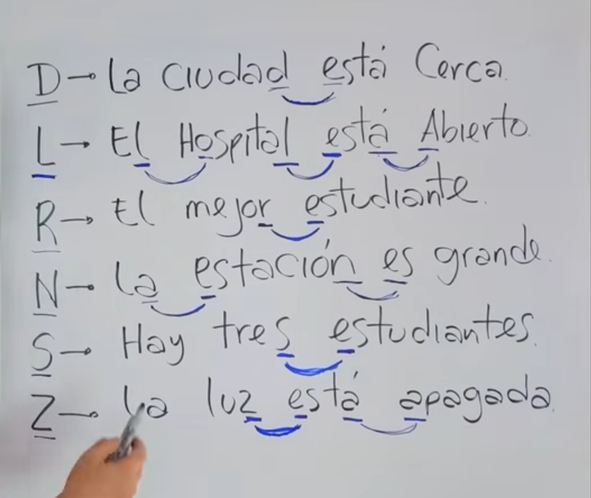
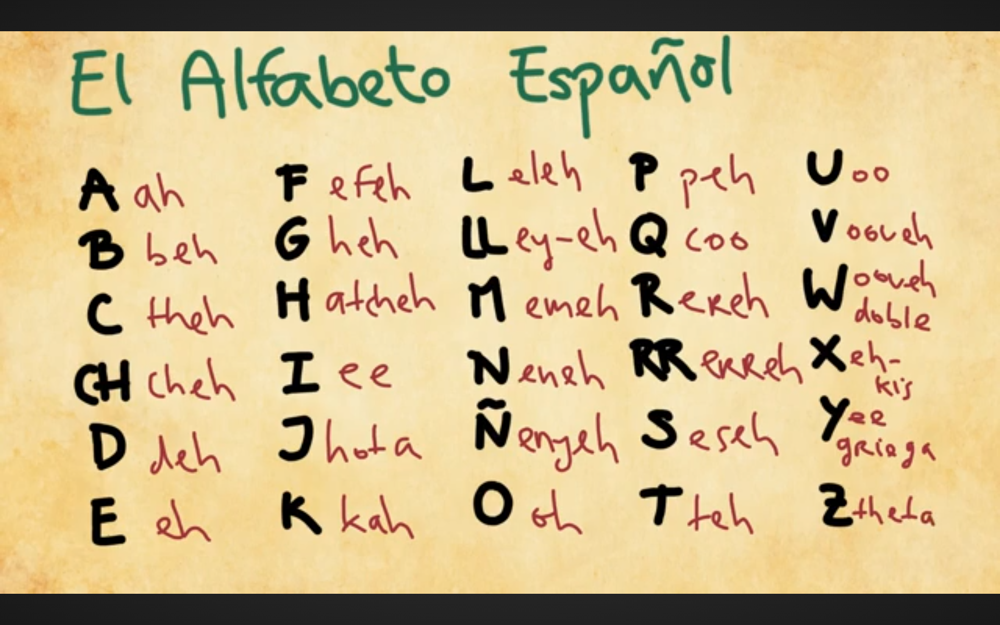

[[Spanish Verbs]]
[[Spanish Verb Tenses]]

Babbel support - support@babbel.com
 
# Table of Contents 
[[#Common Phrases]]
- [[#Greetings]]
- [[#Small talk]]
- [[#Exclamations]]
- [[#Short phrases]]
- [[#Holiday Greetings]]
[[#Common Adverbs & Adjectives]]
- [[#Turning verbs into adjectives]]
- [[#Turning adjectives into adverbs]]
- [[#Adjectives Before vs. After the Noun]]
[[#Todo vs Cada]]
[[#Question words (interrogatives)]]
- [[#Qué vs Cuál]]
- [[#"How do you" expressions]]
- [[#Interrogatives Summary]]
[[#Articles]]
[[#Possesive Adjectives]]
[[#Some/Any variations]]
- [[#Referring to People or Objects]]
[[#Prepositions]]
[[#Pronouns]]
- [[#Direct Object Pronouns]]
  - [[#it and them]]
- [[#Indirect Object Pronouns]]
  - [[#Attach Indirect Object Pronouns to Verbs]]
- [[#Relative pronouns]]
- [[#Indefinite pronouns]]
- [[#Reflexive verbs and pronouns]]
- [[#Possessive pronouns (singular/plural)]]
[[#Uses of *lo*]]
- [[#As a direct object pronoun referring to a masculine noun]]
- [[#As a neuter article often meaning "the thing" combined with an adjective in the masculine singular form]]
- [[#Lo que (that which, what)]]
- [[#*Lo* meaning "how" often used with *mucho*]]
- [[#*Lo* used in idiomatic expressions]]
[[#Vosotros]]
[[#this/these, that/those]]
[[#Expressing that something still hasn't happened, just happened and keeps happening]]
- [[#Still hasn't happened]] 
- [[#Just happened or finished]]
- [[#Keeps happening repeatedly]]
[[#Conditional sentences]]
[[#Commands]]
[[#Noun gender tips]]
- [[#Article Gender Noun Exceptions]]
[[#Comparisons]]
- [[#Differences]]
- [[#Equality]]
- [[#Comparison pairs]]
- [[#Bien vs bueno]]
- [[#Algo/alguien vs nada/nadie]]
- [[#Algún/ningún vs alguno/ninguno]]
[[#Superlatives]]
[[#Bein vs bueno]]
[[#Por vs Para]]
[[#al versus del]]
[[#Sizes]]
[[#Home related]]
- [[#Kitchen]]
- [[#Bathroom]]
- [[#Bedroom]]
[[#Bedtime activities]]
[[#Relationships]]
- [[#Nationality]]
[[#Occupations]]
[[#Small and cute - los diminutivos]]
[[#Location related words and phrases]]
- [[#Proximity]]
- [[#Directions]]
[[#Transportation and travel]]
- [[#Destinations (destinos)]]
[[#Weather]]
- [[#Weather Vocabulary]]
- [[#Weather Phrases]]
[[#Computer related]]
[[#Sports (Deportes)]]
[[#Soccer (fútbol)]]
- [[#Field Positions]]
- [[#Plays]]
- [[#Non-playing positions]]
- [[#Field layout]]
- [[#Fútbol equipment]]
[[#Body parts (partes del cuerpo)]]
- [[#Face (la cara)]]
- [[#Body (el cuerpo)]]
- [[#Organs (los órganos)]]
- [[#Sickness and Injury]]
[[#Feelings & Emotions]]
- [[#Complementing someone's looks]]
- [[#Verbs used when expressing feelings]]
[[#Clothing (la ropa)]]
[[#Food]]
- [[#Food feelings]]
- [[#Cooking related]]
- [[#Salad (ensalada)]]
- [[#Non-Salad Vegetables]]
- [[#Fruit (fruta)]]
- [[#Meat (carne)]]
- [[#Seafood (el marisco)]]
- [[#Desserts (postres)]]
- [[#Snacks]]
- [[#Meals]]
- [[#Drinks]]
- [[#Spanish Dishes]]
- [[#Ordering at a restaurant]]
[[#Animals (animales)]]
[[#Trees (árboles)]]
[[#Shopping]]
[[#Commands]]
[[#Noun gender tips]]
- [[#Article Gender Noun Exceptions]]
[[#por vs para]]
[[#al versus del]]
[[#Use of the personal 'a' in Spanish]]

[[#Pronunciation]]
- [[#Vowels]]
- [[#Consonants]]
- [[#Sounds nearly the same in Spanish as English]]
- [[#Stressed syllables]]
- [[#Diphthong Pronunciation Rules]]
- [[#Connected speech (Discourso conectado)]]
[[#Spanish Alphabet]]
[[#Cognate tricks for translating English to Spanish]]
[[#Pattern for creating sentences using two verbs, the second being an infinitive]]
[[#Spanish in Latin America vs Spain]]

[[#Numbers (números)]]
- [[#Arithmetic]]
- [[#Ordinals (Rank)]]
- [[#Measurement quantities]]
- [[#Years(años)/Dates(fechas)]]
[[#Time]]
 - [[#Telling time]]
 - [[#Using *desde* and *desde hace* and *hace* to talk about time]]
[[#Days of the week]]
[[#Months (meses)]]
[[#Weather]]
- [[#Vocabulary]]
- [[#Phrases]]
[[#Colors (Colores)]]

[[#Holiday Greetings]]
[[#Common Phrases]]

[[#Spanish learning resources]]

---
# Common Adverbs & Adjectives

***Note: Adjectives always come after the noun they refer to.***

bien - well (bueno=good)
mal - badly (malo=bad)
cada - each/every
todos - every (See [[#Todo vs Cada]])
- todo el mundo - everybody 
solamente - just/only
solo - only 
único - only
listos - ready
cierto - sure
debería - should 
tal - such
ya - already 
algo - something 
algún, alguno(a) - one, a, an, any
algunos(as) - some, any
ningún, ninguno(a) - none, not one 
alguna vez - ever
alguien - someone 
a veces - sometimes
ambos(as) - both
mismo(a) - same
- yo mismo(a) - myself
- mi mismo(a) - myself
otro(a) - another/other 
otra vez - again
a menudo - often 
un par de veces - a couple of times 
- cuatro veces - four times 
antes - before
después - after
nunca - never
casi - almost
demasiado - too
- demasiados - too much 
tanto(a)/tantos(as) - so much/so many 
- tan - so
tan...como - as ... as
- tanto(a)...como -as much/many ... as
bastante - quite, quite a lot of, enough 
tal vez - maybe 
- quizás - maybe (ES)
- posible - possible
- imposible - impossible 
- a lo mejor - maybe/possible
todavia - still, yet (something that didn't take place or wasn't completed)
- aún - still, yet
porque - because 
acá - here
- aquí 
allá - over there
ahí - there 
verdad - true
realmente - really 
 - verdaderamente - really, truly 
seguramente - surely, probably 
supremamente - supremely
sumamente - highly, extremely 
extremadamente - extremely 
increíblemente - incredibly 
altamente - highly 
simplemente - simply/plainly afortunadamente - fortunately 
desafortunadamente - unfortunately 
- lamentablemente - unfortunately 
frecuentemente - frequently 
inmediatamente - immediately 
actividad - activity 
oportunidad - opportunity 
calidad - quality
cantidad - quantity
irreproachable - irreproachable 
rápidamente - quickly, rapidly 
adrede - intentionally, deliberately, on purpose 
híper - hyper
por fin - finally, at last 
- finalmente - finally 
en fin - anyway 
bastante - quite
seguro - sure/safe
tampoco - either/neither 
- Yo tampoco - Me neither.
- Context determines if meaning is either or neither.
ninguno - neither 
feo(a) - ugly
cómodo(a) - comfortable 
incómodo(a) - uncomfortable
en lugar de - in place of, instead of 
estupendo(a) - stupendous, wonderful 
tremendo(a) - tremendous
fantástico - fantastic
excelente - excellent 
óptimo(a) - optimal
hermosísimo(a) - really beautiful 
bellísimo(a) - really beautiful 
carisimo(a) - really expensive 
así - this way, that way, like this, like that
while - mientras 
then - entonces 

#### Turning verbs into adjectives 
In English, we can use verbs (like to haunt) as adjectives. For example, in "The house is haunted", haunted describes the word house.

You can do the same thing in Spanish! 
For -ar verbs, use -ado and for -er and -ir verbs, use -ido.

pintar -> pintado(a) - painted 

perder -> perdido(a) - lost

dormir -> dormido(a) - asleep 

Notice that the endings also change depending on gender and number.

*La cafetera está apagada.*
The coffee maker is off.

*Los hombres están perdidos.*
The men are lost.

[[#Table of Contents]]
#### Turning adjectives into adverbs

For adjectives that end in an *e*, add *mente* to the end.

For adjectives that end in an *e* or a consonant, add *mente* to the end.

For adjectives that end in an *o*/*a* add *mente* to the end if the feminine form.

[[#Table of Contents]]

#### Adjectives Before vs. After the Noun

In Spanish, adjectives can come either after or before the noun — and that can be pretty confusing. So below I’ve explained what actually determines the order of nouns and adjectives in a sentence.

***AFTER the noun → Literal, descriptive, factual***

This is the default and most common word order in Spanish. When you place the adjective after the noun, you’re usually describing a real, objective, or physical quality of the thing you're talking about.

Un coche grande → A big car.

Una casa nueva → A house that was just built.

Un amigo viejo → A friend who is old.

Una historia cierta → A story that is true.

***Adjective BEFORE the noun → Figurative, emotional, subjective***

Placing the adjective before the noun often adds an emotional, figurative, or interpretive twist. You’re not just describing — you’re expressing something: a feeling, a personal judgment, or a commonly accepted quality.

Una gran sorpresa. → A great surprise.

Un dulce recuerdo → A sweet (emotional) memory.

Un viejo amigo → A longtime friend.

**From**: https://www.reddit.com/r/SpanishAIlines/s/ssupchRLld

[[#Table of Contents]]

## Todo vs Cada

### The meaning of todo

todo means all in English when a noun doesn't follow.

*Eso es todo.*
That's all.

Before singular nouns, todo/a means whole.

*He entrenado todo el día y toda la noche.*
I have trained the whole (all) day and the whole (all) night.

Before plural nouns, todos/as means all.

*Todos los jugadores están aquí.*
All the players are here.

Before a noun, todo functions as a normal adjective and agrees with the noun. The definite article always comes between todo and the noun.

*¡Él controla todo el juego!* 
He's controlling the whole game!

*Entrenan toda la noche.*
They train the whole (all) night.

*¿Han elegido a todos los jugadores?*
Have they chosen all the players?

*Comenzamos con todas las bolas.*
We start with all the balls.

### Cada and todo used with time activities

**With regard to regular time activities, you use todos/-as in the plural form with the meaning of every**.

*Todos los años participamos en el torneo.*
Every year (lit. All the years) we participate in the tournament.

**With regard to singular nouns, you can use cada (each/every) without the article. The meaning stays the same.**

*Cada año participamos en el torneo.*
Each year, we participate in the tournament.

The word ***cada*** (each/every) never changes. It **remains the same when preceding masculine and feminine nouns in the singular form.**

[[#Table of Contents]]
# Question words (interrogatives)

## **what - qué**
- often used when asking about a definition: ¿Qué es ...? - What is ...?
- used before a noun.
  - ¿Qué hora es? - What time is it?
  - in LA, cuál or cuáles often used here 
- used before a verb
  - Qué quieres? - What do you want?
- lo que - what , that which, the thing that 
    - *NOT an interrogative*. Often used in the middle of a sentence.
    - refers to a general idea or concept, but not a specific noun.
    - You know what I want - *Tú sabes lo que quiero.*
    - What I want from you is cooperation - *Lo que quiero de ti es cooperación.* (not a question)
    - I don't understand what you said - *No entiendo lo que dijiste.*
    - What I like (that thing that I like) is chocolate - *Lo que me gusta es chocolate* 
    - What I want to do is... - *Lo que quiere hacer...*
- *que* can be used to mean "that" when it is not used to point to something .
  - I want to say that I love you. - *Quiero decir que te amo.*

## **which/what - cuál**
- often used if there is more than one choice: ¿Cuál es...? - Which/What is.. ?
- See [[#Qué vs Cuál]] to learn how each can be used for "what" questions.
- Used when the question asks for a definite answer: ¿Cuál es tu nombre? - What is your name?
- used before a verb that isn't a form of *ser* where there is a small subset of answers. Asks the question "Which one?"
  - ¿Cuál te gusta más? - Which one do you like more?
- ¿Cuál de...? - which of a list of options: ¿Cuál de Italia. Alemania y España tiene más gente? - Which of Italy, Germany and Spain have more people?
- cuáles - if which/what refers to a plural 

## **what for? - ¿para qué?**

## **when - cuando**

## **where - dónde**
- where are... - dónde están
- ***adónde*** - **to where**: someone or something is moving toward a particular place 
  - Where are we going tomorrow? - ¿Adónde vamos mañana?
  - Can be written as 'a dónde'
- ***de dónde*** - **from where**: origin or source of someone or something.
  - Where are you from? - ¿De dónde eres?

## **how - cómo**
- qué can be used here before an adjective 
- **how many - cuántos(as)**
- **how much - cuánto(a)**
- Also see [[#"How do you" expressions]]

## **who - quién**
- **quiénes - who (a group)**
- de quién - whose 
  - See cuyo(a)/cuyos(as) in [[#Relative pronouns]] when "whose" is used inside the sentence 
- de quiénes - plural whose
- con quién - with whom 
## **why - por qué**

## Qué vs Cuál 
What (qué) and which (cuál) differences are not often obvious in English. 
- "What is your favorite ice cream flavor" and  "Which is your favorite ice cream flavor" are often used interchangeably.
### Using qué or cuál for "What"
#### When asking a definition with *ser*,  use Qué 
"¿Qué es...?"
- ¿Qué es 'coche' en ingles? 
- ¿Qué es esto? - What is this?
#### When asking for a simple answer with ser, use Cuál 
"¿Cuál es...?"
- ¿Cuál es tu nombre?
- ¿Cuál es tu dirección?
- ¿Cuál es tu música favorita?

#### When asking for a simple answer with another verb (besides ser), use Qué 

- ¿Qué quieres cenar? - What do you want for dinner?
#### When asking for a choice with another verb (besides ser), use Cuál 
- ¿Cuál quieres ver? - What do you want to watch?
You also can use "Cuál de" to indicate options 
- ¿Cuál de estos libros has leído? - Which of these books have you read?
##### Use Qué when followed by a noun
- ¿Qué hora es? - What time is it?
- ¿Qué país visitaste? - What country did you visit?

## "How do you" expressions 
- ¿Cómo se dice? - How do you say it? 
- ¿Cómo se escribe? - How do you write it? 
- ¿Cómo se deletrea? - How do you spell it? 
- ¿Qué quiere decir casa en inglés? - What does "house" mean in English? (asking for the translation of a word: ¿Qué quiere decir ... en inglés?)
  - ¿Qué significa casa en inglés? - alternate phrase 

## Interrogatives Summary

| Spanish               | English                       |
| --------------------- | ----------------------------- |
| a qué + distancia     | how far                       |
| qué + noun            | what*                         |
| cuál                  | which/what*                   |
| cuál de               | which of                      |
| cómo                  | how                           |
| cuándo                | when                          |
| dónde                 | where                         |
| de dónde              | where from (origin or source) |
| a dónde               | to where (movement)           |
| cuánto/cuánta         | how much                      |
| cuántos/cuántas       | how many                      |
| cuánto tiempo         | how long                      |
| quién/quiénes         | who                           |
| de quién/de quiénes   | whose                         |
| con quién/con quiénes | with whom                     |
\* See [[#Qué vs Cuál]] above for use in "What" questions

**Question words are usually placed at the beginning of the sentence unless there is a preposition that goes with the verb. That preposition goes before the placed before the question word.**

[[#Table of Contents]]

# Articles 
## definite (the)
- el
- la
- los
- las
## Indefinite 
- un, una - one, a
- unos, unas - some

# Possesive Adjectives 
## Singular and plural forms
- mi/mis - my
- tu/tus - you
- su/sus - his, her, your
  - **object + de + person** - to specify *su*
    + el carro de Pablo
    + el carro de Carmen 
    + el carro de usted
    + el carro de él
    + el carro de ella

See also [[#Possessive pronouns (singular/plural)]]

[[#Table of Contents]]
# Some/Any variations 
Some/Any - algún(a)
Something/Anything - algo
Someone/Somebody/Anyone/Anybody - alguien 
Any - cualquier 
- any place - cualquier lugar
#### Nobody/Nothing 
Nobody - nadie
Nothing - nada

## Referring to People or Objects 
### To people 
alguien - someone/somebody 
nadie - no one/nobody 
### To an object 
algo - something 
nada - nothing/anything 

[[#Table of Contents]]
# Prepositions
See this video for a complete list and meanings: https://youtu.be/RLnwem941ok?si=TKTQBlWQNqM3fKHK

- durante - during, for (an amount of time)
- a - to 
- por - for and others 
- para - others and for
- contra - against 
- con - with
- sin - without
- de - of, from (refers to possession) 
- desde - from, since (implies motion)
- entre - between, among 
- sobre - over, above, on top, on top of, about
  - el sobre - envelope (noun)
- en - in, on, at, into
- antes de - before 
- después de - after
- debajo de - under
- dentro de - inside, inside of 
- encima de - on top, on top of
- cerca de - close to, near. around 
- alrededor de - around 
- a través de - through (end to end)
- acerca de - about (a subject)

- tan ... como ... - so .... as ...
- entonces - so, then
- pero - but
- pero que - because 

[[#Table of Contents]]
# Pronouns

| (Person)        | English Object Pronouns | Spanish [[#Direct Object Pronouns]] | Spanish [[#Indirect Object Pronouns]] |
| --------------- | ----------------------- | ----------------------------------- | ------------------------------------- |
| (Yo)            | Me                      | Me                                  | Me                                    |
| (Tú)            | You                     | Te                                  | Te                                    |
| (Él / Ella)     | Him / Her / It          | Lo / La                             | Le (Se before Lo/La)                  |
| (Usted)         | You (Formal)            | Lo / La                             | Le (Se before Lo/La)                  |
| (Nosotros)      | Us                      | Nos                                 | Nos                                   |
| (Vosotros)      | You All                 | Os                                  | Os                                    |
| (Ellos / Ellas) | Them                    | Los / Las                           | Les (Se before Los/Las)               |
| (Ustedes)       | You All (Formal)        | Los / Las                           | Les (Se before Los/Las)               |

***Direct object pronouns answer what? or whom***? (e.g., *Lo vi* → "I saw him/it.")

***Indirect object pronouns answer to whom***? or for whom? (e.g., *Le di el libro* → "I gave him/her the book.")

When both object pronouns are used together ***the indirect object pronoun comes before the direct object pronoun***. If "le/les" comes before "lo/la/los/las," "le/les" changes to se (*Se lo di* instead of *Le lo di*). 

Remember, little words like *me or te* generally come before the verb, like in *Me llamo Duo.

[[#Table of Contents]]
## Direct Object Pronouns 
A direct object pronoun (*un pronombre de objeto directo*) replaces a direct object, which is **a noun that directly receives the action of a verb** in a sentence.
A way to remember them is to note the article that is used with the noun that will be replaced by a pronoun:
- la, las (f) & los (m) articles are the same when used as direct object pronouns 
- el (m) becomes lo when used as a direct object pronoun.
Direct object placement follows the following rules:
- Attached to infinitive: comer (to eat) becomes comerla (eat it)
- Attached to a gerund (ing word): comiendo (eating) becomes comiendola (eating it)
- Attached to an affirmative command: hazlo (Do it) or hágalo ([you (formal:usted)]do it)
- Before a conjugated verb: put the pronoun before the verb: lo hago (I do it) Él los quiere ver (He wants to see it)
Don't use a direct object pronoun with a preposition. **DO NOT do this**: 
~~para la~~ - for it/him
~~sobre la~~ - about it/her
~~en las~~ - in them
 
See https://www.spanishdict.com/guide/direct-object-pronouns-in-spanish

**When referring to people who are not replaced by a direct object pronoun, you always need the preposition "a".**

*Ella ha llamado a su madre.*
She has called her mother.1

*María quiere mucho a Raúl.*
María loves Raúl a lot.

*¿Quién ha despertado al señor?*
Who has woken the man up?

**For objects, you only use the article and no preposition is necessary.**

*No tenemos el periódico.*
We don't have the newspaper.

*Ellos leen la revista.*
They read the magazine.
### it and them
Often used as direct object pronouns when *it* and *them* refer to objects 
#### it
lo - a masculine object 
la - a feminine object 
lo/la tengo - I have it (lo or la depending on what gender *it* is)
#### them
los - a masculine object 
las - a feminine object 
los/las tango - I have them (los or las depending on what gender *them* is)

[[#Table of Contents]]
## Indirect Object Pronouns 

An indirect object pronoun tells you **to whom or for whom something is done**.  It is often used for receiving and giving.

In simple terms, the indirect object pronoun answers the questions:
- To who/what
- For who/what

Here are the indirect object pronouns in Spanish:
me (to/for me)
te (to/for you)
le (to/for him/her/it)
nos (to/for us)
os (to/for you all)
les (to/for them)

**_Indirect object pronouns always come before the direct object pronoun (if there is one) in the sentence. If is attached to an infinitive, gerund or affirmative command then it is the first suffix._**

*Díselo*
Tell it to her (*her (se)* is the IOP)

See https://www.spanishdict.com/guide/indirect-object-pronouns

[[#Table of Contents]]
### Attach Indirect Object Pronouns to Verbs
1. If your sentence has an infinitive verb, you can attach these little words to the end of that instead!
	1. Ella se quiere quedar en Nueva York.
	    She wants to stay in New York.
        becomes:
        Ella quiere *quedarse* en Nueva York.
        She wants to stay in New York.

	2. ¿Me vas a decir tu nombre?
       Are you going to tell me your name
       becomes:
     ¿Vas a *decirme* tu nombre?
     Are you going to tell me your name?
2. Attached to gerund
	1. Le estoy preguntando
		I am asking him
		becomes:
		Estoy *preguntandole*
		I am asking him
3. Attach to an affirmative command
	1. Le quiero preguntar
	   I want to ask him/her/it
	   becomes:
       Quiero *preguntarle*
		Ask him
4. Before the conjugated verb
    Le pregunto
    I ask him/her/it

***If the indirect object is not specified, you have to add it onto your sentence for clarity:***
*Le compré flores...*
I bought flowers for...
becomes:
Le compré flores *a mi novia*
I bought flowers for my girlfriend 

***Like a direct object pronoun, you DO NOT put an indirect object pronoun before a preposition*** 

[[#Table of Contents]]

## Relative pronouns 

A Spanish relative pronoun is a word that **refers back to a previously mentioned noun** (called the antecedent) **and introduces a relative clause** that provides additional information about it.  These pronouns ***link two related ideas into a single, more detailed sentence, avoiding repetition.*** 

### Common relative pronouns

- **que** – used for people, things, animals, or abstract ideas (e.g., *El libro que leí es interesante* – "The book that I read is interesting"). 
- **quien/quienes** – used specifically for people, often after prepositions (e.g., *La mujer con quien hablé* – "The woman with whom I spoke"). 
- **el que / la que / los que / las que** – used to refer to people or things with a definite article; agree in gender and number with the antecedent. 
- **el cual / la cual / los cuales / las cuales** – formal equivalents of el que, often used when there’s a gap between the antecedent and the pronoun. 
- **lo que / lo cual** – used to refer to ideas, concepts, or entire clauses (e.g., *No entiendo lo que dices* – "I don’t understand what you’re saying"). 
- **donde** – refers to place (e.g., *El lugar donde viví* – "The place where I lived"). 
- **cuando** – refers to time (e.g., **El día cuando nací** – "The day when I was born"). 
- **cuyo(a)/cuyos(as)** – means "whose" and shows possession (e.g., *El hombre cuyo coche se averió* – "The man whose car broke down"). 

Unlike English, Spanish relative pronouns cannot be omitted and must agree in gender and number with their antecedent when applicable. 
## Indefinite pronouns

Indefinite pronouns are vague – they either refer to unspecific nouns or make sweeping generalizations.
### Characteristics of indefinite pronouns
- Replace indefinite adjective + noun
- Several are identical to Spanish indefinite adjectives
- May need to agree with the noun they replace in gender or number
- May be subject, direct object, indirect object, or object of a preposition

### Spanish indefinite pronouns

| Masculine     | Feminine | Translation      |
| ------------- | -------- | ---------------- |
| algo          |          | something        |
| alguien       |          | someone          |
| alguno        | alguna   | a certain one    |
| algunos       | algunas  | some, a few      |
| cada uno      | cada una | each one         |
| ciertos       | ciertas  | some             |
| cualquiera    |          | anyone, whoever  |
| muchos        | muchas   | a lot. much,many |
| un otro       | una otra | another one      |
| otros         | otras    | others           |
| sí            |          | one              |
| sí mismo      | sí misma | oneself          |
| todo          |          | everything       |
| todo el mundo |          | everyone         |
| uno           | una      | one              |
| varios        | varias   | some, several    |
See https://www.lawlessspanish.com/grammar/pronouns/indefinite-pronouns/

[[#Table of Contents]]
## Reflexive verbs and pronouns 
A reflexive pronoun (pronombre reflexivo) is used as part of a reflexive verb (verbo reflexivo) to indicate that someone or something is performing an action on or for itself.

The reflexive pronoun is placed before the verb.
### Reflexive pronouns for each person
yo - me
tu - te
el/ella/usted - se
nosotros - nos
vosotros - os
ellos/ellas/ustedes - se

### Reflexive verbs
- ducharse - shower oneself  
- bañarse - to bathe oneself 
- lavarse - wash oneself
- secarse - to dry oneself
- vestirse - get dressed (e->i)
- maquillarse - put on makeup 
- peinarse - comb oneself
- cepillarse - brush (teeth or hair)
- acostarse - go to bed (o->ue)
- dormirse - to fall asleep (o->ue)
- despertarse  - wake up (e->ie)
- levantarse - to get up (from reclining)
- enfadarse - get angry 
- llamarse - call oneself

You can also add reflexive pronouns to verbs that are not regularly reflexive in order to make them reflexive:

verse - to see one’s self (yo veo)
hablarse - to talk to one’s self
escribirse - to write to one’s self
comprarse - to buy (something) for one’s self

See https://www.spanishdict.com/guide/reflexive-verbs-and-reflexive-pronouns

[[#Table of Contents]]
## Possessive pronouns (singular/plural)

***Note: possessive pronouns always agree in gender and number (singular/plural) to the noun they refer to.***
### Possessives used before the object/noun 
yo - mi/mis - my (sing/pl)
tú - tu/tus - your (sing/pl) (LA)
- vuestro(a)/vuestros(as) - ES pl
el/ella/usted - su/sus - his/her (sing/pl)
nosotros - nuestro/nuestros - our
ellos/ellas/ustedes - su/sus - their
### Possessives used after the object/noun
yo - mio/mia,míos/mías - mine
tú - tuyo(os)/tuya(as) - yours
el/ella - suyo(os)/suya(as)* - his/hers
ellos/ellas/ustedes - suyo(os)/suya(as) - theirs/yours \*
nosotros - nuestro(os)/nuestra(as) - ours
vosotros(ES) - vuestro(os)/vuestra(as) - yours (informal, plural)

\* suyo/suya is often ambiguous, so in that case it can  be used with 'de' to identify the particular object/person doing the possession 
Also see [[#Relationships]]

**Stressed possessive pronouns can also come straight after the noun. In this case you emphasize things and people which belong to a group.**

***Una amiga mía habla muy bien inglés.***
A friend of mine speaks very good English.

***¡Esos discos tuyos de rock son viejísimos!***
These rock records of yours are ancient!

**You can use the definite article el, la, los, las before a stressed possessive pronoun in the place of a noun, provided that the noun has already been mentioned.**

*Esta es tu cartera. La mía está en casa.*
That's your wallet. Mine (lit. The mine) is at home.!

*Me gustan estos cuadros, pero los tuyos son más bonitos.*
I like these pictures, but yours (lit. the yours) are nicer.

The stressed possessive pronouns always come after the noun that they refer to. Just like adjectives, they have to agree with the nouns in gender and number, by adding the usual endings.

*Ese dinero es mío.* 
That money is mine.

*Esas cosas son suyas.* 
Those things are his.

[[#Table of Contents]]

## Subject Pronouns 

These substitute for the noun of the sentence.

| Singular                                    | Plural                                             |
| ------------------------------------------- | -------------------------------------------------- |
| yo (I)                                      | nosotros/nosotras (we)                             |
| tú, vos** (informal you) usted (formal you) | vosotros/vosotras (infml pl. you*)   ustedes (you) |
| él (he)ella (she)                           | ellos/ellas (they)                                 |
|                                             |                                                    |
\* Spain
\** Argentina, Uruguay and Paraguay
### See:
https://www.spanish.academy/blog/a-beginners-guide-to-spanish-subject-pronouns/

[[#Table of Contents]]
# Uses of *lo*
## As a direct object pronoun referring to a masculine noun
*Lo conocí ayer* 
I met him yesterday 
## As a neuter article often meaning "the thing" combined with an adjective in the masculine singular form
*lo bueno* - the good thing 
*lo importante* - the important thing 
*lo curioso* - the curious thing 
*lo más difícil* - the most difficult thing 

## Lo que (that which, what)
*Nunca sabes lo que tienes que lo pierdes.*
You never know what you have until you lose it. (Note that translating *lo que* as "that which" helps you understand when you use *lo que* for "what". Also note that "what" is not a question word here.)

*Lo que más me gusta es leer novelas.*
What I like most is reading novels.

*Lo que necesito es un poco de tiempo a solas.*
What I need is some time alone.

*Lo que necesito es un poco de café.*
What I need is a little coffee.

*Ella siempre hace lo que dice.*
She always does what she says.

*Soy lol que soy.*
I am what I am.

## *Lo* meaning "how" often used with *mucho*
*No sabes lo mucho que te quiero.*
You don't know how much I love you.

*Me impresión lo mucho que sabes sobre este tema.*
It impresses me how much you know about this topic.

## *Lo* used in idiomatic expressions
*a lo largo* - along, throughout 
*a lo lejos* - in the distance, far away 
*lo antes posible* - as soon as possible 
*por lo visto* - apparently 

[[#Table of Contents]]
# Vosotros 

**In Spain, *Vosotros* is an informal 'you all'
*Ustedes* is still used as a formal 'you all'

|               | Singular          | Plural                  |     |
| ------------- | ----------------- | ----------------------- | --- |
| First person  | yo                | nosotros / nosotras     |     |
| Second person | tú                | vosotros / vosotras     |     |
| Third person  | él / ella / usted | ellos / ellas / ustedes |     |
See [[https://blog.duolingo.com/what-is-spanish-vosotros/]]

### Conjugation of vosotros for regular verbs
 Remember that vosotros is used for you-all instead of ustedes 

| Verbs | Present | Preterite | Future |
| ----- | ------- | --------- | ------ |
| -ar   | -aís    | -asteis   | -aréis |
| -er   | -éis    | -isteis   | -eréis |
| -ir   | -ís     | -isteis   | -iréis |
See [[https://youtu.be/CO0VKeEawtc?si=KUaFu-u2MWnilmzE]]

[[#Table of Contents]]
# this/these, that/those
#### Used to indicate distance to an object 
##### 1. Close Objects

**this - esta (fem) este (masc)**
**these (plural) - estas (fem) estos (masc)**

##### 2. Not Close Objects

**that - esa (fem) ese (masc)**
**those (plural) - esas (fem) esos (masc)**

##### 3. Neutral or Abstract Situations 

esto/eso - abstract or neutral this or that 
- Por ejemplo:
  - This is it! - ¡Esto es todo!
  - What is that? - ¿Qué es eso?

- Esto is often used informally when the noun is not used in the sentence. 
  -   Esto es interesante - This (thing I'm holding) it's interesting

Pneumonic: 
***THIS* AND *THESE* HAVE Ts
*THAT* AND *THOSE* DON'T**

#### 4. Objects Further Away 
aquella(s) - feminine 
aquello(s) - masculine 
aquel - neutral 
## General rules for this/these & that/those

1. ***Este(s)*** refers to things close by (this/these)
2. ***Eso(s)*** refers to things a bit further away (that/those)
3. ***Aquello(s)/Aquella(s)/Aquel*** refers to a thing/things a long distance away.

Just as with the other demonstrative pronouns, esto, eso and aquello are used according to the distance from the object referred to. ***They always refer to objects***:

*Esto es un limón.*
This is a lemon.

*Eso es un limón.*
That is a lemon.

*Aquello es un limón.*
That over there is a lemon.

[[#Table of Contents]]

# Expressing that something still hasn't happened, just happened and keeps happening 

## Still hasn't happened

**The formulation of *seguir sin***

By using the irregular verb ***seguir (to continue, to follow) and sin (without) + the infinitive of a verb***, you express that something still hasn't been done.

*Siguen sin resolver el problema.*
They still haven't resolved (lit. continue without resolving) the problem.

*Sigo sin pagar el recibo de teléfono.*
I still haven't paid (lit. continue without paying) the telephone bill.

Also see: [[Spanish Verbs#seguir - to continue, to follow]]
## Just happened or finished 

**The formulation of *acabar de***

You use acabar de + the infinitive of a verb to express that something has just been done.

*Pedro acaba de desayunar.*
Pedro has just had breakfast.

It is ***often used to say if something is finished or not.***

*Todavía no he acabado de limpiar.*
I still haven't finished cleaning.

*¿Cuándo acabas de cocinar?*
When will you finish cooking?

Also see: [[Spanish Verbs#acabar - to finish, end, complete]]
***Note:*** acabar is a regular verb

## Keeps happening repeatedly 

**The formulation of *volver a***

You use volver a + the infinitive of a verb for something that ***keeps happening or for an activity that happens again***. Volver literally means to return.

*Volvemos a ver la película.*
We are seeing the film again.

*Vuelven a arrojar basura.*
They keep throwing trash out.

[[#Table of Contents]]

# Conditional sentences 
Also see [[Spanish Verbs#Conditional tense]]

### The sequence of tenses in real conditional clauses (si-clauses)

Conditional sentences always have a fixed sequence of tenses.

The first verb in the sentence with Si is in the present tense. In the next sentence after the comma, the second verb is in the present tense or alternatively in the future. There can also be conditional sentences that start in the future and end in the past too.

*Si tienes 18 años, ya eres mayor de edad.*
If you are 18 years old, you are already of legal age.

*Si estudias mucho, aprobarás el examen.*
If you study a lot, you will pass the exam.

The compound future tense with ir a + the infinitive is also possible.

*Si estudias mucho, vas a aprobar el examen.*
If you study a lot, you're going to pass the exam.

[[#Table of Contents]]
# Relationships
los/las familiares - relatives
- pariente - relative
la madre - the mother 
el padre - the father 
el padres - the parents 
el hijo - the son
los hijos - the children or sons (parents would say)
- los niños - the children (generic)
- la ninez - childhood 
la hija - the daughter 
el hermano - the brother
- los hermanos - siblings
la hermana - the sister 
- las hermanas - female siblings 
la abuela - the grandmother 
el abuelo - the grandfather 
los abuelos - the grandparents 
el sobrino - the nephew 
la sobrina - the niece 
el tío - the uncle 
la tia - the aunt
el nieto - the grandson 
la nieta - the granddaughter 
los nietos - the grandchildren 
primo(a) - cousin (m/f)
el marido - the husband (ES)
- el esposo (LA)
la mujer - the wife (ES)
- la esposa (LA)
- la mujer - the woman (in ES it depends on context)
- media naranja - soulmate, better half 
suegra - mother-in-law
suegro - father-in-law
yerno - son in-law
el hombre - the man
casado(a) - married 
divorciado(a) - divorced
soltero(a) - single 
adolescente - teenager
vecino(a) - neighbor 
el colega - colleague
la gerente - manager 
jefe(a) - boss
la reunión - meeting 
amigo(a) - friend 
- la amistad - friendship 
muchacho - boy
muchacha - girl
la cita - date (going out)
el beso - kiss

Also see [[#Possesive pronouns (singular/plural)]]]

## Nationality 
US American - estadounidense 
Spaniard - español(a)
Mexican - mexicano(a)
English - inglés(a)
French - frances(a)
Italian - italiano(a)
Chinese - chino(a)

[[#Table of Contents]]
# Small and cute - los diminutivos

## The diminutive with -ito

***The ending -ito is added to nouns, adjectives and adverbs to form the diminutive in Spanish***. This makes everyday Spanish alive and expressive.

*Espera un momentito.*
Wait a second (lit. a little moment).

*Ella tiene un perro pequeñito.*
She has a tiny (lit. very small) dog.

*La niña corre rapidito.*
The girl runs quite fast.

***Just as with the adjectives, the form of the ending agrees with the noun in gender and number. The masculine singular ending is -ito, the feminine is -ita. In the plural you add an -s to those endings.***

*Mi casa es pequeñita, pero hermosa.*
My house is quite small, but pretty.

*Manuelito juega con sus primitos y primitas.*
Little Manuel plays with his little cousins 

## Forming the diminutive

***If the word ends with a consonant then -ito is usually added.***

*El hámster es un animalito pequeño. (el animal)*
The hamster is a little animal.

***With words ending with -o or -a the -ito replaces these endings.***

*Nuestra abuelita se llama Rosalía. (la abuela)*
Our little granny is called Rosalía.

*Mis hermanitos tienen 5 y 3 años. (el hermano)*
My little brothers are 5 and 3 years old.

## More about the diminutive

***With words ending with -e, -r, or -n, -ito isn't added, but instead -cito.***

¿Te preparo un cafecito? (el café)
Shall I make a little coffee for you?

Mi amorcito, ¡cuánto te quiero! (el amor)
My little darling, how much I love you!

Quiero comprar un pantaloncito rojo para el bebé. (el pantalón)
I would like to buy a little red pair of pants for the baby.

***If the word has a z before the ending, then the z is dropped and -cito is used:***
taza -> tacita (small cup)
pedazo -> pedacito (small slice)

[[#Table of Contents]]

# Occupations
médico(a) - doctor 
enfermera(o) - nurse
estudiante de medicina - medical student 
dentista - dentist
artista - artist
escritor(ora) - writer
professor(a) - teacher 
- maestro(a)
cocinero(a) - cook
periodista - journalist 
abogado(a) - attorney 
juez(a) - judge
cantante - singer
poeta(poetisa) - poet
el vendedor - salesman 
el constructor - construction worker 
el programador - programmer 
ingeniero de software - software engineer

Soy jubilado por cinco años - I am retired for 5 years 

Trabajé como ingeniero de software - I worked as a software engineer 

¿Qué profesión tienes? - What do you do for a living?

[[#Table of Contents]]
# Computer related 
ordenador(ES) - computer
- computadora(LA)
ordenador portátil - laptop 
- portátil - laptop 
- la pantalla - screen
cargador - charger
aplicación - app
un línea - online
- universidad en línea - online college
ingeniero de software - software engineer
correo electrónico - email 
texto del mensaje - text message
enviar un mensaje - send a text
borrar - to delete 
archivos - files

[[#Table of Contents]]

# Sports (Deportes)

jugar - to play (sport, game) (irregular boot u->ue)
- jugador(a) - player
fútbol - soccer 
la carrera - run
- correr - to run (regular)
el ciclismo - cycling
- bicicleta/bici - bike
- andar en bicicleta - to ride a bicycle 
la natación - swim 
- nadar - to swim (regular)
pesca con mosca - fly fishing 
- pescar - fishing (regular; preterite yo pesqué)
el/la triatlón - triathlon 
el patinaje - skating 
el esquí - ski
- esquiar - to ski (irregular boot i->í )
el golf - golf

[[#Table of Contents]]
# Soccer (fútbol)
Names can be different in different Spanish speaking countries 

Home game - partido de casa 
Away game - partido fuera de casa 
## Field Positions
Goalie
- el portero - defends the *porteria*
- el arquero - defends the *arco* (arch)
- el guardamenta - translates to goalkeeper
- el goleador (ES)
- portero(a) (LA)
Defenders (defensas or defensores)
- defensas centrales - central defenderse
- laterales o carrileros - outside defenders or fullbacks 
- carrilero - wingbacka
Midfielders (mediocampistas/volantesi)
- medio de contención - defensive midfielder
  - pevote
  - mediocampista defensivo
- medio creativo - offensive midfielder (el diez)
  - mediocampista central 
Forwards (delanteros)
- delantero centro, ariete - central forward, striker
- extremo, puntero o interior - wingers
Substitute players
- el sublimente
- los reservas
- el suplente (ES)
- el banquillo - the bench 
## Plays
game tactics - las tácticas de juego 
atacar - to attack (regular)
- el ataque - the attack
kick off - saque inicial 
corner kick - saque de esquina o sacar de córner
goal kick - saque de puerta
free kick - toro libre 
center the ball - centrar el balón 
pass the ball - pasar el balón 
- make a pass - hacer un pase 
tackle - derribar
shoot - tirar o lanzar o chitat
- shoot a goal - meter un gol
aimed at the goal - apuntó al arco
header - rematar de cabeza
throw in - saque lateral o saque de banda
goal kick - saque de puerta 
penalty - penalti 
score a goal - marca un gol
- hacer un gol 
- marcar - to score (regular! preterite yo marqué)
equalizer goal - gold de empate 
tie the game - empatar el partido 
tie, draw - empate
win the game - ganar el partido 
lose the game - perder el partido 
offsides - fuera de juego 
to be on the bench - estar en el banquillo 
Score a goal - meter un gol
tácticas de juego - game tactics

lesionado - injured 

first half - el primer tiempo
half-time - descanso o medio tiempo 
second half - segundo tiempo 
additional/injury time - tiempo adicional
extra/over time - prórroga
## Field layout 
Stadium - estadio 
Pitch - campo
Goal (la portería/puerta(ES) o el arco(LA))
- la red - net
- los postes o los palos - goalposts
- el vaquero o el travesaño - crossbar
Goal box - àrea chica o àrea de meta
Penalty area or 16 yard box - àrea grande o àrea de penal (ES)
Corner - el toro de esquina o el área de esquina (ES)
+ corner flag - banderín
Midfield line - la línea de medio campo
- central circle - el circulo central 
Sidelines - la línea de banda o la línea lateral  
Goaline - la línea de meta
## Non-playing positions
Referee - el árbitro 
- first warning - advertencia 
- yellow card - la tarjeta amarilla 
- red card - la tarjeta roja 
- signal a foul - señalar una falta 
- sending off - expulsión 
- expell from the game - expulsar del partido 
Offsides referee, linesman
- juez de línea 
- abanderado 
Coach - el entrenador
Trainer 
- preparador físico
- detector téchnico
Fan - hincha, afición, fan o fanático 
## Fútbol equipment 
Ball - la pelota o el balón  
Whistle - el silbato, pitar
Fútbol shoes - los botines o las zapatillas 
Studs/cleats - los tacos o los taquetes
Shin guards - las espinilleras o las canilleras
Jersey - la camiseta o el jersey 
Shorts - los pantalones cortos 
Goalkeeper gloves - los guantes del portero 

[[#Table of Contents]]

# Body parts (partes del cuerpo)
## Face (la cara)
la mente - mind
el rostro - face (ES)
- [[Spanish Verbs#sonrojarse - to blush]]
la cabeza - head
- dolor de cabeza - headache 
- No sé donde tengo la cabeza - I don't know where my head's at
- la frente - forehead
el cuello - neck, throat 
la garganta - throat 
la boca - mouth 
- los labios - lips
  - lápiz labial - lipstick (LA)
  - pintalabios - lipstick (SP)
  - besar - to kiss (regular)
    - el beso - kiss
- la lengua - tongue
- voz - voice
la carrillera - cheek
la sonrisa - smile
- sonreir - to smile (irregular)
el ojo - eye
- los lentes - glasses
- llorar - to cry
- guiñar - to wink (regular)
  - el guiño - the wink
la oreja - the (outer) ear
- el oido - inner ear 
- el tímpano - eardrum 
- los pendientes - earrings
- oìr (irregular) - to hear 
- el ruido - noise 
- ¿me oyes? - Do you hear me?
el diente - tooth
- el cepillo de dientes - toothbrush 
la nariz - nose
- las narices - noses
- oler (irregular) - to smell 
el cabello - hair (caballo = horse)
- el pelo - hair
- cabello/pelo largo - long hair
- cabello/pelo corto - short hair
- cabello/pelo rubio - red hair
- cabello/pelo negro - black hair 
- cabello/pelo castaño - brown hair
la barba - beard 
la garganta - throat 
- garganta irritada - sore throat 
- tos - cough
el cuello - neck
## Body (el cuerpo)
la piel - skin
la mano - hand (las manos)
- el jabón - soap
  - Lávate las manos con jabón. - Wash your hands with soap.
el dedo - finger
el brazo - arm
- zurdo(a) - left handed 
- diestro(a) - right handed
el hombro - shoulder 
la pierna - leg
el pie - foot
el pecho - chest
- la pechuga - breast
- el seno - breast
la espalda - back
- dolor de espalda - back pain 
- lumbago - lower back
ventresca - belly
blood - sangre
la rodilla - knee
el culo - ass
entrenar - to train, work out (regular)

## Body type 
alto(a) - tall
bajo(a) - short
delgado(a) - thin
gordito(a) - chubby 
- gordo(a) - fat

## Organs (los órganos)
el corazón - heart
el estómago - stomach

## Sickness and Injury 
health - salud
- healthy - saludable 
- You don't look too healthy - No te ves muy saludable
enfermo(a) - sick/ill
te ves muy mal - You look really bad 
tos - cough
- Tango tos - I have a cough 
la nariz congestionada - stuffed nose 
dolor de cabeza - headache 
el resfriado - the cold 
la gripe - flu
la fiebre - fever
- se toma la temperatura - take temperature (37C=98.6F)
el accidente - accident
la cicatriz - scar
doler - to hurt (irregular: [[Spanish Verbs#doler - to hurt]])
- el dolor - the pain  
- dolorosa - painful  
- dolor de cabeza - headache 
- lesión - tissue injury, often during ~~spo~~rts 
- ¡Ten cuidado! - be careful!
el médico - doctor
- Doctor (Dr.) - male doctor (Dr.)
- Doctora (Dra.) - female doctor (Dr.)
el enfermero - male nurse
la enfermera - female nurse 
el pálido - pale
Te ves muy mal - You look very bad 
cuidar - to take care of 
la pastilla - pill
la aspirina - aspirin
el accidente - accident
cuidar - to take care of (regular verb)
cigarillos - cigarettes 
- Fumar no es bueno para la salud. - Smoking is not good for your health.
sordo(a) - deaf
mudo(a) - mute
ciego(a) - blind

[[#Table of Contents]]
# Bedtime activities 

[[Spanish Verbs#acostarse - to lay down, go to bed]] 
- acostar - to put to bed (o->ue boot stem change)
[[Spanish Verbs#levantarse - get up]] 
- levantar - to lift
madrugar - get up early (regular; preterite yo madrugué)
despertar - to wake up (e->ie boot stem change)
- [[Spanish Verbs#despertarse - to wake up]] 
- despierta - wake up
descansar - to rest (regular)
- [[Spanish Verbs#descansar - to rest]]
dormir  - to sleep (o->ue boot stem change)
- [[Spanish Verbs#dormirse - to fall asleep]]
desvelarse [[Spanish Verbs#desvelarse - to stay awake]]
 trasnocharse  - to stay up late (regular)
arropar - to tuck in (regular)

hacer el amor - to make love 

[[#Table of Contents]]

# Feelings & Emotions
presentimiento - feelings
- mal presentimiento  - bad feelings 
good - bien
love - amor
- abrazar - to embrace, hug (regular; preterite yo abracé)
- un abrazo - a hug 
- cariñoso(a) - affectionate 
happy - feliz
- contento(a) - contented
- unhappy - infeliz
cheerful - alegre
sad - triste
tired - cansado(a) 
- descansado(a) - rested
exhausted - agotado
restless - inquieto(a)
patient - paciente 
bored/boring - aburrido 
- experiencing boredom (bored) - use *estar*: ¡*Estoy aburrido!* (I'm bored!)
- dull (boring) - use *ser*: *¡Esta película es tan aburrida!* (This movie is so boring!)
timid, shy - tímido(a)
worried - preocupado(a)
afraid - miedo(a)
nervous - nervioso(a)
upset/bothered - molesto(a)
- te molesto(a) - do you mind 
angry - enfadado(a)
guilty - culpable 
mean - mezquino(a)
- malo(a) - mean
jealous - celoso(a)
to envy - envidiar (regular)
calm,quiet - tranquilo(a)
timid - timid
- timidez - shyness
kind - amable
funny - gracioso(a)
friendly - amistoso(a)
grateful - agradecido(a)
disgust - asco(a)
surprised - sorprendido(a) 
dizzy - mareado(a)
sick - enfermo(a)
pain - el dolor 
tango malestar - I'm not feeling well 
relajado(a) - relaxed
- relajarte - to relax 
satisfecho(a) - satisfied 
- insatisfecho(a) - unsatisfied
contento(a) - happy 
confundido(a) - confused
agotado(a) - exhausted 
estresado(a) - stressed
- estresante - stressful 
desanimado(a) - discouraged
esperanza - hope
pena - shame
- es una pena - it's a shame
asco - disgust
parece - seems (think)
sonrojarse - to blush (regular)
agotado(a) - exhausted 
vago(a) - lazy 
travieso(a) - naughty 
afortunado(a) - lucky
- la suerte - luck
- ¡Qué  suerte! - How lucky!
inolvidable - unforgettable

## Complementing someone's looks
When you want to compliment someone's looks in Spanish, remember that some words are super safe while others can be flirty or romantic. Here's a breakdown:

⚪ Super Safe (Everyday Compliments)

Bonita (Pretty): The most common and safe word. Use it for people, things, or even kids. ¡Qué bonita es tu casa! (What a pretty house!)

Linda (Cute / Lovely): Very common in Latin America for an affectionate compliment. Esa niña es muy linda. (That girl is so cute.)

Chula (Cute / Stylish): Popular in Spain and Mexico for people or objects. Me compré una bolsa chula. (I bought a cool bag.)

Monita (Cute / Sweet): Used in Colombia and Chile, often for kids or a casual look. Mi sobrina es una monita. (My niece is so cute.)

🟢 Warm but Safe

Preciosa (Precious, Lovely): A very warm compliment, often used for kids or close friends. Tienes una sonrisa preciosa. (You have a precious smile.)

Encantadora (Charming): This is more about personality, but still a great, friendly compliment. Es una persona encantadora. (She’s a charming person.)

🟡 Medium (Can be Romantic)

Hermosa (Gorgeous / Beautiful): A sincere compliment common in Latin America that can be romantic. Te ves hermosa esta noche. (You look gorgeous tonight.)

Divina (Divine, Gorgeous): Used for fashion and looks, it can be stylish and affectionate. Ese vestido es divino. (That dress is divine.)

🟠 Flirty / Bold

Guapa (Attractive, Good-looking): Safe and friendly in Spain, but in Latin America, it's often more flirty. ¡Qué guapa estás hoy! (You look so attractive today!)

Bonísima (Super hot): This is more for friends and can sound a bit objectifying. Esa modelo está bonísima. (That model is super hot.)

Sexy (Sexy): Just like in English, this is a very direct compliment, usually for flirting. Te ves muy sexy con ese traje. (You look very sexy in that suit.)

🔴 Romantic / Intense

Bella (Beautiful / Poetic): A strong, romantic, and often literary compliment. Eres bella como una flor. (You’re beautiful like a flower.)

Radiante (Radiant, Glowing): Perfect for weddings or special occasions. La novia está radiante. (The bride looks radiant.)

Espléndida (Splendid, Dazzling): A dramatic and poetic compliment. Tu actuación fue espléndida. (Your performance was splendid.)

Diosa (Goddess): Great for flirting or exaggeration to show admiration. ¡Eres una diosa! (You’re a goddess!)

[[#Table of Contents]]
## Verbs used when expressing feelings 

**You can use the verbs sentirse, encontrarse and estar interchangeably to talk about feelings**.

*Me encuentro genial.*
*Me siento genial.* 
*Estoy genial.*
I feel great.

*¿Cómo te encuentras?* 
*¿Cómo te sientes?*
*¿Cómo estás?*
How are you? (informal)

*Me encuentro tranquilo.*
*Me siento tranquilo.*
*Estoy tranquilo.*
I am calm.

*Ella encuentra muy contenta.*
*Ella siente muy contenta.*
*Ella está muy contenta.* 
She's very happy.

All these verbs are synonyms when it comes to talking about feelings.

[[#Table of Contents]]
# Clothing (la ropa)
la camesa - shirt
la camiseta - T-shirt
el jersey - jersey
el calcetín - sock(ES)
- calcetines - socks 
- los medias - socks, stockings (LA)
la gorra - cap
- el kepis - baseball cap
el sombrero - hat
el abrigo - Coatzacoalcos 
- abrigar - to bundle up (regular; preterite yo abrigué)
la chaqueta - jacket (ES)
- la chamarra (LA)
- el bolsillo - pocket 
la bufanda - scarf 
los pantalones - pants 
los vaqueros - jeans (ES)
- los jeans - jeans (LA)
el suéter - sweater
l. a blusa - blouse 
el vestido - dress
la falda - skirt 
el traje - suit
la corbata - tie
el zapato - shoe
traje de baño - swimsuit 

vestirse - to get dressed (See [[Spanish Verbs#vestir - to dress]])

¿Qué lleva puesto tu padre? - What is your father wearing?
- lleva puesto - is wearing 

[[#Table of Contents]]
# Food 

mantequilla - butter
aceite de oliva - olive oil 
dulce - sweet 
margo(a) - bitter
- amargo(a) - bitter
- ácido(a) - acidic 
podrido(a) - rotten
harina - flour
masa - dough
caffeine - cafeína 
- sin cafeína - decaf
el yogur - yogurt 
el huevo - egg
+ la yema - yolk 
la verdura - vegetable (food)
- vegetal - vegetable (plant)
montaditos - sandwiches
especias - spices
saludable - healthy

# Food feelings 
hambre - hunger
+ Tengo hambre - I have hunger 
- hambriento - hungry 
sed - thirst
- sediento - thirsty 
lleno - full
- estoy lleno - i'm full
### Seafood  (el marisco)
pescado/pez - fish
el pulpo - octopus 
calamares - squid
el camarón - shrimp 
- la gamba - shrimp (ES)
langostinos - prawns
el cangrejo - crab
boquerones - anchovies 
vieiras - scallops 
- zamburiñas (ES)
atún - tuna
bacalao - codfish
el lenguado - sole
el salmón - salmon
mejillones - mussles

### Salad (ensalada)
la lechuga - (head of) lettuce 
la cebolla - onion 
la zanahoria - carrot
el tómate - tomato
el pimiento - pepper
chiles - chilis
- ajíes - (ARG)
aceituna - olive
el apio - celery
el aguacate - avocado 
las champiñones - mushrooms 
+ setas (ES)
+ cebollas y champiñones salteados - sauteed onions and mushrooms
### Non-Salad Vegetables 
vegetales - vegetables 
vegetariana - vegetarian
el elote/maize - corn 
los chicharos - peas
- las arvejas - peas (ARG)
los ejotes - green beans 
el brócoli - broccoli 
la berenjena - eggplant 
las lentejas - lentils
el arroz - rice
- arroz con leche - rice pudding 
patatas - potatoes (ES)
  - papas - LA
el camote - sweet potato 

### Meat (carne)
ternera - beef
- solomillo de ternera - beef tenderloin 
rabo de toro - oxtail
cerdo - pork
- chuleta de cerdo - pork chop 
- solomillo de cerdo - pork tenderloin 
- orejas de cerdo - pigs ears
- ¿Está hecho con cerdo? - Is it made with pork?
cordero -  lamb
 - lechazo - roast lamb
 - chuletas de cordero - lamb chops
 - pinchito de cordero - skewared (kebeb) lamb
jamón de ibérico - Iberian ham
el pollo - chicken 
el pavo - turkey 
- el relleno - stuffing 
- Acción de gracias - Thanksgiving 
ternera - veal
callos - tripe (cow stomach lining)
el chorizo - chorizo
las morcillas - blood sausages
guiso - stew, casserole 
frituras - fried food 
jamon - cured ham
- jamón serrano - simple flavor
- jamón ibérica de bellota - top grade ham fed with acorns

### Fruit (fruta)
la naranja - orange
la manzana - apple
el plátano - banana 
la uva - grape
el arándano - blueberry 
el albaricoque - apricot 
la piña - pineapple 
el limón - lemon 
- lime in some LA countries (lima=lemon)
- limonada - lemonade
la lima - lime
- la cal
la fresa - strawberry 
la frambuesa - raspberry
la cereza - cherry
- la guinda 
la sandía - watermelon 
el higo - fig
la ciruela - plum
 
[[#Table of Contents]] 
### Snacks
los cacahuetes - peanuts
las almendras - almonds
helado - ice cream 
patatas fritas - fries
el caramelo - candy 
### Cooking related 
cocinero(a) -  the cook
groceries - compra
kitchen - cocina
refrigerator - refrigerador
- nevera
butter - mantequilla 
oil - el aceite 
garlic - ajo
parsley - el perejil
cinnamon - la canela
ginger - el jengibre
dill - el eneldo
fried - frito
grilled/roasted - asado(a)
raw - crudo
burnt - quemado 
salt - la sal
- salted, salty - salado
- to salt - salar (regular)
spicy - picante
bland - soso(a) 
#### Cooking-related verbs
agregar - to add (regular)
cortar - to cut (regular)
mezclar - to mix (regular)
echar - to pour (regular)
hervir - to boil (e->i irregular boot)
#### Kitchen utensils 
knife - cuchillo 
fork - tenedor 
spoon - cuchara 
cup - taza/copa(ES)
glass - vaso
## Meals
menu - la carta
- la carta de vinos - wine list 
- el menú - fixed price multi-course meal 
order - el pedido 
- pedir - to order (ask for, request)
¡Buen provecho! - Enjoy your meal!

### breakfast - el desayuno
- desayunar - to have breakfast 
- cereal - cereal 
  - cereal rico en fibra - high fiber cereal 
  - granola - granola 
- churros - fried dough sticks that are dipped into dark chocolate 
- gachas de avena - oatmeal porridge
  - avena - oatmeal 
- tortilla de huevos - egg omelette 
- tortilla española - Spanish omelette 
- huevo revuelto - scrambled eggs 
- la panceta - bacon
   - tocino - bacon
- English Breakfast tea - té de desayuno inglés
- ?Quieres algo de desayunar? - Do you want some breakfast?
- ¿nos encontramos para desayunar mañana? - shall we meet for breakfast tomorrow?
- ¿Ya desayunaste? - Have you had breakfast already?
- 
### lunch - el almuerzo 
- almorzar - to have lunch 
- bocadillo - sandwich made with a baguette (ES)
- sandwich - sandwich
### dinner - la cena
jcenar - to have dinner 
caseros - homemade 
especias - spices
¡Què ricas! - Yummy!
bien hecho - well done (cooked)
estoy lleno(a) - i'm full
algo más - anything else 
probar - to try
- pruebas el pescado - try the fish 
la propina - tip
- dar propina - to tip

[[#Table of Contents]]

### Drinks
Can I have something to drink? - ¿Puedo tomar algo?
aqua - water 
el hielo - ice
jugo/zumo(ES) - juice
café - coffee 
- café descafeinado - decaf
- café sin cafeína - decaf 
- nata - cream (aka crema)
- café con leche - coffee with hot milk
el té - tea
- la miel - honey 
sidra - cider
refresco - soda
el jerez - sherry
- fino - a type of dry sherry (ES)
- jerez de andalucía - Andalusiann sherry  
  - jerez local - local sherry 
el vermut - vermouth
vino tinto - red wine
vino blanco - white wine 
- Que vino tenéis por copa - what wines are available by the glass 
Licor de Guindas - Liqueur made from sour cherry juice with anise from a small town near Seville 
la cerveza - beer
- la caña - beer (ES)
la malteada - milkshake 
- malteada de chocolate - chocolate milkshake 
### Desserts (postres)
churros - fried dough (con chocolate)
helado - ice cream 
pasteles - pastry 
- Costrada - made of several alternating layers of puff pastry and meringue, with a custard filling in between.
- Pestiños - rolled dough made with flour and olive oil and fried.Freshly fried are typically soaked in a honey or sugar syrup.
pastel - cake 
mollete - muffin 
galleta - cookie 
- galleta con chispas de chocolate - chocolate chip cookie
- galleta de avena y pasas - oatmeal raisin cookie 
- Galleta María -  A simple, round wheat cookie that has been the most consumed in Spain for decades
- Polvorones - almond shortbread cookie often eaten at Christmas 
- Mantecados - shortbread made with dry wine and orange juice 
- Rosquillas de anís - almond cookies made with eggs, olive oil and spices 
bollería - pastries 
- Un pastel con frutas - pastry with fruit
pastel - pie
- uno trozo de pastel de fruta - a piece of fruit pie 
mazapán - martzipan
### Spanish Dishes 
- cocido madrileño - chickpea, meat and vegetable stew (Madrid region)
- Pringá: A chickpea stew from Seville, served with meat and bread.
- Gazpacho: A cold tomato soup originating from Seville, made with tomatoes, green peppers, cucumbers, garlic, and bread.
- Salmorejo: A thicker, creamier version of gazpacho, typically served with bread, ham, and egg.
- el jamón serrano - Iberian cured ham (ES)
- el queso manchego - Manchego cheese
- las croquetas - croquettes
- las patas bravas - fried potatoes with spicy sauce 
- unos tacos al pastor - tacos with split-grilled pork
- ostra gallega - Gallacian oysters
- tortillas de camarónes- toasted shrimp
- espinacas con garbanzos - spinach with chickpeas 
- Tortillitas de camarones - shrimp fritters
- bocadillo de tortilla de patata- sub-like sandwich with potato omelette inside 
- polvorones - crumbly cakes served at Christmas 
- sopa de lentejas - lentil soup (often with chorizo)
- pistol - vegetable stew made with savory eggplant, green & red peppers, tomatoes and olive oil 
- callos a la madrileña - slow cooked hearty stew made from tripe spiced with chorizo and morcilla
- queso de cabrales - tradicional Spanish blue cheese made with cow, sheep and/or goat cheese 
- oreja a la plancha - sliced or cubed pig eats grilled in olive oil and spices 
- albóndigas - pork and beef meat balls made with onions, garlic and parsley. Rice or bread coated they are simmered in a tomato sauce with smoked paprika and chili flakes. Prepared as a tapa.
- gambas al ajillo - garlicky shrimp in olive oil 
- extra vegetales - extra vegetables 

[[#Table of Contents]]
### Ordering at a restaurant 

camarero(a)(ES)/mesero(a)(LA) - waiter(waitress)
el pedido - the order 

I would like...
Quisiera...

Can you bring me...?
¿Me puede traerme...?
¿Ponme... por favor?

What do you recommend?
¿Qué me recomiendas?

What's a typical dish here?
¿Qué es lo más típico de aquí?

I want to order something typical of the locale.
Quiero pedir algo típico del lugar.

What is the special of the day?
¿Qual es el especial del día?

When is breakfast served?
¿Cuando se sirve el desayuno?

What do you have to eat and to drink today?
‽Qué tienes para comer y beber hoy?

We want to order our food now.
Queremos pedir nuestra comida ahora.

What are the specials today?
¿Cuáles son las ofertas de hoy?

What is the special today?
¿Cuáles el especial de hoy?

What time do you have breakfast?
¿A qué hora desayunas?

What would you like for breakfast?
¿Qué te gustaría desayunar?

Una mesa para dos, por favor.
A table for two, please.

Una mesa, por favor.
A table, please (for one person).

Nos quedamos en la barra.
We'll stay at the bar.

I don't like anything fried.
No quiero nada frito.

La carta, por favor.
Can I have the menu, please?

La carta de vinos, por favor.
Can I have the wine list, please?

¿Qué vino tenéis por copa?
What wines do you have by the glass?

Quería una botella de vino tinto, por favor.
I'd like a bottle of red wine, please.

Una botella de vino blanco, por favor.
A bottle of wine wine, please.

Una botella de rioja, por favor.
A bottle of Rioja, please.

Una copa de vino tinto/blanco, por favor.
A glass of red/white wine, please.

Una caña, por favor.
A glass of draft beer, please.

Una doble, por favor.
A large glass of draft beer, please.

Un vaso de agua, por favor.
A glass of water, please.

Una botella de agua, por favor.
A bottle of water, please.

Agua de grifo, por favor.
Tap water, please.

Una ración de calamares/boquerones, por favor.
A large plate of calamari/fried anchovies, please.

Media ración de boquerones, por favor.
Half plate of fried anchovies, please.

Una tapa de boquerones, por favor.
A tapa of fried anchovies, please.

It's raw.
Está crudo.

It's burnt.
Está quemado.

Quería pedir algo más, por favor.
I'd like to order something else, please.

Otra copa de vino, por favor.
Another glass of wine, please.

 Otra caña, por favor.
Another glass of draft beer, please.

 ¿Qué postres tenéis?
What is there for dessert?

I am very full.
Estoy muy llenó 

Bring me the check please?
¿Me traes la cuenta por favor?

Please, when you have a chance, bring me the check?
¿Por favor, cuando pueda, Me traer la cuenta?

¡Bueno provecho!
Enjoy your meal!

Everything was delicious, thanks.
Todo estuvo delicioso, gracy 

Muchas gracias. ¡Estaba muy rico!
Thanks so much. It was delicious!

See https://youtu.be/rsxaek7BDro?si=j7BeRd5Gb9AJSHxn

[[#Table of Contents]]
## Shopping 
- tienda - store
- mercado - market 
- supermercado - supermarket
- precios - prices
- la rebaja - discount 
  - una rebaja del veinticinco por ciento - a 25% discount
- comprar - to buy (regular)
- pagar - to pay (regular; preterite: yo pagué )
  - pago - payment 
- moneda - currency 
### Shopping phrases 
- ¿Por favor, haz las compras? - Please do they shopping?
- ¿Cuánto cuesta? - How much does it cost?
  - Use *`cuantos cuestan`* for múltiple items
  - Alternatively you can say *Cuánto vale* (how much is it worth) or *Cuánto es* 
- ¿En efectivo o con tarjeta? - Cash or credit card?
- aquí tiene - here you are 
- ¿En qué le puedo ayudar? - how can I help you?
- ¿Que precio tiene...? - What is the price...?

# Sizes 
pequeño(a) - small
grande - large 
estrecho(a) - narrow
anchor(a) - wide

[[#Table of Contents]]

# Transportation and travel 
autobús - bus
- parada de autobús - bus stop 
tren - train
- estación de tren - train station 
- tren de alta velocidad - high-speed train 
avión - airplane 
- aeropuerto - airport 
- la azafata - stewardess 
- el auxiliar de vuelo - flight attendant 
taxi - taxi
hotel - hotel
- habitación de hotel - hotel room 
estacionamiento - parking lot
concierge - el conserje
reserva - reservation (ES)
- reservación - reservation (LA)
foreign - extranjero
- vivir en el extranjero - living abroad 

## Destinations (destinos)
Spain - España 
- Sevilla - Seville
England - Inglaterra 
France - Francia 
Italy - Italia 
Mexico - México 
- Mexico City - Ciudad de México
- Gulf of Mexico - golfo de México 
- Yucatán - yukatán
Middle East - Medio Oriente 
Lebanon - Líbano 
Israel - Israel
Syria - Siria 
Iran - Irán 
Turkey - Turquía  
Saudi Arabia - Arabia Saudita  

[[#Table of Contents]]
## Banking
el cajero automático - auto teller
la clave secreta - PIN number 
el monto máximo - maximum amount 
retirar - to withdraw 
el crédito - loan
la tarjeta de crédito - credit card 

# Church
la iglesia - church 
Iglesia católica - Catholic Church
el sacerdote -  the priest 
el clero - the clergy
la clero - the nun 
el clero - the priest
la biblia - the Bible 
orar - to pray (regular)
Dios - God
el Señor - the Lord
sagrado(a) - sacred, holy
- sagrada familia - Holy Family 

[[#Table of Contents]]
# Home related 
- la habitación - room
- la cocina - kitchen 
- el comedor - dining room 
- la sala - living room (or just room)
  - la sala de estar - the living room (ES)
  + el sofá - sofa
- la alfombra - carpet
- el cuarto/dormitorio - bedroom 
- el armario - closet 
- la televisión (tele) -  TV
  - el televisor 
- la lámpara - lamp
  - la luz(luces) - light (lights)
  - apagadar to turn off 
    - ​apagado(a) - turned off, switched off 
  - encender - to turn on, ignite 
   - encendido(a) - turned on 
- la pared - wall
- el piso(ES) - floor, apartment 
  * departmento/apartmento(LA)
- los muebles - the furniture(pl)
- el sillón - arm chair
  - la silla - the chair
- la ventana - window
  - la cortina - curtain 
- el balcón - balcony
- la aspiradora - vacuum 
  - pasar la aspiradora - to vacuum 
- limpiar - to clean 
  - lavar - to wash
  - planchar - to iron
- pintar - to paint
  - pintado(a) - painted 
- aire acondicionado - air conditioner 
- el césped - the grass/lawn
- seguro - safe/sure 
- arriba - upstairs 
- abajo - downstairs 
- ... no funciona - ... doesn't work
   - La lámpara no funciona
- de madera - made of wood
- desordenado(a) - messy
- ordenado(a) - tidy
- luminoso/oscuro - light/dark 
- cómodo/incómodo - comfortable/uncomfortable 
 - compañera de cuarto - roommate 
 - el césped - grass/lawn
 - el patio - backyard 
 - los vecinos - neighbors 
## Kitchen 
- la cocina - kitchen
- la nevera - refrigerator 
  - el refrigerador - refrigerator 
  - el frigorífico - refrigerator (ES)
  - la estufa - stove 
   - el fogón - burner, campfire 
- el horno - oven
- la microonda - microwave 
- la tostadora - toaster 
- la batidora - blender 
- la cafetera - coffee maker 
- el comedor - dining room 
- la parrilla - grill
- la vajilla - dishes 
- el tazon - mug
- la basura - trash
  - saca
  - la basura - take out the trash 
## Bathroom 
- el baño - bathroom 
- la bañera - bathtub 
  - bañarse - to bathe
- la ducha - shower 
- el lavabo - sink
- el espejo - mirror 
- el inodoro - toilet 
- el aseo - toilet 
- la plancha - iron
- la lavadora - washing machine 
## Bedroom 
el dormitorio - bedroom
 - habitacion 
  - cuarto 
  la cama - bed
  - dormir - to sleep, to be asleep 
  - acuestarse - to go to bed
  - despertar - to wake up 
  - levantar - to get up 
  - dormido(a) - asleep
la mesilla de noche - night table 
la lámpara de noche - night light 
la bombilla - light bulb 
el armario - closet 
la cómoda - dresser 
el escritorio - desk
- una mesa de estudio 
- cajones - drawers 
la butaca - armchair 
la regleta - power strip 
la cable USB - USB cable 
el enchufe - plug
el interruptor - switch 
el cargador - charger

[[#Table of Contents]]
# Location related words and phrases
## Proximity 
- al lado de.... next to, alongside
  - junto (ES)
- cerca de ... close to or nearby 
  - más cercano(a) ... nearest to
- lejos de... far from 
- encima de ... on top of
- debajo de ... underneath 
- adentro de ... inside (LA)
  - dendro ... inside (SP)
- al fuera - outside  (LA)
  - afuera - outside (SP)
- enfrente ... in front or across 
- delante de ... in front of 
- detrás ... behind or after
- atrás ... in (the) back
- entre ... between or through 
- abajo - down, downstairs 
- arriba - up, upstairs 
- alrededor - around or about 

- por aquí ... around here 
- desde aquí ... from here 
- lejano - far away 
## Directions 
dirección - address 
izquierda - left 
derecho - right (or straight)
gira a la derecha - turn right 
giras a la izquierda - you turn left 
donde giro - where do I turn? 
- girar - to turn
la esquina - corner
- la vuelta - around the corner 
seguir - to continue (on a road or street)
- [[Spanish Verbs#seguir - to continue, to follow]]
- [[#Still hasn't happened]]
mejor sigue ... better continue
calle - Street
- calle principal - main street 
carretera - highway 
la parada del autobús ... the bus stop 
- use del when noting the location of a masculine word
desde aquí ... from here

Aquí o ahi - Here or there 
ahí - there 
allá - there (or over there)
- alli - ES

tomar - to take (train, bus)
buscando - to look or search for 
encontrar - to find ([[Spanish Verbs#encontrar - to find, to meet up]]) *o->ue boot stem change* 
sitio, lugar - place
paso de peatones - crosswalk 
iglesia - church 

[[#Table of Contents]]

### Travel related 
pasta de dientes - toothpaste 
cepillo de dientes - toothbrush 
la toalla - towel 
la regadera - shower (MX)
- ducha
aparcar - parking
peligro - danger 
paso de peatones - crosswalk
salida de emergencia - emergency exit

### Compass points 
el norte - north
el sur - south 
el este - east
el oeste - west

[[#Table of Contents]]

## Environments

el bosque - forest
- la selva tropical - rain forest 
el océano - oceano
el mar - sea
el lago - lake
el estanque - pond

## Animals (animales)
la fauna - fauna, wildlife 
el perro - dog
el gato- cat
- la hatta- female cat
- el gatito - mala kitten 
- la gatita - female kitten 
el cabello - horse 
cerdo(a) - pig
la vaca - cow
- toro - bull
el pollo - chicken 
el pájaro - bird
- el ave - bird
- la ala - wing
- el nido - nest
el conejo - rabbit 
el mamífero - mammal
el lobo - wolf
el zorro - fox
el oso - bear
el insecto - insect
el dinosaurio - dinosaur
el pescado - fish
- el pez - fish
- pescar - to fish (regular; preterite yo pesqué)
el tiburón - shark
el pingüino - penguin 

[[#Table of Contents]]

## Trees (árboles)
el roble - oak
el arce - maple
el pino - pine
el arbusto - shrub
el bosque - forest
ias flores silvestres - wildflowers
- el ramo - bouquet 
selvas tropicales - tropical rain forests 

[[#Table of Contents]]
## el vs él
El without an accent means ‘the’, and it always comes before an adjective, adverb, or a singular, masculine noun. Él with an accent is the direct translation of ‘he’ or ‘him’. Él is a pronoun, so it doesn’t precede a noun, it replaces it

##  sí vs si (accented, yes;  no accent, if)
yes if you like me 
sí si te gusto

[[#Table of Contents]]
## Days of the week
Monday - lunes
Tuesday - martes
Wednesday - miércoles
Thursday - jueves
Friday - viernes
Saturday - sábado
Sunday - domingo

Relative days (use with el for 'on')
yesterday - ayer
today - hoy
tomorrow - mañana

from Monday to Friday - de lunes a viernes 
the weekend - fin de semana 

date - la fecha 

[[#Table of Contents]]
# Time
Also see [[#Years(años)/Dates(fechas)]]

**Use *ser* in talking about time or dates**
- What time is it? - *¿Qué hora es?*
- It's 7:00 am. - *Son las siete de la mañana* 

a qué hora... - what time...
recientemente - recently 
hace un año - a year ago
hace tres años - three years ago 
hace mucho tiempo - a long time ago
el año pesado - last year 
cuánto tiempo - how long
cada cuánto... - how often...
hace media hora - half an hour ago 
el amanecer - dawn
mediodia - noon
medianoche - midnight
hace poco - recently
hace mucho tiempo - long time ago 
hace un rato - a while ago 
jamás - never
ahora mismo - right now 
tanto tiempo - so much time 
casi nunca - almost never 
de vez en cuando - once in a while, from time to time 
una vez al año - once a year 
dos veces por semana - twice a week 
cara quince días - every fifteen days 
el años pasado - last year 
el mes pasado - last month 
seminal - each/every week, weekly 
está semana - this week 
la semana pasada - last week 
la próxima semana - next week 
el próximo mes - next month 
el mes que viene  - next month (the month that is coming)
hoy mismo - today, this very day 
mañana mismo - the first thing tomorrow 
ahora mismo - right now 
aquí mismo - right here 
antier - The day before yesterday
anoche - last night 
antenoche - the night before last night 
cada tercer dia - every other day

[[#Table of Contents]]
## Telling time

la/las "number" y media - half past ...
- Son las cuatro de la tarde - It's 4:00 pm

la/las "number" y cuarto - quarter after ... 
cuarto de "number " quarter of ...
las "number" en la tarde - "number" in the afternoon

*\***NOTE: Use "son*" when expressing time.**

[[#Table of Contents]]
## Using *desde* and *desde hace* and *hace* to talk about time 

### desde hace (for \<a time period\>) 

***Desde hace*** refers to something that began in the past and is **translated as for.** It is ***used to describe a period of time.***

*Desde hace dos semanas estoy mejor.*
I have been better for two weeks.

*No voy al médico desde hace cuatro meses.*
I haven't gone to the doctor for four months.

**Expression:** ***Desde hace \<time period\> \<action or behavior\>***
### desde (since)

A specific point in time in the past is indicated by the word desde (since):

*No fumo desde el año pasado.*
I haven't smoked since last year.

*Desde el sábado estoy enfermo.*
I've been ill since Saturday.

### hace (ago)

***Hace*** by itself functions a bit like the English word ago. It ***describes completed actions in the past.***

*Hace dos semanas fui al gimnasio*.
I went to the gym two weeks ago.

*Comimos hace tres horas.*
We ate three hours ago.

*Hace unos meses estuve enfermo.*
I was ill a few (lit. some) months ago.

**NOTE**: *Hace* is placed in the sentence before the time it is part of. 

[[#Table of Contents]]

## Use of the personal 'a' in Spanish 
Remember that the basic rule of the personal A is that an a precedes the mention of a person or people who are the direct object in the sentence, as in the following examples: 

Entiendo a Carlos. – I understand Carlos.

Estoy viendo a mi hija jugar. – I’m watching my daughter playing.

¿Recuerdas a tu tío? – Do you remember your uncle?

The point is that any animal, plant, or inanimate thing that is treated as a person or thought of as having personal qualities needs a personal A in Spanish. 

Mi padre saca a pasear a Pipo todas las noches. – Mi dad takes Pipo out every night. (Where Pipo is obviously a dog.)

Emma lleva a su perro en el bolso. – Emma carries her dog in her purse.

Even countries and cities are included in this case: 
Amo a México. – I love Mexico. 

For more details see: https://www.spani

[[#Table of Contents]]

## Use ir + a + the infinitive to talk about plans

***To talk about what you plan to do in the near future in Spanish, you use the verb ir + a + an infinitive verb***. This is the equivalent of going to in English.

*Este fin de semana vamos a viajar a Barcelona.*
This weekend we're going to travel to Barcelona.

*¿Qué vas a hacer el viernes?*
What are you going to do on Friday?

***You can also use ir + a to talk about the distant future if you've made firm plans to do something.***

*Él va a visitar a sus padres el próximo verano.*
He's going to visit his parents next summer.

***Note that you can use it + a with the infinative ir:***

*Voy a ir a la fiesta.*
I'm going to go to the party

[[#Table of Contents]]

# Commands 
**Drop the -s from the normal tú verb form** to tell someone what to do. There are a few exceptions including:
- haga for [[Spanish Verbs#hacer - to make/to do/to ask]]
- ponga for [[Spanish Verbs#poner - to put, to give]]
- vaya for [[Spanish Verbs#ir - to go]]
- venga or ven for [[Spanish Verbs#venir - to come]]
- di for [[Spanish Verbs#decir - to say, to tell]]
- ten for [[Spanish Verbs#tener - to have]]
- lava for lavar
- mira for [[Spanish Verbs#mirar - to look, watch]]
- 
In **formal situations**, you do things a little differently. You **swap out the normal usted vowel ending**. Basically, if there's normally an -e, use an -a. And if there's usually an -a, it'll turn into an -e.

abrir (command: abre; formal: abra) - open
cerrar (command: cierre; formal: cierra) - close

## The Imperative: regular verbs with -ar

The Imperative is used to ask someone something directly or to give an instruction or command. If you are on familiar terms with someone, you simply use the 3rd person singular form of the verb.

*Jordi no canta bien, canta tú.*
Jordi doesn't sing well. You sing!

If you are addressing a group of people you know well, the ending -ad is added to the stem of the verb.

*No podéis jugar aquí. Jugad en el parque.*
You can't play here. Play in the park!

In Latin America you use the form ustedes (you), e.g. *Jueguen en el parque* (Play in the park). Here we will be concentrating on the forms with -ad which is used in Spain.

Jora doesn't sing well. You sing!

If you address more than one person and include yourself, you use the ending -emos.

*Ellos no saben cómto limpiar, limpiemos la casa.*
They don't know how to clean. Let's clean the house.

## The Imperative: regular verbs with -er

If you are familiar with someone, then you use the 3rd person singular of the verb.

*Lee ese libro, es muy bueno. (leer)*
Read this book, it's very good.

If you are addressing a group of people you know well, then the ending -ed is added to the verb stem.

*Niños, comed el pescado, jes muy saludable! (comer)*
Children, eat (your) fish, it's very healthy!

If you are addressing a group of people and include yourself, then the ending -amos is used.

*Vamos a llegar tarde, ¡corramos! (correr)*
We're going to arrive late, let's run!

## The Imperative: regular verbs with -ir

The endings of the regular verbs with -ir are the same as those for verbs with -er.

*Vive saludablemente, te hace bien.* 
Live healthily, that will do you good.

*Abramos las ventanas para que entre aire fresco.* 
Let's open the window, to let fresh air in.

If you address a group of people you are familiar with, the ending -id is added to the stem.

*Para llegar a mi casa, subid al autobús número 14.* 
To get to my house, get on (the) bus number 14.

## Imperative taught in Babbel

### -ar verbs
The Imperative is used to ask someone something directly or to give an instruction or command. **If you are on familiar terms with someone, you simply use the 3rd person singular form of the verb.**

*Jordi no canta bien, canta tú.*
Jordi doesn't sing well. You sing!

**If you are addressing a group of people you know well, the ending -ad is added to the stem of the verb.**

*Vosotros no podéis jugar aquí. Jugad en el parque.*
You can't play here. Play in the park!

**If you address more than one person and include yourself, you use the ending -emos.**

*Ellos no saben cómo limpiar, limpiemos la casa.*
They don't know how to clean. Let's clean the house.

In **Latin America you use the form ustedes (you, pl., formal)**, e.g. Jueguen en el parque (Play in the park!). Here we will be concentrating on the forms with -ad which is used in Spain.

### -ir and -er verbs
If you are familiar with someone, then you use the 3rd person singular of the verb.

Lee ese libro, es muy bueno. (leer)
Read this book, it's very good!

If you are addressing a group of people you are familiar with, replace the -er ending of the infinitive with -ed and the -ir ending with -id.

*Niños, comed el pescado, jes muy saludable! (comer)*
Children, eat (your) fish, it's very healthy!

*Para llegar a mi casa, subid al autobús número 14.*
To get to my house, get on (the) bus number 14.

If you are addressing a group of people and include yourself, then the ending -amos is used.

*Abramos las ventanas para que entre aire fresco.*
Let's open the windows to let fresh air in.

### Irregular imperatives

- sé (ser) - be
- ve (ir) - go
- haz (hacer) - do!
- da (dar) - give
- di (decir) - say
- te (tener) - habe

### Imperatives and pronouns

**Object pronouns and reflexive pronouns come after the Imperative, if it isn't negated.**

*¡Dame un consejo, por favor!*
Give me your (an) advice, please!

**If indirect and direct object pronouns occur together, the indirect form (e.g. me, te) comes before the direct form.**

*Coge tu sombrero y póntelo.*
Take your hat and put it on (you).

**If you add the pronoun os (you, pl., informal) to an imperative form with the ending -ad, -ed, -id, the -d is omitted.**

*Vestíos rápido, tenemos que salir ya.*
Get dressed quickly, we have to go immediately.

**If the pronoun nos (us) is added to an imperative form with the ending -amos and -emos, the s of the ending is omitted.**

*Desde aquí se ve muy bien el escenario, sentémonos aquí.*
You can see the stage very well from here. Let's sit (us) down here.

[[#Table of Contents]]

# Noun gender tips
### Masculine 
- (97%): nouns ending in L, O, N, E, R & S
#### Common  masculine noun endings
- -aje
- -án, -er, -or, ón
- -ate, -ete, -ote
- -és
- -miento
- -pa
- -ma
- -ema, -uma, -oma (Greek origin)
### Feminine 
- (98%): Nouns ending in D, ión, ez, ed, Z and A
#### Common feminine noun endings
- -ción, -sión, -zón
- -dad
- -ad
- -ed
- -ez, -eza
- -ia, -ie
- -ncia
- -tud

- la canción - the song 
- la estación - the station 

### Profesiones 
Most words for professions are masculine by default, but are made feminine by adding an a.
- cocinero -> cocinera
- profesor -> profesora
- escritorio -> escritora

For professions ending in 'e', only the article is changed 
- el cantante -> la cantante 

Some words ending in 'a' use it for the masculine and feminine forms
- el artista -> la artista 
- el periodista -> la periodista 
- el dentista -> la dentista
## Article Gender Noun Exceptions
### feminine 
la ciudad - city
la universidad - university
la foto - the photo 
la radio  - radio 
la boleto - the ticket 
la mano - the hand 
la moto - motorcycle/moped
la modelo - The model
la polio - The polio melitis

#### Feminine ending in e
la clase - class
la calle - street 
la llave - key
la noche - night
la jefe - boss
las vacaciones - the vacation 
la leche - milk
la tarde - the afternoon
### masculine 
el agua - water
el avión - airplane
el camión - the truck 
el clima - the weather 
el dia - day
el problema - problem
el idioma - the language
el sofá - sofa
el lápiz - pencil 
el mapa - map
el camión - truck
El azúcar. - The sugar
el agua - The water
el sofá - The sofa
el alma  - The soul
el papá - the father
el papa - The pope
el poeta - the poet
el arma - the weapon
el idioma - the language.
el diploma - The diploma.
el axioma - The axiom
el papiloma - The papilloma virus
eI SIDA - The AIDS
el esquema - The scheme

**Some nouns ending in "-ma"  are masculine, rather than feminine**

**Adjectives ending in *e* usually have the same ending when used with a masculine or feminine noun.**

[[#Table of Contents]]
# Por vs Para
## *por*

Refers to something looking backwards 
### Duration - how long to do something 
- *Camino por veintiocho minutos* (I walk for 28 minutes)
- Por la noche veo la tele   (At night, I watch TV)
### Reasons - why someone is doing something  (cause or reason)
-  *Lol voy hacer por ti* (I'll do it for you)
- *No fuimos al parque por la lluvia.* (We didn't go to the park because of the rain)
- *Las tiendas cerraron temprano por la tormenta*. (The stores closed early because of the storm)
### Price - trading one thing for another 
- *Te doy tres dólares por dos botellas de agua* (I'll give you three dollars for two bottles of water)
- *Tomé un café en Starbucks por 5 euros*. (I had a coffee at Starbucks for 5 euros)
### Mode of travel and/or communication 
- *Me habló por celular* (He talked to me by cell phone)
- *Pasamos por el rio* (We passed by the river)
### Set phrases or idiomatic expressions
- *por supuesto* - of course 
- *por cierto* - by the way 
- *por los menos* - at least 
- *por Dios* - for God's sake 
- *por lo que yo sé* - as far as I know 
- *por completo* - completely 
- *por si acaso* - just in case 
### Summary: the preposition por

***Por***, on the other hand, is used to emphasize ***reasons, prices and time***.

Por tu demora vamos a llegar tarde.
Because of your delay we are going to arrive late.

*Lo compraron por poco dinero.*
They bought it for little money.

*¿No ves televisión por la mañana?*
You don't watch television in the morning?

***Also, por can indicate how/by which means something is done.***

*Te llamé por teléfono.*
mI called you on the telephone.
## *para*

Refers to something moving forward, in the future or recipients
### Destination - going somewhere 
- *Voy para el museo* (I'm going to the museum)
- *Estoy saliendo para allá*. (I'm leaving for there)
### Goals - achieving something (...in order to...)
- *Estoy llamando para hablar contigo* (I'm calling to talk to you)
- *Estoy lavando el coche para ir a dar una vuelta*. (I'm washing the car in order to go for a ride)
- *Es un buen libro para aprender español.* (It's a good book in order to learn/for learning Spanish)
- *Es una máquina para hacer queso*.  (It's a machine for making cheese)
### Recipients - giving to somebody
- *La comida es para tu madre* (The food is for your mother)
- Yo traigo la manzana para ti (I bring the apple for you)
### Deadline - do something by a date 
- *Necesito el dinero para lunes*. (I need the money for Monday)

### Summary: the preposition para

To emphasize ***a goal, a recipient or a destination***, you use the preposition ***para.***

*Necesito gafas para ver mejor.*
I need glasses to see better.

*Esto es para tu hermana.*
This is for your sister.

*Vamos para Madrid.* 
We're going to Madrid.

How to differentiate between *por* and *para* in Spanish in an easy and logical way

Forget the lists: Understand "Por" and "Para" as mental movements

 Think about the direction of energy:

1. **POR: The origin and the journey.** Imagine that **por** is something that **goes through** a situation or looks back, towards the **motivation or the cause** that pushes you to act. That's why we use it for exchanges ("I did it for you" as a replacement), reasons ("I did it for love") or journeys ("I walk through the park", moving inside it). It's the **"why"** of things.
2. **PARA: The destination and the goal.** **Para** works like an arrow or a dove that always moves **forward**, focused on the **future or the final objective**. It is used when there is a clear goal ("I study to learn") or a final recipient ("this gift is for you"). It's the **"what for"** of your actions.

[[#Table of Contents]]
## al versus del
Both al and del are Spanish contractions of definite articles and prepositions. The difference between these words is that 
- **del is used to talk about possession or the origin of an object or person**. 
- **al describes the destination or direction a person or thing is heading towards**.  

[[#Table of Contents]]

## this/these (this & these have "t's")
este/está(f) estos/estas(f)
## that/those 
esa/esa(f) esos/esas(f)
those - esas(f) esos(m)
- aquellas/aquellos also
that - esa (fem) ese (masc)
- aquella/aquello  also

Eres - are you...
De donde son... - where are they from 

Cómo son -  what are ... like.

(yo) creo que - I think that...

Ellas son - they are
unos/unas - some
también - also
de verdad - really

nuestro/nuestra - our

[[#Table of Contents]]
# Comparisons

## Comparison rules 

### Differences 
 
***To form the comparative, you use más...que or menos...que.***

*Más* and *menos* always come before the adjective, and *que* follows it.

*Tú eres más alto que yo.*
You are taller than me.

*Tú eres menos listo que yo.*
You are less clever than me.

You can also use *más que* and *menos que* to compare nouns and verbs:

*Yo tengo más libros que tú.*
I have more books than you.

*Ella lee más que yo.*
She reads more than me.

*más* and *que* come after verbs
### Equality

#### tan...como
***To compare things that are equal, use tan...como for nouns (for qualities or characteristics)***

*Yo soy tan rápido como tú.*
I am as fast as you.

*Tú eres tan listo como él.*
You are as clever as him.
#### tanto...como

***With verbs, tan como changes to tanto como (for quantities or amounts)***

With verbs, they are placed after the verb with nothing between them.

*Yo leo tanto como tú.*
I read as much as you.

For nouns, *tan* changes to *tanto, tanta, tantos, or tantas* to agree with the noun.

*Marcos tiene tanto dinero como Patricia.*
Marcos has as much money as Patricia.

*Nosotros tenemos tantas plantas como vosotros.*
We have as many plants as you.

*Adriana tiene tanta suerte como Alejandra.*
Adriana is as lucky (lit. has as much luck) as Alejandra.

*Tú eres tan guapa como ella.*
You are as pretty as her.

*Yo tengo tantos libros como tú.*
I have as many books as you.

#### In summary
- Use **"tan...como"** with **adjectives or adverbs** to compare **qualities**.
    
- Use **"tanto...como"** with **nouns or verbs** to compare **quantities or actions**. 
## Comparison pairs

more ... than ... - màs ... que ...
as .... as ... - tan ... como ...
- tan pequeña como aquella - as small as that
more or less - más o menos 
best(better)/worse - mejor/peor
older/younger than - mayores/menores que
tall/short - alto(a)/bajo(a)
thin/fat - delgado(a)/gordo(a)
narrow/wide - estrecho(a)/ancho(a)
light/heavy - ligero(a)/pesado(a) 
slow/fast - lento(a)/rapido(a) 
- slowly - despacio 
cheap/expensive - barato(a)/caro(a)
on/under - encima/debajo 
upstairs/downstairs - arriba/abajo
outside/inside - afuera/adentro
outside/inside - fuera/dendro
in front/behind - delante/detrás 
- prepositions of place are always followed by *de*
next/previous - próximo(a)/previo(a)
- siguiente - following 
  - la siguiente semana - the following week 
success/failure - éxito/falla
verdadero/falso - true/false 
## Bien vs bueno
bien - modifies verb (well)
bueno - modifies noun (good)

## Algo/alguien vs nada/nadie 
### Algo and nada are for objects 
?Estás haciendo algo hoy?
No estoy haciendo nada.

?Compraste algo?
Nada compré

### Alguien and nadie are for people or animals 

*?Viste ella?*
Did you see her?

*Nadie ví ella.*
Nobody saw her.
### Sentence structure with nada or nadie 
1. nada/nadie + verb
2. No + verb + nada/nadie 
The use of *No* could be as a double negative: 
*No. No estoy haciendo nada.*
No. I'm not doing anything.
## Algún vs ningún 
algún, alguno(a) - one, a, an, any
- algunos(as) - some, any
ningún, ninguno(a) - none, not one 
- plural forms (ningunos/ningunas) are not often used unless the noun is always plural (like *lentes* - glasses) 

### Algún/ningún vs alguno/ninguno
Use with "o" for the masculine when you don't use the noun someone  is referring to:

*¿Hay algunos restaurantes buenos en el pueblo?*
Are there some good restaurants in the town?

*No. No hay **ningún** restaurante bueno allí.*
No. There isn't a single good restaurant there.
OR
*No. No hay **ninguno** allí.*
No. There isn't a single one there.

*Algún* and *alguno* are two forms of the same word in Spanish, differing primarily in function and usage. 

*Algún* is the shortened (apocopated) form of *alguno* and is used as an adjective before a masculine singular noun.  It means "some" or "any" in a general sense.

Example: *¿Tienes algún problema?* (Do you have any problem?)

It is used before masculine singular nouns, especially when the noun starts with a stressed a or ha (e.g., algún águila, algún hacha), though the full form alguno is sometimes used in formal writing. 

*Alguno* is a pronoun (or can be used as an adjective in full form) and can stand alone, replacing a previously mentioned noun.  It means "one" or "some" in a non-specific way and agrees in gender and number with the noun it replaces.

Example: *Sí, he leído alguno*. (Yes, I’ve read one.)

It can also be used in phrases like alguno que otro (one or two), meaning "a few" or "some." 

#### Key Differences:

##### Function:
Algún = adjective (must be followed by a noun). 
Alguno = pronoun (can stand alone). 

##### Form:
*Algún* is a shortened version of alguno used before masculine singular nouns.
*Alguno* is used when the word functions as a pronoun or in plural forms (algunos, algunas). 
💡 Tip: If you’re unsure, remember:
- **Use *algún* before a noun**: *algún día, algún libro*. 
- **Use *alguno* when referring back to something already mentioned**: *¿Tienes un libro?  Sí, he leído alguno*.

*Ningún* and *ninguno* work the same way as *algún* and *alguno*, but in the negative form.

[[#Table of Contents]]

# Superlatives 

**The superlative, the highest degree of comparison, also uses *más or menos* as well as the articles el, la, los, las. The article always comes before the superlative.**

*Yo soy el más listo.* 
I am the most clever.

*Tú eres la menos egoísta.* 
You are the least selfish.

Bueno and malo have irregular comparative and superlative forms.

*Este libro es mejor que aquel.*
This book is better than that one.

*Esta película es peor que la de ayer.*
This film is worse than yesterday's one.

**Bueno and malo only have one form for the comparative and the superlative. These forms are *mejor, peor***

*Este libro es el mejor.*
This book is the best.

*Esta película es la peor.*
This film is the worst.

[[#Table of Contents]]
# Weather

## Weather Vocabulary

el clima/el tiempo - weather
- ¿Como está el tiempo? - How's the weather?
cambio climático - climate change 
la predicción del tiempo - weather forecast 
la temperatura - temperature  
- el termómetro - thermometer 
soleado(a) - sunny 
- Está soleado - It's sunny 
el calor - hot/heat
- caluroso - hot, warm
- clima caluroso - hot weather 
el frio - cold
- clima frío - cold weather 
- congelado - frozen
wind - el viento 
- windy - ventoso
- tornado - tornado
nublado(a) - cloudy
- está nublado - it's cloudy 
tormenta - stormy
- Está tormentoso - It's storming
- nubes de tormenta - storm clouds
oscuro - dark
despejado - clear
- Está despejado
la escarcha - frost
la lluvia - rain
- to rain - llover (irregular, see [[Spanish Verbs#llover - to rain]])
- it rains... - llueve...
- raining - lloviendo 
  - Está lloviendo - It's raining 
- lluvioso(a) - rainy
- aguacero - downpour/rainstorm
la nieve - snow
- to snow - nevar (irregular e->i)
- snowing - nevando 
  - tiempo nevado - snowy weather
  - la nevada - snowfall 
  - tormenta nieve - snow storm/blizzard
- la tormenta de nieve - the snow storm 
- palear - to shovel, to dig, to paddle (regular)
el esqui - ski
* I like to ski - me gusta esquiar
contaminado(a) - polluted 
## Weather Phrases 
#### Use hace for impersonal statements about the weather 

How's the weather outside?
**¿Que hace el tiempo?**

How is the weather today?
**¿Qué tiempo hace hoy? OR
¿Cómo está el tiempo hoy?**

The weather is nice/bad.
**Hace buen/mal tiempo**

It's cold
*Hace frío*

It's cool.
*Hace fresco.*

It's sunny 
**Hace sol**

It's very hot!
*¡Hace mucho calor!*
(Don't use *caliente*)

It's going to rain 
*Va a llover*

It's very windy 
**Hace mucho viento**
#### Use tengo to express your personal perception of the weather 

I'm hot!
*¡Tengo calor!*

I'm cold
*¡Tengo frío!*

What a cold day!
*¡Qué día tan frío!*

#### What's it \[the weather] like?  - ¿Qué hay?

Hay niebla - There's fog
Hay relámpagos - There's lightning 
Hay viento - There's wind 
Está nevando - It's snowing

[[#Table of Contents]]

# Colors (Colores)
rojo - red
- rojizo - reddish  (adj)
azúl - blue
- azulado(a) - blueish
- azul cielo - sky blue
morado - purple
amarillo - yellow 
marrón - brown
- castaño - chestnut brown 
granate - maroon
negro - black
blanco - white 
gris - gray
- grisáceo - grayish
- azul grisáceo - blue-gray

# Months (meses)
January - Enero
February - Febrero 
March - Marzo
April - Abril 
May - Mayo
Junio
Julio 
Agosto 
Septiembre 
Octubre 
Noviembre 
Diciembre 

## Seasons
Spring - primavera 
Summer - verano 
Autumn - otoño
Winter - invierno
- invernal - wintry
- invernar - to winter (e->i irregular boot)

[[#Table of Contents]]

# Numbers (números)
1 uno
2 dos
3 tres
4 cuatro
5 cinco
6 seis
7 siete
8 ocho
9 nueve
10 diez
11 once
12 doce
13 trece
14 catorce
15 quince
16 dieciséis
17 diecisiete
18 dieciocho
19 diecinueve
20 veinte
21 veintiuno 
22 veintidós 
23 veintitrés 
24 veinticuatro 
25 veinticinco 
26 veintiséis 
27 veintisiete 
28 veintiocho 
29 veintinueve 
30 treinta 
31 treinta y uno
32 treinta y dos 
33-39 follows the same pattern as it does for the 40s-90s
40 cuarenta 
41 cuarenta y uno
50 cincuenta 
60 sesenta 
70 setenta 
71 setenta y uno
80 ochenta
90 noventa 
100 cien
101 ciento uno
135 ciento treinta y cinco
169 ciento sesenta y nueve
200 doscientos 
201 doscientos uno
250 doscientos cincuenta
251 doscientos cincuenta y uno
300 trescientos 
400 cuatrocientos
500 quinientos 
600 seiscientos
700 setecientos 
800 ochocientos 
900 novecientos
1000 mil
5000 cinco mil
10000 diez mil
50000 cincuenta mil
500000 quinientos mil
1000000 un millón
2000000 dos millones

**Between 200 and 900, the numbers need to agree with the gender of the things you are enumerating:**

doscientos hombres
doscientas mujeres 

*Tropecientas veces*
Zillions of times 

 Also see [[#Years(años)/Dates(fechas)]]

# Arithmetic 

## Plus - más 
*Uno(a) **más** dos es igual a tres*
one plus two equals three

## Minus - menos
*cuatro **menos** uno es igual a tres*
four minus one equals three

## Times - por
*cuatro **por** dos es igual a ocho*
four times two equals eight 

## Divided by - dividido entre
*cuatro **dividido entre** dos es igual a dos*
four divided by two equals two

[[#Table of Contents]]
## Ordinals (Rank)
first - primero(a) 
second - segundo(a)
third - tercero(a)
fourth - cuarto(a)
fifth - quinto(a)
sixth - sexto(a)
seventh - séptimo(a) 
eighth - octavo(a)
ninth - noveno(a)
tenth - décimo(a) 
After 10, the actual numbers are used for the ordinal (e.g. *la once día* = the eleventh day)

last - último(a)

***Ordinal numbers, like adjectives, agree with the nouns that they describe. In singular the masculine ending is usually -o, and the feminine ending is -a.***

*Me gusta la primera canción de su segundo disco.*
I like the first song of his second record.

***An exception to the rule are the masculine singular forms of primero (first) and tercero (third), which drop the -o before the noun.***

*Prefiero el primer al tercer disco.*
I prefer the first to the third record.

***In this case, the form tercero doesn't stand before a noun and therefore the o isn't omitted, unlike, e.g. el tercer disco (the third record).***

*Mi primer hijo será médico, el tercero será cantante.*
My first son will be a doctor, the third will be a singer.

***The plural ending has -os with masculine nouns and -as with feminine nouns.***

*Enero y febrero son los primeros meses del año.*
January and February are the first months of the year.

*Son las segundas vacaciones que paso en Sevilla.*
These are the second vacations that I'm spending in Seville.

***Unlike adjectives, ordinal numbers always come before the noun (if it is used with a noun).***

*Por enésima vez...*
For the umpteenth time...

[[#Table of Contents]]
## Measurement quantities 
measure - medida
the measurement - la medida
to measure - medir (irregular e->i)

### Distance 
meter - el metro
kilometer - kilómetro 
foot - el pie
- four feet to the wall - cuatro pies hasta la pared
inch - la pulgada
mile - la milla
- half mile - media milla
- quarter mile - cuarto de milla
2.5k (length of SDL) - dos kilómetros y medio
5.7 meters (my height) - uno punto siete metros
fifteen point two centimeters  (about 10 inches) - quince coma dos centímetros

### Liquid measures!⁷
liter - el litro
  - milliliter - el/la mililitro
pint - la pinta
quart - el cuarto
gallon - el galón

[[#Table of Contents]]
## Years(años)/Dates(fechas)
fechada - dated
**Use *ser* in talking about time or dates**
- When is Mexican independence day? - *¿Cuándo es el día de independencia de México?
- What's today's date? - *¿Cual es la fecha de hoy?*
- Today is March 6th - *Hoy es seis de marzo*

the year 1820 - el año mil ochocientos veinte
the year 1798 - el año mil setecientos noventa y ocho 
1953 - mil novecientos cincuenta y tres 
1949 - mil novecientos cuarenta y nueve
2000 - dos mil año  
2006 - el año dos mil seis
2014 - el año dos mil catorce
2024 - el año dos mil veinticuatro
2025 - el año dos mil veinticinco 
2026 - el año dos mil veintiséis 

He lived for eighty-seven years - él vivió ochenta y siente años
- Note the *for* is not translated 

el siglo - century
- el siglo catorce - the fourth century 

### Date-related phrases 
*¿Cuántos años tiene tu madre?*
How old is your mother?

*¿Qué día es hoy?*
What day is today?

Also see [[#Time]] and [[#Telling time]] and [[#Numbers (números)]]

# Using numbers phrases 
¿Cuánto cuesta? - How much does it cost?
¿Cuál es tu número de teléfono? - What's your phone number?
¿Cuántos años tienes? - What's your age?
¿Mi número es... - My number is...
¿Cuál es tu dirección? - What's your address?
¿Cuál es el monto maximo? - What's the maximum amount?
un par de veces - a couple of times 
[[#Table of Contents]]

# Pronunciation
My pronunciation is poor - Mi pronunciación es pobre
## Vowels 
a - ah as the "a's" in 'mama'  (*habla, mala*)
e - eh as the 'a' in 'say' (*que, de*)
i - ee as the two "e's" in 'see' (*si, mi*)
o - oh but said softly with a round mouth like a soft 'no' in English (*no, solo*) but not as dramatic as the 'o' in Do.
u - oo as the two "o's" in 'boot' (*tu, su*)

### Vowel pronunciation summary 

| Vowel | Pronunciation Guide              | Example           | What the Example Mean |
| ----- | -------------------------------- | ----------------- | --------------------- |
| A     | is pronounced "ah" like “father” | abajo             | down/downstairs       |
| E     | is pronounced "eh" like “rent”   | antes             | before                |
| I     | is pronounced "ee" like “free”   | amigo             | friend                |
| O     | is pronounced "oh" like “flow”   | beso              | kiss                  |
| U     | is pronounced "oo" like “loose”  | nube (noob-ay)    | cloud                 |
| AI/AY | is pronounced "y" like “fly”     | bailar /hay (eye) | dance / there is      |
| AU    | is pronounced "ow" like “how”    | aunque            | although              |
| EI    | is pronounced "ay" like “day”    | aceite            | oil                   |
| IE    | is pronounced "yeh" like “yes”   | bien              | fine                  |
| UE    | is pronounced "weh" like “well”  | cuello            | neck/collar           |
## Consonants 
b - see v below 
c - sounds like k (*como*) when followed by A, O or U ('k' in 'bake'). If it is followed by the letters 'e' or 'i' then it sounds like 's' ('th' in Spain)(*hacer, cierra*). When c comes before a, o and u within a word, these consonants arve pronounced the same as if it was at the beginning of a word.
cc - is always followed by an 'i' or 'e' and sounds like an 'x' in taxi.
d - somewhat like a soft 'th' with tongue resting on the front teeth (*donde, nada*) except after 'n' or 'l' or after a break (start of word) where the sound is a hard 'd' like the 'd' in English "den".
g - a hard g sound like 'g' in 'go' (*agua, guapo*)(when before an A, O or U) When  before an 'e' or 'i' it sounds like a strong English 'h' (*página, gente*)
gui/gue - the 'u' is silent and pronounced like 'g' in guitar: *la guerra* (war).
gu - if before 'a' or 'o', the 'u' is pronounced: *el aqua* (water)
gü - appears before 'e' or 'i' and pronounced like goo in good 
h - is silent. (*habla, hola*)
j - sounds like an gutteral h in English. (*Javier, pájaro*)
t - sounds like a soft English 't', but with tongue forward (*tu, tengo*)
L - like 'L' in English but a shorter sound (*la, playa*)
p - spoken crispy with no follow up breath as in English when followed by 'a', 'o' and 'u'. When p comes before a vowel within a word, it is pronounced the same as if it was at the beginning of a word.
ps - When at the beginning of a word. it's pronounced with an 's' like psychology in English. If inside of a word, the 'p' and 's' are pronounced separately like in the English word capsule.
q - almost always is followed by a 'u', but sounds like a 'k' as in 'koala or kiss' ('quiere'). 'qu' is always followed by an 'i' or 'e'.
r - sounds like a soft English 'd' as in 'muddy' (*para, pero*) if it is in the middle of a word. When it is at the beginning of a word, it is rolled or trilled like the double 'r'.
rr - is rolled trilled. Blow air over tongue (*perro, carro*)
s - sounds like 's' in English. In Andalusian Spain it is pronounced with a 'th' like the English word 'there'. When followed by a consonant, a soft e sound is placed before it.
- the letter s in the alphabet is pronounced *ese*
sp/st - There are many foreign words in Spanish which begin with sp or st. These words are pronounced with an e at the beginning. *sport*, *stand* and *spray* are examples. Many foreign words in Spanish are also spelled with an e as the first letter. Examples are *estrés* and *espagueti*.
t - spoken crispy with no follow up breath as in English when followed by 'a', 'o' and 'u'. When t comes before a vowel within a word, it is pronounced the same as if it was at the beginning of a word.
ü - indicates that the 'u' is pronounced???
*At the beginning of a word or after m or n, the b and v have a hard b sound. I'm all other cases, the b and v are pronounced softer than the English b.*
v - sounds like a soft 'b' like in 'boy' and 'Ben'.
x - sounds like an 'x' in taxi except when used for a name where it sounds like an 'h' (México).
y - sounds like Spanish 'i' if at the end of a word(*hoy, muy*). At other times it sounds like a soft 'j' as in the English 'jet'. The pronunciation can have varied regional differences. In Argentina and Uruguay, it sounds like an 's' in measure.
z - sounds like 's' in English (*diez*). In Spain it is pronounced with a 'th' like the English word 'there' 
ll - sounds like y in English as in "yard" (*llama*)
ñ - sounds like 'ny' the N in onion (*mañana, señor*)

[[#Table of Contents]]
## Sounds nearly the same in Spanish as English 
f, m, n, s, p, k, w
she & ch
## Stressed syllables 
 
1. If the word ends in 'n', 's' or a vowel, stress the 2nd to last syllable (*malo, hablo, comen*)
2. If it ends in any other consonant listed in rule one, the last syllables is stressed (*señor, total*)
3. If there is an accent mark, stress the accented syllable (*esté, hablé*)
4. Accent marks are also used to show different meaning (e.g. está vs esta, tú vs tu and él vs el) and to separate diphthongs*

\* A diphthong occurs when a weak vowel (i,u) combined with a strong vowel (a,e,o) or another weak vowel (i,u)

## Diphthong Pronunciation Rules

**Strong vowel + weak vowel**: The strong vowel is slightly more prominent.

ai/ay → sounds like "eye" (e.g., aire, hay)
ei/ey → sounds like "ay" (e.g., reina, rey)
oi/oy → sounds like "oy" (e.g., hoy, boina)
ia → sounds like "yah" (e.g., piano, hacia)
ie → sounds like "yeh" (e.g., tierra, serpiente)
io → sounds like "yoh" (e.g., radio)
ua → sounds like "wah" (e.g., agua, cuadro)
ue → sounds like "weh" (e.g., fuego, trueno)
uo → sounds like "woh" (e.g., cuota, individuo) 

**Two weak vowels** (i + u or u + i): Always form a diphthong, with the second vowel unstressed.
iu → sounds like "yoo" (e.g., ciudad, viuda)
ui/uy → sounds like "wee" or "we" (e.g., fuimos, muy) 

**Two strong vowels together do not form a diphthong** — they are pronounced in separate syllables (a hiatus). 

[[#Table of Contents]]
## Connected speech (Discourso conectado)
Connected speech are when two separate words are spoken as if they are one word.
### Vowels
A, E, I, O, U
### Common consonants that end a word
L, R, S, N, D, Z ,Y (when used as a consonant)

Connected speech connects:
1.  An ending consonant of one word with the first vowel of the next word.
2. An ending vowel of a word with the first vowel of the next word. If both letters are the same, then one of them is dropped.
3. A ending vowel of one word with a vowel that is the second letter of a word when the next word starts with an H (which is not spoken)
### Connected speech Examples 
L: *El hospital está abierto* is spoken as *Elospitalestabierto* 
R: *El mejor estudiante* is spoken as *El mejorestudiante*
S: Hay tres estudiantes is spoken as Hay tresestudiantes
N: *La estación es grande* is spoken as *La estaciónes grande*
D: *La cuidad está cerca* is spoken as *La cuidadestá cerca*
Z: *La luz está apagada* is spoken as *La luzestápagada*

From https://youtu.be/WsB2LwGwzSY?si=J52rNZwXbn5l585f

[[#Table of Contents]]
# Cognate tricks for translating English to Spanish 
1. s -> es
- English *tion* word starts with an s followed by a consonant which becomes ES 
-- station -> estación 
-- speculation -> especulación 
2. double letters that do not change the pronunciation often dropped to a single letter: mm -> m or ss -> s
- recommendation -> recomendación
- communication -> comunicación 
3. In cases where the double letter is pronounced in English, the two letters are maintained in Spanish 
- cooperation -> cooperación 
- narration -> narración (pattern is often the case with two rs
4. The combination of T&H  often drops to just a T
- authorization -> autorización 
5. ic -> ico
+ fantastic + fantástico 
+ basic + básico 
+ electric - eléctrico
+ classic - clásico 
6. ty -> dad
- activity - actividad 
- quality -> calidad
- quantity -> cantidad 
- society -> sociedad 
7. ous -> oso
- famous -> famoso 
- delicious -> delicioso
- nervous -> nervioso
- generous -> generoso
8. ble -> ble
- possible-> posible
- terrible -> terrible
- probable -> probable
- flexible -> flexible
- visible -> visible 
9. al -> al
- normal -> normal
- total -> total 
- final -> final 
- brutal -> brutal 
- original -> original 
10. tion -> ción
- invitation -> invitación 
- action -> acción
- station -> estación 
- situation -> situación 
11. ment -> mento
+ document +> documento 
+ argument -> argumento 
+ fragment -> fragmento 
+ experiment -> experimento 

[[#Table of Contents]]
# Pattern for creating sentences using two verbs, the second being an infinitive
1. If you want to use a cognate as the second verb, create a verb infinitive from an *ción* cognate by dropping the *ión* and appending *ar*
- verificación -> verificar
- confirmación -> confirmar 
- información -> informar
- participación -> participar
2. Use verbs like quiero, necesito, tengo with the infinitive. Works with 
- Quiero confirmar - I want to confirm 
- Necesito verificar - I need to verify 
## Any infinitive can be used as the second verb 
- Quiero comer - I want to eat 
- Tengo ir ahora - I have to go now 
- Necesito saber - I need to know 

[[#Table of Contents]]
# Spanish Alphabet 

See ["From this YouTube video"](https://youtu.be/dlazjKbt40Q?si=S0eZoP6I5Xolt5HL)
deletrear - to spell
- deletrea la palabra - spell the word 
- ¿Cómo se deletrea? - how do you spell it 
[[#Table of Contents]]
# Spanish in Latin America vs Spain 
English LA/ES
glass - vaso/copa
juice - jugo/zumo 
car - carro/coche 
husband - esposo/marido 
wife - esposa/mujer
your - tu/vuestro(a)
cell phone - celular/móvil
computer - computadora/ordenador
television - televisión/televisor
waiter/waitress - mesero(a)/camarero(a)

[[#Table of Contents]]
# Common Phrases

## Greetings 

Hey!
¡Oye!

How are you?
¿Cómo estás?
¿Cómo te encuentras?

How's it going?
¿Como te va? (informal)
¿Como le va? (formal)

¿Cómo has estado?
How have you been?

OK!
¡Vale!(ES)
¡Está bien!(LA)
¡Claro!(LA)
¡Bueno!(LA)

What's going on? (What happens?)
¿Qué pasa?

What happened?
¿Qué pasó?

What's up?
¿Qué onda?

Take a look.
Hecha un vistazo 

How about ...
Qué tal de ...
Que tal si...

What if...
Qué tal si...
Y si...
Qué te parece si...

Without a doubt
Sin duda

What do you think?
¿Qué te parece?

We have to talk.
Tenemos que hablar.

Have a good day.
Que tengas un buen día.

What are you doing?
¿Qué estás haciendo?

Tell me!
¡Dime!

Talk to you later.
Ya hablamos.

See you!
¡Nos vemos!

You too.
Tú también.

Welcome 
Bienvenido(a)

[[#Table of Contents]]

## Small talk

I am Craig. What is your name?
*Me llamo Craig. ¿Cómo te llamas?* 

Nice to meet you 
*Mucho gusto OR encantado(a)*

Pleased to meet you 
*Encantado(a) de conocerte* 

I feel great!
*¡Me siento muy bien!*

I speak a bit of Spanish 
*Yo hablo poquito de español* 

Please excuse my poor Spanish, but...
*Disculpen mi pobre español, pero...*

I want to practice my Spanish
*Quiero practicar mi español.*

Please correct my Spanish when it is bad.
*Por favor corrige mi español cuando sea malo.*

I'm a beginner.
*Soy un principiante.*

Hopefully you will understand me
*Ojalá me entiendas*

Do you hear me?
*¿Me oyes?*

Excuse me, I didn't understand what you said?
*¿Disculpe, no he entendido lo que ha dicho?*

What did you say?
*¿Qué dijiste?*

Who said that?
*¿Quién dijo eso?*

I told you that.
*Yo te dije eso.*

What do you think...?
*¿Qué le parece...?*

How often do you...?
¿Cada cuánto...?

Who knows/ You never know 
*Nunca se sabe*

I travel to Spain at the end of March 
*Viajo a España al final de marzo.*

I'm going to my niece's wedding (in Seville)
*Voy a la boda de mi sobrina (en Sevilla)*

Where are you from?
*¿De donde eres?*

I am an American.
*Soy estadounidense.*
*Soy de Estados Unidos.*

I speak a little Spanish 
*Hablo un poco de español*

I speak a little Spanish so be patient with me 
*Hablo un poco de español así que ten paciencia conmigo.*

I am trying to speak Spanish, but I only know a little Spanish.
*Estoy intentando hablar español, pero sólo sé un poco de español*

I'm still a beginner
*Todavía soy una principiante.*

My conversation skills are bad.
*Mis habilidades de conversación son malas.*

We're here to attend our niece's wedding 
Estamos aquí para asistir a la boda de nuestra sobrina.

The other side of the street is a lake.
Al otro lado de la calle hay un lago.

Cómo está todo
How is everything 

¿Tienes una afición?
Do you have a hobby?

¡No me preguntes!
Don't ask!

¿Que pas?
What's up? or What's going on?

Qué mal.
That's too bad.

You're right.
Tienes razón.

Estoy de acuerdo.
I agree.

What did you do..
¿Qué hiciste....?

What are you doing? 
- today 
  - ¿Qué harás hoy?
- tomorrow 
  - ¿Qué harás mañana?

What do you want to do today?
¿Qué quieres hacer hoy?

What do you want to do tomorrow?
¿Qué quieres hacer mañana?

What are your plans for tomorrow?
¿Cuales son tus planes para mañana?

Once in a while...
De vez en cuando...:

The weather is nice 
*Hace buen tiempo* 

Have a nice day.
*Que tengas un buen día.*

I like it very much.
*Me gusta muchimismo.*

A pleasure /Your welcome
*Un placer/ de nada*

My Spanish isn't very good.
*Mi español no es muy bueno* 

Speak more slowly, please.
*Habla  más despacio, por favor.*

Can you speak slower please 
*Puedes más lento por favor* 

Speak louder, please.
*Hable más alto, por favor* 

Have a nice day 
*Que tengas buen dia*

Sound good!
*¡Suena genial!*

I think so.
Pienso que si.

How about....
*Qué tal si...*

What do you do for a living? (lit. What profession do you have?)
*¿Qué profesión tienes?*

I was a software engineer 
*Yo era ingeniero de software* 

I am retired now.
*Ya estoy jubilado* 

I don't understand 
*Yo no entiendo* 

Please explain it to me.
*Por favor, explícamelo.*

I don't know 
*No sé (Yo no lo sé)*

I don't think so 
*Creo que no* 

What can we do?
*¿Qué le vamos a hacer?*

not so much
*no tanto*

Yours or mine 
*El mío o el tuyo* 

I would like...
*Quisiera...*

OK/Okay
*está bien* 
*bueno* 

Now that's... (That's what it is.)
*Eso sí que es...*

[[#Table of Contents]]

How do you say ... in Spanish 
Cómo se dice ... en español 

 What did you say?
 ¿Qué dijiste?

I think so
*Creo que si* 

I don't think so 
*Creo que no*

We think so 
*Pensamos que si* 

See you  (see you on Monday )
*Nos vemos (Nos vemos el lunes)*

Who is he/she?
*¿Quien es él/ella?*

What do you think?
*¿Qué opinas?/¿Qué piensas?*

It's a piece of cake!
*¡Es pan comido!*

Good luck!
*¡Buena suerte!*

Don't worry 
*No te preocupes*

I miss you!
*¡Te echo de menos! (ES)*
*¡Te extraño! (LA)*

This is for you 
*Esto es para ti* 

It hurts!
*¡Me duele!*

What is this?
*¿Qué es esto?*

Bland, characterless, very simple (people or things)
*Ñoño*

Scoundrel 
*Sinvergüenza* 

[[#Table of Contents]]
## Exclamations
!Genial!
Great!

How good (great)!
¡Qué bueno!

Of course!
¡Por supuesto!
¡Pues claro!
¡Pero claro!

Well done!
*¡Bien hecho!*

Wow!
¡Guau!

Congratulations!
*¡Felicitaciones!*
*¡Enhorabuena! (ES)*

¡Qué alegría!
*How great!*

Really! 
*¡A verdad!* 
*¡De verdad!*

Really?!? (disbelief)
*¡En serio!*

Are you saying that for real?
¿Lo dices en serio?

What a pity/shame!
¡Qué pena!

Your kidding me!
¡No me digas!

Oh my!, Good heavens!
¡Cielos!

Oops!
¡Uy! [oo-eee] = oops
¡Que pena! (Too bad)
¡Me equivoqué! (I made a mistake)
¡La embarré! (I messed up)

How wonderful!
¡Qué estupendo!

It's true!
¡Es cierto!

No way!
¡De ninguna manera!

Right now!
¡Ya mismo!

I'm on my way!
¡Ya voy!

Glad to hear!
¡Me alegro!

Alright!, okay! 
¡De acuerdo!
- When followed by *estar, de acuerdo* means "I agree"

¡Chulo!
Cool!

I wish!, Hopefully!
¡Ojalá!

What's wrong!, What's happening!
¡Qué sucede!

¡guàcala!
gross!

Now that's...!
¡Eso sí que es...!
- ¡jEso sí que es un buen café!

See:  https://duome.eu/tips/en/es

[[#Table of Contents]]
## Short phrases
Yo también - me too
Que tal - how are you
Que tal si - How about...
Por que - why is/are...
bienvenido - welcome 
¿Cuánto? - how much 
Quizás/Quizá - maybe
por cierto - by the way 
en cuanto a... - regarding, in regards/reference to
ahora mismo - right now 
no hay problema - no problem
- no pasa nada (ES)
quedar chico - used in phrases about outgrowing 
seguir adelante - to move on, go ahead 

### Holiday Greetings 

Merry Christmas 
Feliz navidad 
- la Navidad - Christmas 
- navideño - Christmas (adjective)
- Nochebuena - Christmas Eve 

New Year's Eve 
Nochevieja 
- la víspera - eve
- víspera del Año Nuevo - New Year's Eve 

Happy Easter!
¡Felices Pascuas!

"Christ is risen" greeting & response 
¡Cristo està resucitado!
¡En verdad ha resucitado!

Independence day (July 4)
día de la independencia 

Happy Thanksgiving!
¡Feliz Día de Acción de Gracias!

Happy birthday!
¡Feliz cumpleaños!

[[#Table of Contents]]

# Spanish learning resources 

## Preply
tutors
https://preply.com/en/online/spanish-tutors

[[#Table of Contents]]

